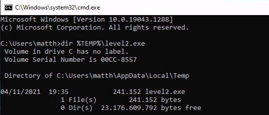
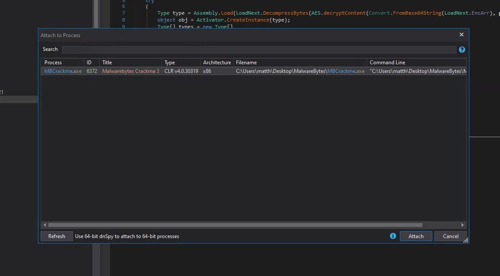
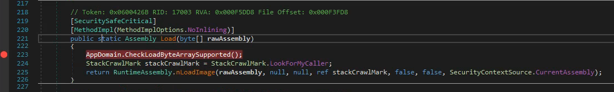

Malwarebytes released their 3rd crackme, here's my entry for the writeup contest.  
You can find the original announcement [here](https://matth.dmz42.org/posts/2021/the-return-of-the-malwarebytes-crackme/) and the contest summary [here](https://blog.malwarebytes.com/threat-intelligence/2021/11/malwarebytes-crackme-contest-summary/).

## 0. First Look

Running the crackme, we understand we'll be asked to find 3 passwords.
Only the first button is enabled, so they will most likely need to be found in order


Loading the binary into PE-bear reveals it's a Dot Net binary


so let's open it in dnSpy


It opens nicely, so far, so good.

## 1. Level 1

Browsing a little bit in dnSpy we quickly find the code behind the 3 buttons, so let's start with the first one:


It's basically calling a ``decode`` function with a resource named ``mb_logo_star`` as first parameter and our input password as 2nd parameter.
The resulting array is then resized to **241152** bytes and if its crc32 is **2741486452** the bytes are written to  ``%TEMP%/level2.exe`` and the newly created binary is executed.

It's safe to assume the ``decode`` function will use our input password to somehow decrypt an executable.

Let's start by extracting the resource, which is easily done with dnSpy:


and look at the ``decode`` function


it uses LSB (Least Significant Bits) steganography to hide data:
- each pixel is represented by 3 color bytes Red, Green and Blue
- the least 3 significant bits of the red and green values, and the 2 least significant bits of the blue are used to encode a total of 8bits per pixel
- the resulting byte is then XOR'd with our input password

let's start by extracting the data with a simple script:
```python
#!/usr/bin/env python3

from PIL import Image

bm = Image.open("mb_logo_star").convert('RGB')
with open('l1_extract.bin', 'wb') as fp:
    for i in range(bm.width):
        for j in range(bm.height):
            r, g, b = bm.getpixel((i, j))
            num2 = r & 7
            num3 = (g & 7) << 3
            num4 = (b & 3) << 6
            b = num2 | num3 | num4
            fp.write(b.to_bytes(1, 'little'))

```

One thing with PE files, is that they contain quite a lot of contiguous NULL bytes, which if we are lucky could reveal the XOR key straight away

```
% xxd l1_extract.bin| more
[snip]
00000270: 845e 6b65 65a0 5c67 6f6b 6e67 21f9 6273  .^kee.\gokng!.bs
00000280: 795f 6c65 7665 6c5f 6f6e 655f 216c 6d2f  y_level_one_!lm/
00000290: 5d06 3a08 000d 655f 6061 725f 7085 5c61  ].:...e_`ar_p.\a
000002a0: 6e74 5f6b 65fb 735f 676f 696e 6721 6561  nt_ke.s_going!ea
000002b0: 7379 5f6c 2576 652e 5f6f 6e65 5f61 6c6d  sy_l%ve._one_alm
000002c0: 6f73 745f 646f 6e65 5f78 6f72 5f70 655f  ost_done_xor_pe_
000002d0: 616e 645f 6b65 6570 5f67 6f69 6e67 2165  and_keep_going!e
000002e0: 6173 795f 6c65 7665 6c5f 6f6e 655f 616c  asy_level_one_al
000002f0: 6d6f 7374 5f64 6f6e 655f 786f 725f 7065  most_done_xor_pe
00000300: 5f61 6e64 5f6b 6565 705f 676f 696e 6721  _and_keep_going!
00000310: 6561 7379 5f6c 6576 656c 5f6f 6e65 5f61  easy_level_one_a
00000320: 6c6d 6f73 745f 646f 6e65 5f78 6f72 5f70  lmost_done_xor_p
00000330: 655f 616e 645f 6b65 6570 5f67 6f69 6e67  e_and_keep_going
00000340: 2165 6173 795f 6c65 7665 6c5f 6f6e 655f  !easy_level_one_
00000350: 616c 6d6f 7374 5f64 6f6e 655f 786f 725f  almost_done_xor_
00000360: 7065 5f61 6e64 5f6b 6565 705f 676f 696e  pe_and_keep_goin
00000370: 6721 6561 7379 5f6c 6576 656c 5f6f 6e65  g!easy_level_one
00000380: 5f61 6c6d 6f73 745f 646f 6e65 5f78 6f72  _almost_done_xor
00000390: 5f70 655f 616e 645f 6b65 6570 5f67 6f69  _pe_and_keep_goi
000003a0: 6e67 2165 6173 795f 6c65 7665 6c5f 6f6e  ng!easy_level_on
000003b0: 655f 616c 6d6f 7374 5f64 6f6e 655f 786f  e_almost_done_xo
000003c0: 725f 7065 5f61 6e64 5f6b 6565 705f 676f  r_pe_and_keep_go
000003d0: 696e 6721 6561 7379 5f6c 6576 656c 5f6f  ing!easy_level_o
000003e0: 6e65 5f61 6c6d 6f73 745f 646f 6e65 5f78  ne_almost_done_x
000003f0: 6f72 5f70 655f 616e 645f 6b65 6570 5f67  or_pe_and_keep_g
00000400: 3ae2 82ec 646d 37f8 79d4 64ee 0669 eda6  :...dm7.y.d..i..
00000410: 6a6e 659f 1470 076f 1b14 be24 6f06 0dbe  jne..p.o...$o...

``` 

it's easy to notice the repeating string: **easy_level_one_almost_done_xor_pe_and_keep_going!**

which turns out to be the correct key:


## 2. Level 2

We can confirm that the crackme spawned a new process (in this case with ``procmon`` from the [sysinternals suite](https://docs.microsoft.com/en-us/sysinternals/)):


At this stage if we input some random password for level2, we get an error and the crackme exits


We can suspect it's because of procmon running: if we retry when it's not running, it does not happen.

The only way to know for sure is to take a look at this **level2.exe**, but first let's have a look at the action performed when we click the 2nd button of the crackme:


it tries to connect to named pipe ``crackme_pipe``, then writes our input password to it, reads something back, checks the CRC, and if it matches an expected value, calls ``LoadNext.load(level2.exe_process, what_was_read_from_the_pipe)``

``LoadNext.Load()`` will use the data read from the pipe to decrypt and load a Dot Net assembly:


and then call the ``RunMe.Invoke(instance, level2.exe_process)`` - most likely injecting code in the level2.exe process.

the key and IV are derived from the SHA256 hash of the password supplied to ``AES.decryptContent``:


We can assume the flow for level2 is:
1. **frontend:**   write input_password to pipe
2. **level2.exe:** read input_password from pipe, do *something* and write something back to the pipe
3. **frontend:** read *something* from the pipe
4. **frontend:** derive AES IV and key from what was read from the pipe
5. **frontend:** decrypt a Dot NET assembly
6. **frontend:** probably do some code injection of some sort ?


Time to look at ``level2.exe``, we should find some code related to named pipes for sure.


### 2.1 Exploring level2.exe

We can either XOR the content we extracted from the image with the password #1 and trim it to the correct size, or just copy the executable from %TEMP% - both work, but the second is a lesser effort.



This time it's not a Dot NET binary, so let's open it with our favorite disassembler/decompiler.
From the entry point, we can navigate down to the main function, which roughly look like this:

```cpp
int __cdecl main_0(int argc, const char **argv, const char **envp)
{
  struct _PEB *v4; // eax
  _DWORD *v5; // ecx
  int v6; // eax
  int v7; // eax
  size_t v8; // esi
  int (__stdcall *function_pointer)(int, void **, _DWORD, size_t *, int, int); // eax
  int v10; // eax
  int (*v11)(void); // ecx
  size_t v12; // [esp+8h] [ebp-4E4C0h] BYREF
  void *v13; // [esp+Ch] [ebp-4E4BCh] BYREF
  char buffer[320692]; // [esp+10h] [ebp-4E4B8h] BYREF

  // register a Vectored Exception Handler
  AddVectoredExceptionHandler(1u, Handler);

  // do something with a buffer
  memset(buffer, 0, 0x4E4B2u);
  if ( !sub_4011D0(&unk_414000, 160345, buffer, 320690, &Size) )
    return -3;
    
  // direct access to the PEB
  v4 = NtCurrentPeb();
  if ( v4 )
    v5 = *(v4->ImageBaseAddress + 3);
  else
    v5 = 0;
  v6 = 0;
  do
  {
    if ( !v5 )
      break;
    if ( !v5[6] )
      break;
    v5 = *v5;
    ++v6;
  }
  while ( !v6 );
  v7 = v5[6];
  v8 = Size;
  
  // somehow get a function pointer
  if ( v7 && (function_pointer = sub_401250(v7, 0xF4DD3DAD)) != 0 )
  {
    v13 = 0;
    v12 = v8;
    
    // execute this function
    v10 = function_pointer(-1, &v13, 0, &v12, 1060864, 64);
    v11 = 0;
    if ( !v10 )
      v11 = v13;
    dword_43BAE0 = v11;
    if ( v11 )
    {
      // copy "buffer" somewhere else
      memmove(v11, buffer, Size);

      // and execute it
      dword_43BAE0();
      return 0;
    }
  }
  else
  {
    dword_43BAE0 = 0;
  }
  return -4;
}
```

At first glance there's nothing much involving some sort of password checking or named pipe operation, however a few things stand out straight away:
- it registers a Vectored Exception Handler (VEH) via the ``AddVectoredExceptionHandler(1, Handler)`` call
  - SEH/VEH can be used to obfuscate control flow (luckily there's no such thing here - we'll see what it is used for later on).
  
- it is directly accessing the PEB (Process Environment Block)
	- PEB via FS:[0x30] and then _PEB_LDR_DATA via PEB+0xC
	- probably to get a list of loaded DLLs
	


```cpp
  // direct access to the PEB
  v4 = NtCurrentPeb();
  if ( v4 )
    v5 = *(v4->ImageBaseAddress + 3);
  else
    v5 = 0;
  v6 = 0;
  do
  {
    if ( !v5 )
      break;
    if ( !v5[6] )
      break;
    v5 = *v5;
    ++v6;
  }
  while ( !v6 );
  v7 = v5[6];
```
- it is dynamically getting a function pointer, based on a value which look like a hash
```cpp
  // somehow get a function pointer
  if ( v7 && (function_pointer = sub_401250(v7, 0xF4DD3DAD)) != 0 )
  {
    v13 = 0;
    v12 = v8;
    // execute this function
    v10 = function_pointer(-1, &v13, 0, &v12, 1060864, 64);
```
- it's transfering execution into memory
```cpp
   dword_43BAE0 = v11;
    if ( v11 )
    {
      // copy "buffer" somewhere else
      memmove(v11, buffer, Size);
      // and execute it
      dword_43BAE0();
      return 0;
    }
```

So it seems that it is using API hashing, a technique commonly used in malware to obfuscate API calls in order to unpack a second stage payload and transfert excution to it.
Let's dive into both.

### 2.2 API Hashing

API hashing is a common and pretty well documented technique, which dynamically resolves API functions.
As a result instead of directly calling:
```cpp
CreateThread(*params);
```
one would do something like:
```cpp
ptr_CreateThread = get_func_by_hash(kernel32.dll, 0x11fc85fd);
ptr_CreateThread(*params);
```
with ``0x11fc85fd`` being a precalculated hash value of some sort for the string "CreateThread".


I will not go into greater details of the internals of this technique as i am not the most skilled person to do so and would probably give incorrect information. It is also pretty well documented all over the internet, but basically, and i hope i am not already giving wrong information:
1. access the PEB from where
2. get a list of loaded dll with their base address
3. from the base dll address, it can loop over the dll exports list
4. for each export, calculate the hash of the name
5. if this hash matches the hash we're looking for, returns the address of the function

references:
- https://0xevilc0de.com/locating-dll-name-from-the-process-environment-block-peb/
- https://www.ired.team/offensive-security/code-injection-process-injection/finding-kernel32-base-and-function-addresses-in-shellcode

It's fair to say it makes static analysis more complicated.

From here we could reverse the hashing algorithm and apply it to all exports of common DLLs.
That would give us a list of common API funtions with their hash and an easy way to find a function name from its hash.

This is for example what [FLARE-IDA](https://github.com/mandiant/flare-ida) is doing with ``shellcode_hashes``. It's great if there's a lot of such obfuscated calls (note that you don't *need* IDA to use it, you can just directly query the sqlite db).

The function hashing algorithm used here looks like this:

```python
def func_hash(func_name):
    h = 0xf00df00d
    for c in func_name:
        h = ((h << 5 | h >> 0x1b) & 0xffffffff) ^ ord(c)
    return h
```

In our case, there's only a pair of such calls, so we can just go with dynamic analysis instead.

Inside this function:
```cpp
  // do something with a buffer
  if ( !sub_4011D0(&unk_414000, 160345, buffer, 320690, &Size) )
```
there's such call:
```cpp
   function_pointer = get_function_by_hash(v8, 0x3AC473D1);
    if ( function_pointer )
    {
      if ( !function_pointer(258, a3, a4, a1, a2, a5) )
        result = 1;
    }
```


and inside the main function as first identified:
```cpp
 // somehow get a function pointer
  if ( v7 && (function_pointer = get_function_by_hash(v7, 0xF4DD3DAD)) != 0 )
  {
    v13 = 0;
    v12 = v8;
    // execute this function
    v10 = function_pointer(-1, &v13, 0, &v12, 0x103000, 0x40);
```


So let's run ``level2.exe`` in x32dbg and hope we'll not get caught by some antidebug trick at this stage.
The goal is here is to break after the calls to ``get_func_by_hash`` and examine EAX, which should contain the address of the resolved API function.

The first call resolves to ``RtlDecompressBuffer``


The 2nd call to ``NtAllocateVirtualMemory``


We can even verify our reversed hash function:
```
>>> hex(func_hash("RtlDecompressBuffer"))
'0x3ac473d1'
>>> hex(func_hash("NtAllocateVirtualMemory"))
'0xf4dd3dad'
```

If we put all the pieces together, the main function:
- decompresses a buffer
- reserves a new memory region with RWX permissions (0x40)
- copies the uncompress buffer to this region
- transfers execution in there

```cpp
  memset(UncompressedBuffer, 0, 320690u);
  if ( !decompress_buffer(CompressedBuffer, 160345, UncompressedBuffer, 320690, &FinalUncompressedSize) )
    return -3;
  [...]

  NtAllocateVirtualMemory(-1, &shellcode, 0, &FinalUncompressedSize, 0x103000, 0x40);
  memmove(shellcode, UncompressedBuffer, FinalUncompressedSize);
  shellcode();
```


### 2.3 Unpacking the 2nd stage

In order to unpack the second stage, we can break right before the control flow is transfered to the shellcode:


if we inspect the memory at ``shellcode`` address, we notice that it starts with the magic ``MZ`` bytes and that there's something which looks like a DOS stub, so it seems we're getting a another PE file.

From here we can right click on the shellcode address, select ``follow in memory map``


then ``dump memory to file``


The resulting file seems to be a valid PE:


### 2.4 Bonus: PE to Shellcode

It's interesting to note that the 2nd stage payload we dumped is a PE file, however execution is directly transfered to it, like it would be with a shellcode, not with a PE.

It is normally not possible because a PE file must first go through a loader which will map memory, apply relocations etc... the executable code is not starting at offset 0.

However the PE header have been modified so it can actually be executed.
The ``CALL EBX`` jumps to a piece of code handling the relocations before transfering execution to the original PE entry point:


as compared to a normal PE header:


I suspect it's the work of Hasherezade's [PE to Shellcode](https://github.com/hasherezade/pe_to_shellcode), the loader looks similar to [this](https://github.com/hasherezade/pe_to_shellcode/blob/master/hldr32/hldr32.asm).
Pretty neat trick.

### 2.5 Analyzing the 2nd stage

Let's now have a look at the dumped content.
_I will only mostly use already cleaned code from here._

Again we can navigate from the entry point down to the main function:
```cpp
int __cdecl main(int argc, const char **argv, const char **envp)
{
  void *v3; // eax
  void *dbg_check; // edi
  int v6; // esi

  v3 = operator new(1u);
  if ( v3 )
    dbg_check = initialize_hashes_and_check_for_debugger(v3);
  else
    dbg_check = 0;
  if ( !dbg_check )
    return -1;
  v6 = stage2_and_3_lets_go("\\\\.\\pipe\\crackme_pipe", 1337);
  __free(dbg_check);
  return v6;
}
```

Seeing the string ``"\\\\.\\pipe\\crackme_pipe"`` we know we're on the right track, but let's start with the first function call


### 2.6 Anti debug

The first function is responsible for initializing a list of hashes and performing some antidebug checks:

```cpp
void *__thiscall initialize_hashes_and_check_for_debugger(void *this)
{
  unsigned int *table_pointer; // esi
  int table_size; // edi
  void *v4; // ecx
  char v6[8]; // [esp+Ch] [ebp-98h] BYREF
  void *_this; // [esp+14h] [ebp-90h]
  int process_hash[34]; // [esp+18h] [ebp-8Ch] BYREF

  _this = this;
  table_pointer = process_hash;
 
  table_size = 34;
  process_hash[0] = 0xC81D63C9; 
  process_hash[1] = 0x5B2839AC; 
  process_hash[2] = 0x17DAD73F; 
  process_hash[3] = 0x72C7241C; 
  process_hash[4] = 0x58E483ED; 
  process_hash[5] = 0x82134662; 
  process_hash[6] = 0x34204667; 
  process_hash[7] = 0x4CD53A71; 
  process_hash[8] = 0x34206499; 
  process_hash[9] = 0xFFDEB191; 
  process_hash[10] = 0x7AC6410B;
  process_hash[11] = 0xEA3503AA;
  process_hash[12] = 0xCCFA2924;
  process_hash[13] = 0x3A09FFBC;
  process_hash[14] = 0x38EA0C1B;
  process_hash[15] = 0x58E479EC;
  process_hash[16] = 0x1B964E1A;
  process_hash[17] = 0x707F9D9A;
  process_hash[18] = 0xF5A79701;
  process_hash[19] = 0x9F5473B; 
  process_hash[20] = 0xBA635AC6;
  process_hash[21] = 0xBB18A65; 
  process_hash[22] = 0x46119FD8;
  process_hash[23] = 0xFB7BF6AF;
  process_hash[24] = 0x3F75D54B;
  process_hash[25] = 0x49110E9F;
  process_hash[26] = 0x5D9F9FD8;
  process_hash[27] = 0x5DCC9FD8;
  process_hash[28] = 0x8293C33E;
  process_hash[29] = 0x5D112314;
  process_hash[30] = 0x9D9F8189;
  process_hash[31] = 0xC10AE786;
  process_hash[32] = 0x67D8B725;
  process_hash[33] = 0x7FE9020; 
  do
  {
    initialize_hash_set(&g_HASH_SET, v6, 0, table_pointer++, this);
    --table_size;
  }
  while ( table_size );
  if ( check_for_debuggers(v4) || kernel_mode_antidbg() || enumerate_process_and_hash(&g_HASH_SET, 1) )
    __debugbreak();
  return _this;
}
```

after the initization of a global hashes set, it will call 3 functions:

#### 2.6.1 check_for_debuggers()

this function uses the following API functions to check if the process is being debugged:
- ``IsDebuggerPresent()``
- ``CheckRemoteDebuggerPresent(GetCurrentProcess(), &pbDebuggerPresent);``

#### 2.6.2 kernel_mode_antidbg()

this function checks for a kernel debugger using

``IsBadReadPtr(0x7FFE0000, 0x3B8u);``

more info here: [https://github.com/hasherezade/antianalysis_demos/blob/master/kernelmode_antidbg.cpp](https://github.com/hasherezade/antianalysis_demos/blob/master/kernelmode_antidbg.cpp)


#### 2.6.3 enumerate_process_and_hash()

This function takes 2 parameters: the list of hashes previously initialized and a bool.
It's using the combo ``CreateToolhelp32Snapshot()``, ``Process32First()``, ``Process32Next()`` to iterate over the list of running processes.

For each process, it gets the executable name, strips the trailing ".exe", computes a hash and checks if the hash is part of the previously initialized list.

Since the bool parameter we mentionned earlier is set to 1, the hash is computed on the lower case version of the executable name (making it case insensitive).

The hash is calculated in this way:

```python
def hash(text):
    key = 0xbadc0ffe
    for c in text:
        c = c.lower()
        key = ((key << 5 | key >> 0x1b) & 0xffffffff) ^ ord(c)
    return key
```

we remember that if ``procmon`` was running the crackme detected it, so let's perform a quick check:

```
>>> hex(hash("procmon"))
'0x34204667'
```

we can indeed find this hash in the in list:
```cpp
process_hash[6] = 0x34204667;                 // procmon
```

So far so good... we'll come back to these hashes later on.

#### 2.6.4 Handling

If any of these checks fail, the binary will call ``__debugbreak()`` - generating a software breakpoint which will either be caught by the debugger - if any and be harmless, or by the Vectored Exception Handler registered before the unpacking of the 2nd stage.

The handler looks like this, and will exit the process with -1 in case there's a (uncaught) breakpoint happening within the stage 2 payload: 
```cpp
LONG __stdcall Handler(struct _EXCEPTION_POINTERS *ExceptionInfo)
{
  DWORD exception_code; // ecx
  int (*exception_address)(void); // esi

  exception_code = ExceptionInfo->ExceptionRecord->ExceptionCode;
  exception_address = ExceptionInfo->ExceptionRecord->ExceptionAddress;
  // // access violation
  if ( exception_code == 0xC0000005 )
  {
    MessageBoxA(0, "Failed!", "ERROR", 0);
    ExitProcess(-2u);
  }
  // exception happened when executing the shellcode
  // and the code was 0x80000003 (breakpoint)
  if ( shellcode
    && FinalUncompressedSize
    && exception_address >= shellcode
    && exception_address < shellcode + FinalUncompressedSize
    && exception_code == 0x80000003 )
  {
    ExitProcess(-1u);
  }
  return 1;
}
```

If the program exits with -1, the frontend will catch it and display the popup we've seen earlier about analysis tools:


### 2.7 Bypassing the Anti debug

There might be different ways to bypass these checks, among them:
- The first (two ?) checks can be bypassed using a x64dbg plugin like ``ScyllaHide``
- The last one can be circumvent by renaming our analysis tools executables.
- One could also use x64dbg to patch the checks (NOP them or make them always successfull), or manipulate registers/flags to achieve the same result, but i do not think this would be really practical as the shellcode will be loaded at a different address everytime and most likely the checks would have run already before we have a chance to attach it.
- Maybe the VEH in level2.exe could be patched to do nothing instead of exiting ?

To be honest, I did not try any of these because the checks are only run once after the second stage payload is executed, meaning we can just start our analysis tools after entering the 1st password and waiting a few millisec for level2.exe to kick in...

This is what i found the easiest and most practical for me here:
1. start the crackme
2. enter the 1st password
3. start the debugger and attach to level2.exe
4. profit!

After the 2nd step, the debug checks are not called again and we can freely play, no need to make it more complex than it needs to be.


### 2.8 Core business

Let's continue the exploration and look at the ``stage2_and_3_lets_go("\\\\.\\pipe\\crackme_pipe", 1337)`` function.

It starts 2 threads: one for level2 and one for level3
```cpp
  th_stage2_param[0] = pipe_name;
  th_stage2_param[1] = check_stage2_password;
  th_stage2 = create_stage2_thread(th_stage2_param);
  if ( !th_stage2 )
    return 2;
  th_stage3_param[0] = int_1337;
  th_stage3_param[1] = check_stage3_password;
  th_stage3 = create_stage3_thread(th_stage3_param);
  if ( !th_stage3 )
    return 3;
```


You can dig into the create_stageX_thread functions by yourself, i dont think there's anything worth mentioning.
Basically stage2 reads input from a named pipe, stage3 listen on 127.0.0.1:1337 to do the same.

The function that verifies the level 2 password received from the frontend is the one i renamed ``check_stage2_password``

### 2.9 check_stage2_password() - the return of the hashes

This function starts by initializing a byte array:
```cpp
  crypted[0] = 0xF158955A;
  crypted[1] = 0xB5626D7C;
  crypted[2] = 0xD68AC6C2;
  crypted[3] = 0x10F6F220;
  crypted[4] = 0x4CEF8FD8;
  crypted[5] = 0x8B4663D6;
  crypted[6] = 0xA2BE0D1A;
```

then removes the trailing spaces (including \r\n) of the input password and computes its hash using the same algorithm than for the anti analysis process check:

```cpp
  remove_trailing_spaces(&password_from_pipe, &v32, v16, v32);
  if ( a7 < 0x10 || (password = password_from_pipe, (v33 = password_from_pipe) != 0) )
  {
    hash = 0xBADC0FFE;
    password_len = strlen(password);
    n_1 = 0;
    if ( password_len )
    {
      do
      {
        password_char_lower = tolower(password[n_1]);
        password = v33;
        ++n_1;
        hash = password_char_lower ^ __ROL4__(hash, 5);
      }
      while ( n_1 < password_len );
    }
  }
```

afterwards it checks if the hash exists in the global list of hashes that has been initialized earlier, and if it does, uses the input password to decrypt the byte array:

```cpp
  key = &password_from_pipe;
  rc4_decrypt(key, key_len, crypted, 0x1Du);
  n = 0;
  while ( 1 )
  {
    some_chr = *(crypted + n);
    if ( !some_chr )
      break;
    if ( (some_chr >= ' ' && some_chr != '\x7F' || some_chr == '\n' || some_chr == '\r') && ++n < 29 )
      continue;
    goto INVALID_PASSWORD;
  }
```
and checks that the result is more or less ascii printable

##### Note: The decryption algorithm is RC4.

> RC4 is usually pretty easy to spot:
> 
> When you see a first loop initializing a 256 bytes array [0, 1, 2, ..., 255], then a second loop with some permutations and 3rd loop with some XOR'ing, you can be suspicious it's RC4: This [Wikipedia page](https://en.wikipedia.org/wiki/RC4) shows it well.
> 
> In this case it turned out to be plain normal RC4.


### 2.10 Finding the password

At this point it's pretty clear that: 
- the password needs to match one the hashes
- the result of the RC4 decryption of the byte array with this password needs to be ascii printable

So we just need to reverse the hashes and one of them must be the password ! right ?

With the help of Z3, this script will generate lowercase strings of a given length matching a given hash.
(PS: Z3 is great, use it and abuse it)

```python
#!/usr/bin/env python3
from z3 import *
import sys

def solve_hash(h, size):
    s = Solver()

    chr_lst = []
    for x in range(size):
        c = BitVec("c%d"%x, 32)
        s.add(
                # lowercase letters + 3 2 6 4 _ -
                Or(
                    Or(c == 51, c == 50, c == 54, c == 52, c == 95, c == 45),
                    And(c >= 97, c <= 122)
                )
                )
        chr_lst.append(c)

    key = BitVecVal(0xbadc0ffe, 32)
    for c in chr_lst:
        key = RotateLeft(key, 5) ^ c

    s.add(key == h)

	# keep going while we have solutions
    while s.check() == sat:
        m = s.model()
        cond = []

        pwd = ""
        for x in range(len(chr_lst)):
            pwd += chr(m[chr_lst[x]].as_long())
            cond.append(chr_lst[x] != int(m[chr_lst[x]].as_long()))
        # just dont print the same solution twice
        s.add(Or(cond))

        print(pwd)


h = int(sys.argv[1][2:], 16)
print("hash = 0x%x"%h)
solve_hash(h, int(sys.argv[2]))
```

While this works well for short strings, the number of collisions goes up exponentially and the method quickly reaches its limits:

```
% ./reverse_hash.py 0x5D9F9FD8 5
hash = 0x5d9f9fd8
% ./reverse_hash.py 0x5D9F9FD8 6
hash = 0x5d9f9fd8
x32dbg
zqrdbg
zs2dbg
% ./reverse_hash.py 0x5D9F9FD8 8 | wc -l
128
% ./reverse_hash.py 0x5D9F9FD8 9 | wc -l
17516
```

Notice that we found the hash for ``x32dbg``.

So i tried it this way on short string lengths, also checked the hashes of the sysinternals tools and whatever analysis tool came to my mind, but i was still left with some unresolved hashes.

Until i put all the hashes i already had "reversed" together in a single google query and found this:
[https://github.com/LordNoteworthy/al-khaser/blob/master/al-khaser/AntiAnalysis/process.cpp](https://github.com/LordNoteworthy/al-khaser/blob/master/al-khaser/AntiAnalysis/process.cpp)

which turned to be the almost complete list of executable names matching the hashes.  
At this stage i had all but one hashes:

```cpp
  process_hash[0] = 0xC81D63C9;                 // ollydbg
  process_hash[1] = 0x5B2839AC;                 // processhacker
  process_hash[2] = 0x17DAD73F;                 // tcpview
  process_hash[3] = 0x72C7241C;                 // autoruns
  process_hash[4] = 0x58E483ED;                 // autorunsc
  process_hash[5] = 0x82134662;                 // filemon
  process_hash[6] = 0x34204667;                 // procmon
  process_hash[7] = 0x4CD53A71;                 // regmon
  process_hash[8] = 0x34206499;                 // procexp
  process_hash[9] = 0xFFDEB191;                 // idaq
  process_hash[10] = 0x7AC6410B;                // idaq64
  process_hash[11] = 0xEA3503AA;                // ImmunityDebugger
  process_hash[12] = 0xCCFA2924;                // wireshark
  process_hash[13] = 0x3A09FFBC;                // dumpcap
  process_hash[14] = 0x38EA0C1B;                // HookExplorer
  process_hash[15] = 0x58E479EC;                // ImportREC
  process_hash[16] = 0x1B964E1A;                // petools
  process_hash[17] = 0x707F9D9A;                // lordpe
  process_hash[18] = 0xF5A79701;                // SysInspector
  process_hash[19] = 0x9F5473B;                 // proc_analyzer
  process_hash[20] = 0xBA635AC6;                // sysAnalyzer
  process_hash[21] = 0xBB18A65;                 // sniff_hit
  process_hash[22] = 0x46119FD8;                // windbg
  process_hash[23] = 0xFB7BF6AF;                // joeboxcontrol
  process_hash[24] = 0x3F75D54B;                // joeboxserver
  process_hash[25] = 0x49110E9F;                // ResourceHacker
  process_hash[26] = 0x5D9F9FD8;                // x32dbg
  process_hash[27] = 0x5DCC9FD8;                // x64dbg
  process_hash[28] = 0x8293C33E;                // fiddler
  process_hash[29] = 0x5D112314;                // httpdebugger
  process_hash[30] = 0x9D9F8189;
  process_hash[31] = 0xC10AE786;                // pe-sieve
  process_hash[32] = 0x67D8B725;                // hollows_hunter
  process_hash[33] = 0x7FE9020;                 // pin
```

I tried them all as input password: no luck.
I thought it would match the last hash i was missing, so i tried bruteforcing solutions... but it was just too long and probably not the correct path to the solution anyway.

Out of despair, i threw in a file whatever executable name i had and tried the RC4 decrypt:

```python
from Crypto.Cipher import ARC4
import string

printable_ascii = [ord(_) for _ in string.printable]

#import struct
#crypt_v = [0xF158955A, 0xB5626D7C, 0xD68AC6C2, 0x10F6F220, 0x4CEF8FD8, 0x8B4663D6, 0xA2BE0D1A]
#crypt = b''
#for v in crypt_v:
#    crypt += struct.pack('<I', v)
crypt = b'Z\x95X\xf1|mb\xb5\xc2\xc6\x8a\xd6 \xf2\xf6\x10\xd8\x8f\xefL\xd6cF\x8b\x1a\r\xbe\xa2'


with open('executable_names.txt', 'rb') as fp:
    for key in fp:
        key = key.rstrip(b'\n')==
        cipher = ARC4.new(key)
        dec = cipher.decrypt(crypt)

        ok = True
        for b in dec:
            if b not in printable_ascii:
                ok = False
                break

        if ok:
            print(key)
            print(dec)
```

and ho surprise:
```
% python rc4_all_exe_names.py 
b'ProcessHacker'
b'we_are_good_to_go_to_level3!'
```

yeah... turned out the hashes are done on the lowercase password, but of course the RC4 key isn't key insensitive...


Anyway, we have the password for level2: ``ProcessHacker``


## 3. Level 3

### 3.1 First impression

As earlier mentionned, level2.exe spins two threads:
- one dealing with the named pipe for level 2
- one listening on localhost:1337 for level 3

```cpp
  th_stage3_param[0] = int_1337;
  th_stage3_param[1] = check_stage3_password;
  th_stage3 = create_stage3_thread(th_stage3_param);
  if ( !th_stage3 )
    return 3;
```

Let's examine the ``check_stage3_password`` function.

It starts off by initializing a byte array, similarly to level 2:

```cpp
  crypted[0] = 0xA39BB17F;
  crypted[1] = 0x987AB8DB;
  crypted[2] = 0x2F6BE93E;
  crypted[3] = 0x5A40C4AC;
  crypted[4] = 0x5F900F42;
  crypted[5] = 0xAB9CF15C;
  crypted[6] = 0xF51B7932;
  crypted[7] = 0x6A3CA0C;
  crypted[8] = 0x4A4A45C4;
  crypted[9] = 0x21591DF6;
  crypted[10] = 0xC7F3DA41;
  crypted[11] = 0xA3EEEFBA;
  crypted[12] = 0x45820D2D;
  crypted[13] = 0x34D33517;
  crypted[14] = 0xD7C3DCCB;
  crypted[15] = 0xFA5E5BB3;
  crypted[16] = 0x69E23F67;
  crypted[17] = 0x5A4102EF;
```

followed by a call to ``CryptStringToBinaryA``
```cpp
  // base 64 decode
  if ( !CryptStringToBinaryA(input_password, cchString, 0x1, decoded_base64, &pcbBinary, 0, &pdwFlags) )
    goto NOPE;
```

**Note**: The 3rd parameter is 0x1, which means CRYPT_STRING_BASE64 / base64 without headers (ref: [Microsoft](https://docs.microsoft.com/en-us/windows/win32/api/wincrypt/nf-wincrypt-cryptstringtobinarya))


Then, the decoded base64 is processed by a small loop, doing ROR/ROL based on the *Y cursor coordinate* and checking it against the *X cursor coordinate*:
```cpp
  if ( pcbBinary )
  {
  	// GetCursorPos - what ???
    while ( GetCursorPos(&Point) )
    {
      point_y = Point.y & 7;
      v10 = &decoded_base64[n % decStrLen];
      v11 = *v10;
      v12 = *v10;
      v13 = *v10;
      v14 = *v10;
      if ( (n & 1) != 0 )                       // odd
      {
        dec_byte = (v13 << point_y) | (v12 >> (8 - point_y));
        v15 = v14 << (8 - point_y);
        v16 = v11 >> point_y;
      }
      else                                      // even
      {
        dec_byte = (v13 >> point_y) | (v12 << (8 - point_y));
        v15 = v14 >> (8 - point_y);
        v16 = v11 << point_y;
      }
      // we want this to be TRUE
      if ( (v16 | v15) == LOBYTE(Point.x) )
        decoded_base64[n] = dec_byte;			// replace the byte in place in the string
        
      // we sure need some sleep...
      Sleep(0x1Eu);
      
      decStrLen = strlen_size;
      if ( ++n >= strlen_size )
        goto CHECK_CHAR_SET;
    }
    goto NOPE;
  }
```

after this wizardry, we're supposed to be left with a more or less ascii printable string:

```cpp
  while ( 1 )
  {
    chr = decoded_base64[i];
    if ( !chr )
      break;
    if ( (chr >= ' ' && chr != 127 || chr == '\n' || chr == '\r') && ++i < 0xFF )
      continue;
    goto NOPE;
  }
```

which will serve (again !) as a RC4 key, which should decrypt the byterarray to something more or less ascii printable

```cpp
  rc4_decrypt(decoded_base64, i, crypted, 0x48u);
  j = 0;
  while ( 1 )
  {
    _chr = *(crypted + j);
    if ( !_chr )
      break;
    if ( (_chr >= ' ' && _chr != 127 || _chr == '\n' || _chr == '\r') && ++j < 0x48 )
      continue;
    goto NONO;
  }
```

Easy game ! Except that ``GetCursorPos()`` call in the loop right after the base64 decode...
Are we supposed to guess the password __*while having the mouse cursor positionned correctly on screen at each loop*__ ?

I don't think so (or rather i hope not), so let's go back a bit...

### 3.2 Back to stage 2 (more unpacking)

If we remember correctly, once the 2nd password is correctly entered, the crackme decrypts a dot NET assembly.
Let's extract it.

We can use dnSpy to dynamically debug the crackme (the crackme is 32 bits so make sure to use the 32 bits version of dnSpy for this task).
In order to do it at the correct moment, we need to close the crackme, open it again and enter the 1st password.

Then, attach the process in dnSpy:



Navigate to the ``LoadNext.Load`` method, then click on ``Assembly.Load``


this will automagically take us where we want to set a breakpoint (by pressing F9)



Now we can enter the level 2 password and after clicking the "level up" popup, the breakpoint will be hit.
Right click the ``rawAssembly`` local variable and ``Save...`` it to file.


### 3.3 Matryoshka (and more unpacking)

Since we're supposed to have unpacked a Dot NET assembly, we can load the new file straight into dnSpy
We find our friends ``Level3Bin.Class1`` and ``RunMe`` that we've seen when following the code handling the click on the level 2 button, inside ``LoadNext.Load()``.


along with a promising ``DropTheDll`` method and ``DllInj`` class.

``RunMe`` will create a temp file, write the DLL to it and inject it into the running level2.exe.

There's different ways of gettting this DLL:
- since the DLL is just base64 encoded in the DropTheDll method, we can also just copy this string and do the base64 decode..
- we could also attach a debugger to level2.exe, making sure to break on DLL Load, get the path and copy the file (``"C:\\Users\\matth\\AppData\\Local\\Temp\\4x4bdt1g.dat"`` in this case)


```
C:\Users\matth\Desktop\MalwareBytes>copy C:\Users\matth\AppData\Local\Temp\4x4bdt1g.dat level3_unpacked.dll
        1 file(s) copied.
```

at least we have it now.

The injection code looks pretty standard and is done by the book: you can even find this method on [Wikipedia](https://en.wikipedia.org/wiki/DLL_injection#Using_the_LoadLibrary_API_function) :)


### 3.4 Hooks

Opening the newly acquired DLL and navigating to DllMain(), the author was kind enough to tell us what is going to happen: hooking !

```cpp
BOOL __stdcall DllMain(HINSTANCE hinstDLL, DWORD fdwReason, LPVOID lpvReserved)
{
  HANDLE v3; // eax
  HANDLE v5; // eax

  if ( fdwReason )
  {
    if ( fdwReason == 1 )
    {
      OutputDebugStringA("Hooking the process");
      sub_10004D00();
      v3 = GetCurrentThread();
      sub_10005260(v3);
      sub_10004570((int)&dword_1002AE60, sub_10002990);
      sub_10004570((int)&dword_1002AE64, sub_10002B10);
      sub_10004570((int)&dword_1002AE68, sub_10002B60);
      sub_10004D60();
      return 1;
    }
  }
  else
  {
    OutputDebugStringA("Unhooking the process");
    sub_10004D00();
    v5 = GetCurrentThread();
    sub_10005260(v5);
    sub_10004A10((int)&dword_1002AE60, sub_10002990);
    sub_10004A10((int)&dword_1002AE64, sub_10002B10);
    sub_10004A10((int)&dword_1002AE68, sub_10002B60);
    sub_10004D60();
  }
  return 1;
}
```

At first glance, the DLL is hooking 3 functions, but which ones ?

An easy way to figure this out, is to configure x64dbg to break on DLL Entry, *before entering the 2nd password*.
When we'll enter the 2nd password, the dll will be injected and run, and the breakpoint will trigger.


From there, navigate to the piece of code performing the hooking and break before it's executed:


The hooks are revealed:


- 1st hook replaces ``CryptStringToBinaryA``
- 2nd hook replaces ``GetCursorPos``
- 3rd hook replaces ``_SleepStub``

```cpp
      OutputDebugStringA("Hooking the process");
      sub_10004D00();
      thread = GetCurrentThread();
      sub_10005260(thread);
      hook((int)&g_trampoline_CryptStringToBinaryA, hook_CryptStringToBinaryA);
      hook((int)&g_trampoline_GetCursorPos,         hook_GetCursorPos);
      hook((int)&g_trampoline_SleepStub,            hook_SleepSub);
      sub_10004D60();
      return 1;
```


After the hooking, all calls to these 3 functions will be redirected to the new hook_* functions.
This seems to be done by modifying the code in memory rather than by modifying the IAT (Import Address Table)

After the new hook execution, the control flow is not transfered back to the original function, so the hook actually *replaces* the original function.

This is what ``GetCursorPos`` looks like before hooking (we're in user32.dll)


And this is what it looks like after hooking:


The prologue has been replaced by a jump to some code in the injected DLL, precisely to the "new" GetCursorPos  
Here below listing for easy comparison:


##### *Note:*
In the hooked ``CryptStringToBinaryA`` there's a call to the actual CryptStringToBinaryA function to perform the base64 decode, this is done using a trampoline:

the instructions (bytes) overwritten by the hook jump are saved when the hook is setup (``&g_trampoline_CryptStringToBinaryA``), followed by a jump back to the original code, right after the overwrite.

Calling the trampoline executes the original, pre-hooking, code.


I'm no expert but the hooking seems to be done using [Detours](https://github.com/microsoft/Detours).  
*More info on hooking by Jurriaan Bremer: [x86 API Hooking Demystified](http://jbremer.org/x86-api-hooking-demystified/)*


Now let's look the 3 hooks.


#### 3.4.1 Sleep

Sleep will just increment a global variable

```cpp
void __stdcall hook_SleepSub(int a1)
{
  ++g_IncrementedByEachSleep;
}
```

#### 3.4.1 CryptStringToBinaryA

CryptStringToBinaryA will actually perform normally, with the addition that it is initializing ``g_IncrementedByEachSleep`` to 4

```cpp
  ///
  // calling the real CryptStringToBinaryA
  v10 = g_trampoline_CryptStringToBinaryA(pszString, cchString, dwFlags, pbBinary, pcbBinary, skip, flags);
  
  ///
  // setting global counter to 4
  if ( v10 )
    counter = 4;
  g_IncrementedByEachSleep = counter;
```


#### 3.4.1 GetCursorPos

GetCursorPos will use the global counter to return (x, y) position values from 2 arrays, instead of the actual cursor position.


```cpp
int __stdcall hook_GetCursorPos(POINT *point)
{
  point->y = g_Y_cursor_pos[g_IncrementedByEachSleep & 0x1F];
  point->x = g_X_cursor_pos[g_IncrementedByEachSleep % 0x21];
  return 1;
}
```

with:

```python
g_Y_cursor_pos = [
        0x83, 0x1b, 0x89, 0x20, 0x37, 0x8b, 0x57,
        0xc6, 0x78, 0x74, 0x00, 0xc4, 0x48, 0x83,
        0xdb, 0x7c, 0x48, 0x49, 0x8b, 0x48, 0xf8,
        0x49, 0xff, 0x24, 0x74, 0x93, 0x53, 0x03,
        0x4a, 0x03, 0xc0, 0x48
    ]

g_X_cursor_pos  = [
        0x95, 0xb9, 0x63, 0x59, 0xdc, 0xb5, 0x58,
        0xc6, 0x6c, 0x5f, 0x68, 0x6f, 0x6f, 0xad,
        0xdc, 0x5f, 0x6d, 0x58, 0xda, 0x65, 0x5f,
        0x58, 0xd7, 0x62, 0x69, 0x9d, 0xd7, 0x91,
        0x96, 0x99, 0x66, 0x65, 0x9c
]
```

We do not have to guess the cursor positions anymore!

### 3.5 The final password

With these new information, the routine we've stumbled upon earlier makes much more sense:

```cpp
    //
    // do actual base64 decoding but also
    // initialize a counter to 4
    //
    CryptStringToBinaryA(input_password, cchString, 0x1, decoded_base64, &pcbBinary, 0, &pdwFlags)

    //
    // with the hook it now returns (x, y) position from 2 known arrays
    //
    while ( GetCursorPos(&Point) )
    {
      point_y = Point.y & 7;
      v10 = &decoded_base64[n % decStrLen];
      v11 = *v10;
      v12 = *v10;
      v13 = *v10;
      v14 = *v10;
      if ( (n & 1) != 0 )                       // odd
      {
        dec_byte = (v13 << point_y) | (v12 >> (8 - point_y));
        v15 = v14 << (8 - point_y);
        v16 = v11 >> point_y;
      }
      else                                      // even
      {
        dec_byte = (v13 >> point_y) | (v12 << (8 - point_y));
        v15 = v14 >> (8 - point_y);
        v16 = v11 << point_y;
      }
      // we want this to be TRUE
      if ( (v16 | v15) == LOBYTE(Point.x) )
        decoded_base64[n] = dec_byte;			// replace the byte in place in the string
        
      //
      // increment a counter
      //
      Sleep(0x1Eu);
      
      decStrLen = strlen_size;
      if ( ++n >= strlen_size )
        goto CHECK_CHAR_SET;
    }
    goto NOPE;
```


we can put everything together in a final script.
- (Ab)use Z3 to figure the correct input
- use these input to get the key
- use the key to get the flag

```python
#!/usr/bin/env python3
from z3 import *
import base64
from Crypto.Cipher import ARC4
import struct

# crypted string
crypted_dw = [
    0x0A39BB17F, 0x987AB8DB, 0x2F6BE93E, 0x5A40C4AC,
    0x5F900F42, 0x0AB9CF15C, 0x0F51B7932, 0x6A3CA0C,
    0x4A4A45C4, 0x21591DF6, 0x0C7F3DA41, 0x0A3EEEFBA,
    0x45820D2D, 0x34D33517, 0x0D7C3DCCB, 0x0FA5E5BB3,
    0x69E23F67, 0x5A4102EF,
]

# just build a bytes string from from the above dwords
crypted = b''
for v in crypted_dw:
    crypted += struct.pack('<I', v)


# (x, y) positions from the dll
y_positions = [
        0x83, 0x1b, 0x89, 0x20, 0x37, 0x8b, 0x57,
        0xc6, 0x78, 0x74, 0x00, 0xc4, 0x48, 0x83,
        0xdb, 0x7c, 0x48, 0x49, 0x8b, 0x48, 0xf8,
        0x49, 0xff, 0x24, 0x74, 0x93, 0x53, 0x03,
        0x4a, 0x03, 0xc0, 0x48
    ]

x_positions = [
        0x95, 0xb9, 0x63, 0x59, 0xdc, 0xb5, 0x58,
        0xc6, 0x6c, 0x5f, 0x68, 0x6f, 0x6f, 0xad,
        0xdc, 0x5f, 0x6d, 0x58, 0xda, 0x65, 0x5f,
        0x58, 0xd7, 0x62, 0x69, 0x9d, 0xd7, 0x91,
        0x96, 0x99, 0x66, 0x65, 0x9c
]

def GetCursorPos(c):
    ''' emulate hooked GetCursorPos
    '''
    y = y_positions[c & 0x1f]
    x = x_positions[c % 0x21]
    return (x, y)


#
# abuse z3 to find a valid input
#

s = Solver()


size = 33   # size of the input key // 0x21 .. size of x_positions array
inp = []
out = []

# create input and output BitVec
# the output are just to get the key straight away
for x in range(size):
    inp.append(BitVec('i%d'%x, 8))
    out.append(BitVec('o%d'%x, 8))

# initialize the global counter
counter = 4

# run the little routine with GetCursorPos
# it's just ROL/ROR
for pos in range(len(inp)):
    x, y = GetCursorPos(counter)
    y = y & 7

    if pos & 1 == 0:
        dec_byte = RotateRight(inp[pos], y)
        check =    RotateLeft(inp[pos], y)
    else:
        dec_byte = RotateLeft(inp[pos], y)
        check =    RotateRight(inp[pos], y)

    # the actual constrain we want to fullfil
    # if ( (v16 | v15) == LOBYTE(Point.x) )
    s.add(x == check)

    # (dirty?) trick to get the output value straight away
    s.add(out[pos] == dec_byte)

    # Sleep()
    counter += 1

# hopefully will not happen
if s.check() != sat:
    raise

# we found a valid input
m = s.model()

pwd = b""
key = ""

# get input (password) and output (key) values from the model
for x in range(len(inp)):
    pwd += m[inp[x]].as_long().to_bytes(1, 'little')
    key += chr(m[out[x]].as_long())

print("password: %s"%str(base64.b64encode(pwd), 'ascii'))
print("key     : %s"%key)

# get flag
cipher = ARC4.new(bytes(key, 'ascii'))
flag = str(cipher.decrypt(crypted), 'ascii')

print("flag    : %s"%flag)
```


Running the script yields this output:

```
% python l3.py 
password: ua2wsWz1aPZvbZv1bbBbZV+wryaW7PqMpcxmZZOs3GOy
key     : small_hooks_make_a_big_difference
flag    : flag{you_got_this_best_of_luck_in_reversing_and_beware_of_red_herrings}
```


## 6. References

Dynamic API functions address resolution:
- https://0xevilc0de.com/locating-dll-name-from-the-process-environment-block-peb/
- https://www.ired.team/offensive-security/code-injection-process-injection/finding-kernel32-base-and-function-addresses-in-shellcode

Tools for dealing with hashes:
- https://github.com/mandiant/flare-ida
- https://github.com/OALabs/hashdb

PE to shellcode:
- https://github.com/hasherezade/pe_to_shellcode
- https://github.com/stephenfewer/ReflectiveDLLInjection

Anti Debug:
- https://github.com/hasherezade/antianalysis_demos/blob/master/kernelmode_antidbg.cpp
- https://anti-reversing.com/Downloads/Anti-Reversing/The_Ultimate_Anti-Reversing_Reference.pdf

RC4:
- https://en.wikipedia.org/wiki/RC4

Code Injection:
- https://en.wikipedia.org/wiki/DLL_injection#Using_the_LoadLibrary_API_function

Hooking:
- https://github.com/microsoft/Detours
- http://jbremer.org/x86-api-hooking-demystified/
- https://www.ired.team/offensive-security/code-injection-process-injection/import-adress-table-iat-hooking


## 5. Conclusion

It was very enjoyable, even though i was stuck way too long on level2, because of something silly.
There's a lot of manual unpacking described here, but that was my intention (not just fire some tool and forget).

I hope this writeup does not contain too many mistakes: should you spot anything incorrect, feel free to [contact me](https://twitter.com/matth_walter).

Thank you for reading.
