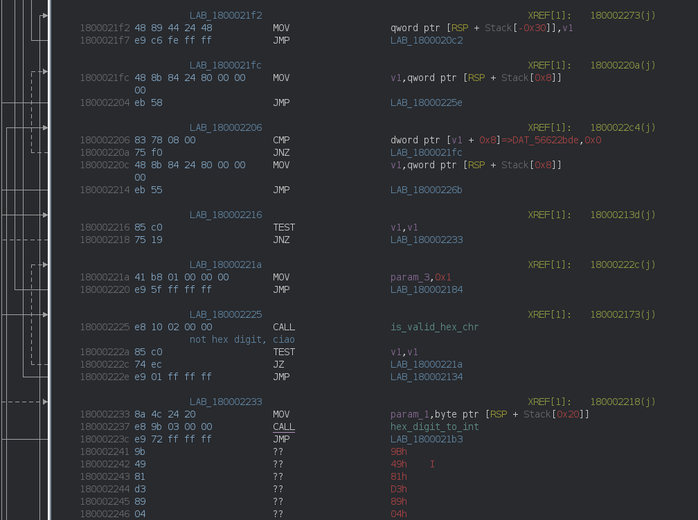
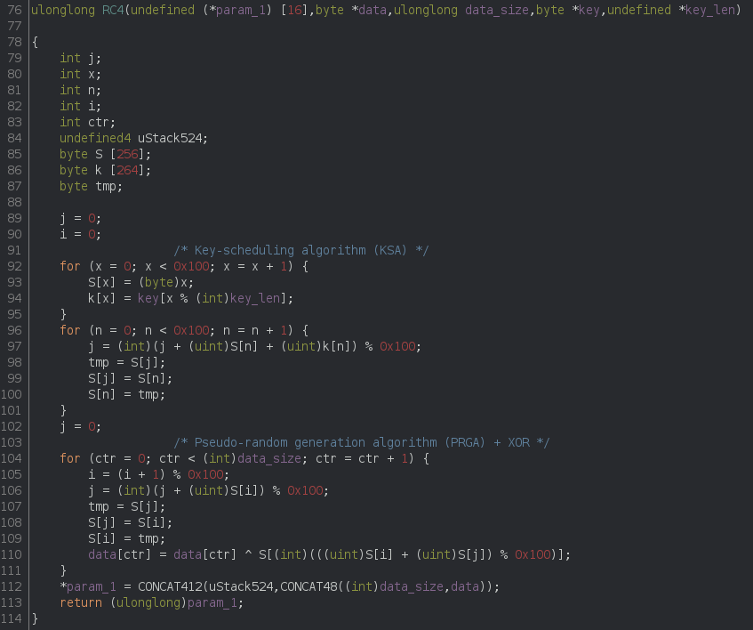
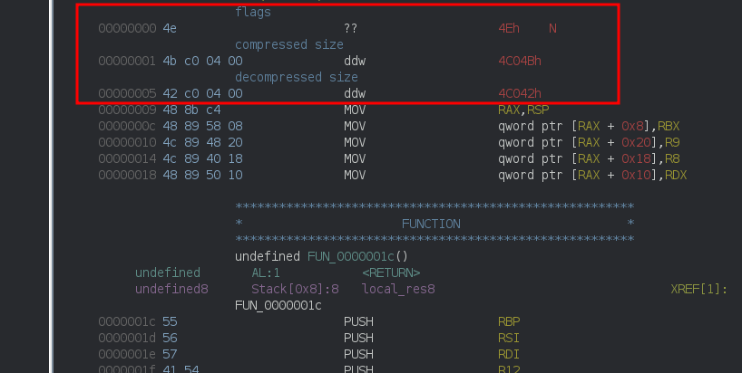
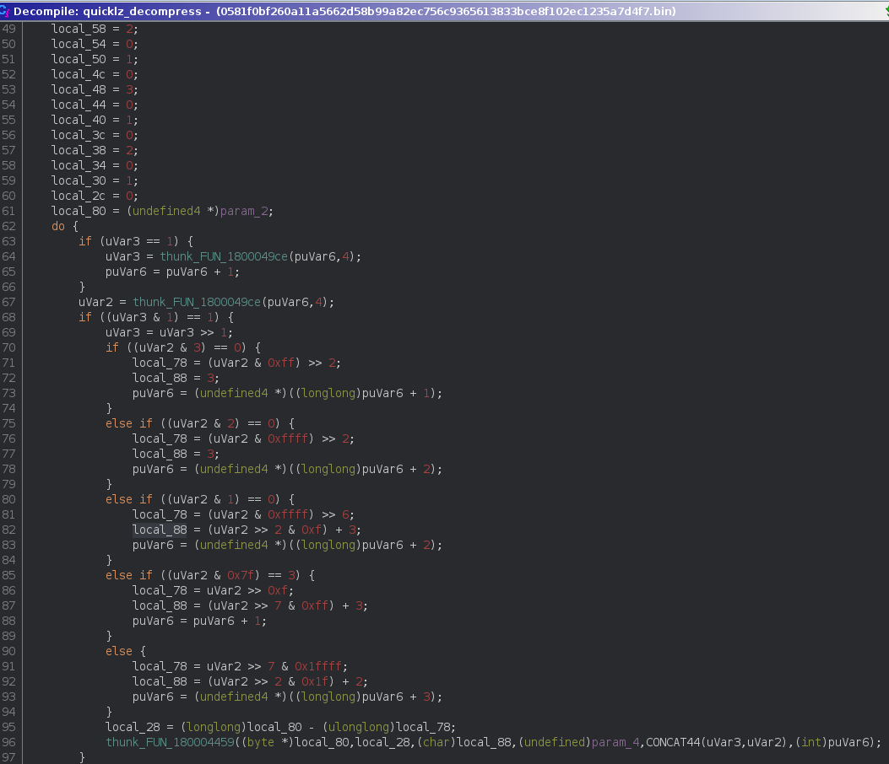
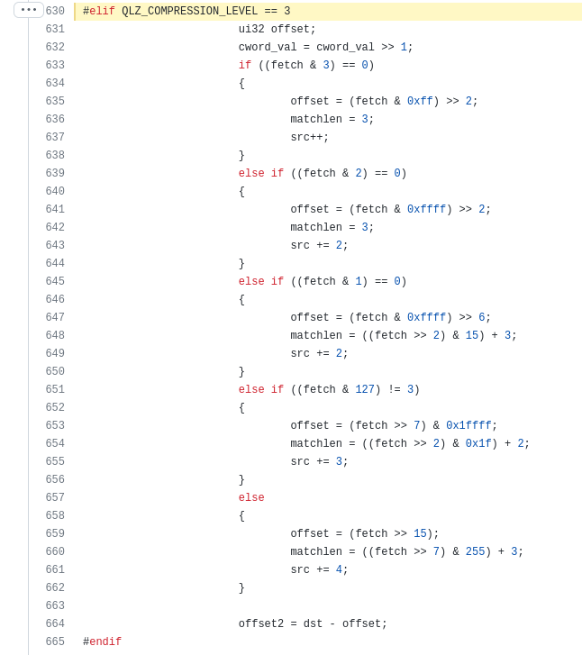
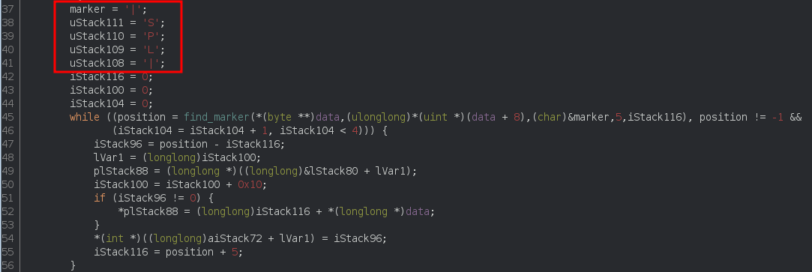

It started with [0verfl0w](https://twitter.com/0verfl0w_) posting a small challenge on the [Zero 2 Automated](https://courses.zero2auto.com/) discord server asking to automatically extract the
configuration of an unpacked IcedID sample ([0581f0bf260a11a5662d58b99a82ec756c9365613833bce8f102ec1235a7d4f7](https://bazaar.abuse.ch/sample/0581f0bf260a11a5662d58b99a82ec756c9365613833bce8f102ec1235a7d4f7/)).

Unpacking the sample was part of the exercise but could be done manually as a one shot, however the more I looked into the stager, the more i thought an automated unpacker would be a fun thing
to do.

I'll skip over some details of the stager (like API hashing and injection) to focus only on the unpacking part.

*TL;DR: full code is available here: [https://github.com/matthw/icedid_stage1_unpack](https://github.com/matthw/icedid_stage1_unpack).*

# 1. Structure and Flow

The packed data are really easy to identify: there's a huge hex string in the data section, and by hex string i a mean littleral string of [0-9a-f] characters.

```
[...]
000af670  33 62 36 64 34 39 61 61  36 35 33 36 31 34 64 65  |3b6d49aa653614de|
000af680  33 31 62 32 66 64 37 31  65 64 38 66 61 30 37 63  |31b2fd71ed8fa07c|
000af690  63 34 30 39 64 64 34 38  61 65 36 35 38 39 31 61  |c409dd48ae65891a|
000af6a0  63 36 33 61 30 39 39 36  31 38 61 63 38 35 30 33  |c63a099618ac8503|
000af6b0  62 34 32 37 39 31 36 63  66 36 31 66 31 31 33 30  |b427916cf61f1130|
000af6c0  37 66 35 39 30 35 33 31  65 37 37 39 35 34 31 33  |7f590531e7795413|
000af6d0  63 64 31 62 32 30 00 00  00 00 00 00 00 00 00 00  |cd1b20..........|
```

The unpacking process is as follow:

```
             ┌────────────┐
             │            │
             │ Hex Decode │
             │            │
             └─────┬──────┘
                   │
                   │
             ┌─────▼──────┐
             │            │
       ┌─────┤    RC4     │
       │     │            │
       │     └─────┬──────┘
       │           │
       │           │
┌──────▼─────┐     │
│            │     │
│     XOR    │     │
│ (optionnal)│     │
│            │     │
└─────┬──────┘     │
      │            │
      │            │
      │      ┌─────▼──────┐
      │      │            │
      └──────►  QuickLZ   │
             │(decompress)│
             │            │
             └─────┬──────┘
                   │
                   │
             ┌─────▼──────┐
             │            │
             │   Split    │
             │            │
             └────────────┘
```

The control flow at assembly level is very obfuscated, so the decompiler comes handy even if it doesn't produces perfect results.




## 1.1. Hex decode

The first step is to decode the hex string:

```C
            for (i = 0; i < length; i = i + 2) {
                chr = hexencoded_data[i];
                next_chr = hexencoded_data[i + 1];
                
                v1 = is_valid_hex_chr(chr);
                
                /* not an hex digit, ciao */
                if ((v1 == 0) || (v1 = is_valid_hex_chr(next_chr), v1 == 0)) {
                    memset((ulonglong)destination,0,0x10,uVar2,chr,length);
                    get_TEB();
                    (*RtlFreeHeap)();
                    return 0;
                }

                /

                /* convert 1st ascii chr to hex value, ex: 'a' -> 0xa */
                v1 = hex_digit_to_int(chr);
                /* 0xa -> 0xa0 */
                high4 = (byte)(v1 << 4);

                /* convert 2nd ascii chr to hex value '8' -> 0x8 */
                low4 = hex_digit_to_int(next_chr);

                /* make it a byte: 0xa0 | 0x8 == 0xa8 */
                *(byte *)(*destination + (i >> 1)) = high4 | (byte)low4;
            }
```

this is a plain equivalent to python's ```bytes.fromhex(...)```

## 1.2. RC4

The RC4 routine is easily identified:



The parameters 4 and 5 are respectively a pointer to the key and the length of the key (which is always 4 apparently).

## 1.3. XOR

The XOR was not present in all samples i checked, but when applied, it reuses the RC4 key.


It looks intimidating but in reality it can be translated to:

```python
    for x in range(len(data) - 1): 
        data[x] = ((data[x] ^ key[x % len(key)]) - data[x + 1]) & 0xff
```


## 1.3. QuickLZ

The QuickLZ part was harder to identify.
On the first sample I analyzed, there was no compression applied, so at this point the
decrypted data looked OK

I could find a valid PE file inside the decrypted data:
```
00000db0  7c 4d 5a 90 00 03 00 00  00 04 00 00 00 ff ff 00  ||MZ.............|
00000dc0  00 b8 00 00 00 00 00 00  00 40 00 00 00 00 00 00  |.........@......|
00000dd0  00 00 00 00 00 00 00 00  00 00 00 00 00 00 00 00  |................|
00000de0  00 00 00 00 00 00 00 00  00 00 00 00 00 d0 00 00  |................|
00000df0  00 0e 1f ba 0e 00 b4 09  cd 21 b8 01 4c cd 21 54  |.........!..L.!T|
00000e00  68 69 73 20 70 72 6f 67  72 61 6d 20 63 61 6e 6e  |his program cann|
00000e10  6f 74 20 62 65 20 72 75  6e 20 69 6e 20 44 4f 53  |ot be run in DOS|
00000e20  20 6d 6f 64 65 2e 0d 0d  0a 24 00 00 00 00 00 00  | mode....$......|
00000e30  00 21 c9 10 93 65 a8 7e  c0 65 a8 7e c0 65 a8 7e  |.!...e.~.e.~.e.~|
```

but i still noticed some kind of header at the very beginning of the extracted data, and that
the dword starting at offset 1 was actually the size of the data blob


I thought it was some kind of internal structure I could just ignore, until I started
having issues with some samples where the embedded PE file seemed corrupt:

```
00000c40  3e eb df 8f 46 03 4d 5a  90 00 03 f3 03 00 80 46  |>...F.MZ.......F|
00000c50  8a 10 ff ff cd 17 20 c6  00 06 93 fb 01 00 0b f2  |...... .........|
00000c60  03 0e 1f ba 0e 00 b4 09  cd 21 b8 01 4c cd 21 54  |.........!..L.!T|
00000c70  68 69 73 20 70 72 00 00  00 80 6f 67 72 61 6d 20  |his pr....ogram |
00000c80  63 61 6e 6e 6f 74 20 62  65 20 72 75 6e 20 69 6e  |cannot be run in|
00000c90  20 44 4f 53 20 6d 6f 64  65 20 40 10 c4 2e 0d 0d  | DOS mode @.....|
00000ca0  0a 24 12 11 21 c9 10 93  65 a8 7e c0 16 01 42 6e  |.$..!...e.~...Bn|
00000cb0  05 c0 67 20 16 ca 7f c1  6e 0a 05 7f c0 4f 20 08  |..g ....n....O .|
00000cc0  0a 07 88 83 cc 7a 0a 04  83 cc 7e c1 64 0a 02 7c  |.....z....~.d..||
00000cd0  0a 02 52 69 63 68 06 0e  16 25 8b 5e 03 64 86 07  |..Rich...%.^.d..|
```

After some time staring at the code, it turned out that it's using [QuickLZ](http://www.quicklz.com/).

Major pointers were:
- the header format, as described [here](https://github.com/ReSpeak/quicklz/blob/master/Format.md):
```
┌─────╥──╥──╥──╥──╥──╥──╥──╥──┐
│Flags║ Comp size ║ Dec size  │
└─────╨──╨──╨──╨──╨──╨──╨──╨──┘
```

- finding code like this


looking very very similar to [https://github.com/sergey-dryabzhinsky/python-quicklz/blob/master/quicklz.c#L630](https://github.com/sergey-dryabzhinsky/python-quicklz/blob/master/quicklz.c#L630)


Luckily for us there's python bindings for QuickLZ, which work just fine: [https://pypi.org/project/pyquicklz/](https://pypi.org/project/pyquicklz/).

## 1.4 Split

The decrypted data blob can be split at every occurences of the ```|SPL|``` marker, the string is build on the stack:



I kind of skipped the details in my analysis because i do not need them for now.


# 2. Automating

Right now we have everything we need for unpacking:
- the data blob is easy to grab from the data section, with a regex for example
- RC4 is vanilla
- the XOR is easy to implement
- QuickLZ has python bindings

The only thing we need to be able to recover is the RC4/XOR key, and that's where the fun begins.

The key is not stored as data, instead it's computed in the code and stored on the stack:


so in this case the key is:
```python
>>> p32(0x11c7425e + 0x68)
b'\xc6B\xc7\x11'
```

## 2.1. Failed Approach

my first approach was to match the bytes using a YARA rule like:
```
            rule key {
                strings:
                    // C74424 34 5E42C711       | mov dword ptr ss:[rsp+34],11C7425E
                    // 834424 34 68             | add dword ptr ss:[rsp+34],68
                    $instr = { C7 44 24 ?? ?? ?? ?? ?? 8? ?? 24 ?? ?? }
                condition:
                    $instr
            }
```

emulate all the matches with [unicorn](https://www.unicorn-engine.org/), fetch the result from the stack and try all values as keys.

The key grabbing looked like this and worked on some samples:

```python
def emulate(code):
    """ emulate the potential key instruction and return
    whatever 4 byte value is on the stack (or None)
    """
    ADDR_TEXT  = 0x1000000
    ADDR_STACK = 0x7000000

    mu = Uc(UC_ARCH_X86, UC_MODE_64)
    mu.mem_map(ADDR_TEXT, 0x1000)
    mu.mem_map(ADDR_STACK, 0x1000)

    # copy code
    mu.mem_write(ADDR_TEXT, code)

    # init rsp
    mu.reg_write(UC_X86_REG_RSP, ADDR_STACK)

    # emulate
    try:
        mu.emu_start(ADDR_TEXT, ADDR_TEXT + len(code))
    except unicorn.UcError:
        pass

    # read stack
    stack = mu.mem_read(ADDR_STACK, 0x100)


    # assume there's no null byte
    for v in [stack[i:i+4] for i in range(0, len(stack), 4)]:
        if u32(v) != 0:
            return bytes(v)

    return None


def find_keys(pe):
    ''' find potential instructions setting the key
    '''
    # find .text
    data = get_section(pe, '.text')

    rule = yara.compile(source="""
            rule key {
                strings:
                    // C74424 34 5E42C711       | mov dword ptr ss:[rsp+34],11C7425E
                    // 834424 34 68             | add dword ptr ss:[rsp+34],68
                    $instr = { C7 44 24 ?? ?? ?? ?? ?? 8? ?? 24 ?? ?? }
                condition:
                    $instr
            }""")

    finds = rule.match(data=data)

    # potential code snippet setting the key
    key_code = []
    for find in finds['main'][0]['strings']:
        offset = find['offset']
        string = data[offset:offset+16]
        if string[3] == string[11]:
            #print(string)
            key_code.append(string)


    potential_keys = []
    for code in key_code:
        print("--- emulating:")
        #disasm(code)
        key = emulate(code)

        # assume no null byte in key
        if key is not None and not b'\x00' in key:
            potential_keys.append(key)

    return potential_keys
```

```
 ./unpack2.py 0581f0bf260a11a5662d58b99a82ec756c9365613833bce8f102ec1235a7d4f7.bin
--- emulating:
0x1000:	mov	dword ptr [rsp + 0x20], 4
0x1008:	add	dword ptr [rsp + 0x20], 0
0x100d:	jmp	0x1067
--- emulating:
0x1000:	mov	dword ptr [rsp + 0x34], 0x11c7425e
0x1008:	add	dword ptr [rsp + 0x34], 0x68
--- emulating:
0x1000:	mov	dword ptr [rsp + 0x14], 0xa6
0x1008:	add	dword ptr [rsp + 0x14], 0x5a
--- emulating:
0x1000:	mov	dword ptr [rsp + 0x20], 1
0x1008:	add	dword ptr [rsp + 0x20], 0
0x100d:	jmp	0x101f
--- emulating:
0x1000:	mov	dword ptr [rsp + 0x60], 0
0x1008:	add	dword ptr [rsp + 0x60], 2
0x100d:	jmp	0xfda
--- emulating:
0x1000:	mov	dword ptr [rsp + 0x50], 2
0x1008:	add	dword ptr [rsp + 0x50], 2
0x100d:	cmp	bl, bl
--- emulating:
0x1000:	mov	dword ptr [rsp + 0x70], 0
0x1008:	add	dword ptr [rsp + 0x70], 3
0x100d:	cmp	bp, bp
--- emulating:
0x1000:	mov	dword ptr [rsp + 0x28], 0x800000e0
0x1008:	sub	dword ptr [rsp + 0x28], 0xe0
--- emulating:
0x1000:	mov	dword ptr [rsp + 0x28], 0x800000e0
0x1008:	sub	dword ptr [rsp + 0x28], 0xe0
--- emulating:
0x1000:	mov	dword ptr [rsp + 0x44], 0
0x1008:	add	dword ptr [rsp + 0x44], 3
--- emulating:
0x1000:	mov	dword ptr [rsp + 0x24], 4
0x1008:	add	dword ptr [rsp + 0x24], 0
0x100d:	jmp	0x1073
--- emulating:
0x1000:	mov	dword ptr [rsp + 0x28], 0x800000e0
0x1008:	sub	dword ptr [rsp + 0x28], 0xe0
--- emulating:
0x1000:	mov	dword ptr [rsp + 0x24], 3
0x1008:	add	dword ptr [rsp + 0x24], 1
0x100d:	jmp	0x1086
--- emulating:
0x1000:	mov	dword ptr [rsp + 0x24], 1
0x1008:	add	dword ptr [rsp + 0x24], 0
0x100d:	jmp	0x100f
--- emulating:
0x1000:	mov	dword ptr [rsp + 0x28], 1
0x1008:	add	dword ptr [rsp + 0x28], 0
0x100d:	jmp	0x1050
0x100f:	nop
--- emulating:
0x1000:	mov	dword ptr [rsp + 0x28], 3
0x1008:	add	dword ptr [rsp + 0x28], 1
0x100d:	jmp	0xff6
--- emulating:
0x1000:	mov	dword ptr [rsp + 0x28], 0x7ffffa1
0x1008:	add	dword ptr [rsp + 0x28], 0x5f
0x100d:	cmp	di, di
found 1 potential keys: [b'\xc6B\xc7\x11']
got 0x4c04b data blob
decrypted data
- dump 0581f0bf260a11a5662d58b99a82ec756c9365613833bce8f102ec1235a7d4f7.bin.dump
found 5 elements
- dumped 0581f0bf260a11a5662d58b99a82ec756c9365613833bce8f102ec1235a7d4f7.bin.extracted.0
- dumped 0581f0bf260a11a5662d58b99a82ec756c9365613833bce8f102ec1235a7d4f7.bin.extracted.1
- dumped 0581f0bf260a11a5662d58b99a82ec756c9365613833bce8f102ec1235a7d4f7.bin.extracted.2
- dumped 0581f0bf260a11a5662d58b99a82ec756c9365613833bce8f102ec1235a7d4f7.bin.extracted.3
- dumped 0581f0bf260a11a5662d58b99a82ec756c9365613833bce8f102ec1235a7d4f7.bin.extracted.4
```

until the flow obfuscation of some samples brought even more fun to the party by putting a jump right in the middle of the key setting:


rendering my initial and pretty naive approach useless.


## 2.2. Angr

I only played with [angr](https://angr.io/) before to solve crackmes and CTF challenges, and I wanted to do something else with it to practice (because let's face it, i'm pretty bad with angr).

To quote their website:
```
angr is an open-source binary analysis platform for Python.
It combines both static and dynamic symbolic ("concolic") analysis, providing tools to solve a variety of tasks.
```

My new goal was:
- Identify the RC4 function using some heuristics
- Walk the control-flow graph (CFG) up to find where it's called from
- Execute the function(s) calling the RC4 function up to the actual call
- Get the key

```
                              ┌────────────────────────────────────────────┐
                              │   FUNCTION WHATEVER                        │
                              │                                            │
                              ├────────────────────────────────────────────┤    step5: emulate from
                              │                                            ├────┐    0x0332 (function start)
                     ┌───────►│  0x0332    INSTR1                          │    │     to
step4: find function │        │  0x0334    INSTR2                          │    │    0x0456 (call rc4)
          start addr │        │     etc...                                 │    │
            0x332    │        │     ...                                    │    │
                     └────────┤     ...                                    │    │
                              │     ...                                    │    │
                     ┌───────►│  0x0456    CALL POTENTIAL_RC4              │ ◄──┘
                     │        │     ...                                    │    step6: dump the key parameter
                     │        │     ...                                    │
                     │        │     ...                                    │
step3: find XREF     │        │                                            │
       for 0x1234    │        │                                            │
       ->  0x0456    │        │                                            │
                     │        └────────────────────────────────────────────┘
                     │
                     │
                     │
                     │        ┌────────────────────────────────────────────┐
                     │        │   FUNCTION POTENTIAL_RC4                   │
                     └────────┤                                            │
                              ├────────────────────────────────────────────┤
                              │                                            │
                     ┌──────► │ 0x1234     INSTR1                          │
                     │        │ 0x1236     INSTR2                          │
step2: find function │        │     etc...                                 │
          start addr │        │                                            │   step1: find offset with
            0x1234   │        │    ─────┐ ◄────────────────────────────────┼────────  heuristic (0x1430)
                     │        │ 0x1430  │  xor     eax, ecx                │
                     └────────┤ 0x1432  │  movsxd  rcx, dword [var_18h_2]  │
                              │   ──────┘                                  │
                              │                                            │
                              │                                            │
                              └────────────────────────────────────────────┘
```


Luckily ```angr``` can provide a CFG and has a sense of "*function*".

We can define a project and get the CFG:

```python
        self.prj = angr.Project(filename, load_options={'auto_load_libs': False})
        self.cfg = self.prj.analyses.CFGFast()
```


### 2.2.1. Finding the RC4 Function

I used some loosy heuristic to find the RC4 but it seems to work well:

```python
       # find .text
        section = get_section(self.pe, '.text')
        data = section.get_data()

        # oddly enough this seems to match the rc4 function
        # fairly accurately
        # like
        # 0x1800027c2      33c1                   xor     eax, ecx
        # 0x1800027c4      48634c2418             movsxd  rcx, dword [var_18h_2]
        # or
        # 0x180004242      0fb68c0cd0000000       movzx   ecx, byte [rsp + rcx + 0xd0]
        # 0x18000424a      33c1                   xor     eax, ecx
        # 0x18000424c      e974feffff             jmp     0x1800040c5 ; fcn.180003bbf+0x506
        rule = yara.compile(source="""
            rule rc4 {
                strings:
                    //$s1 = { 33 c1 }
                    $s2 = { 33 c1 48 63 4c 24 ?? }
                    $s3 = { 33 c1 (e9 | 3a) }
                condition:
                    $s2 or $s3
            }""")


        # get matching offsets
        finds = rule.match(data=data)
```

Then we just need to fix the offsets - which are relative to the start of ```.text```, so they match the RVA:

```python
        offsets = []
        for find in finds['main'][0]['strings']:
            # offset are relative to .text, rebase them
            off = self.pe.OPTIONAL_HEADER.ImageBase + section.VirtualAddress + find['offset']
            offsets.append(off)
```

Using these offsets, we can find the start of the function they live in:

```python
        for offset in offsets:
            # find function containg the offset
            func = self.find_func_addr(offset)

            if func is None:
                print("skip 0x%x: not part of a func..."%offset)
                continue

            if not len(func.predecessors):
                print("skip 0x%x: no predecessor..."%offset)
                continue

            if len(func.predecessors) > 2:
                print("skip 0x%s: too many predecessors (%d)"%(func.addr, len(func.predecessors)))
                continue


            print("found potential rc4 code: 0x%x"%func.addr)
```

We discard the offsets if:
- they do not belong to a function
- they belong to a function with no predecessors (meaning it's not called)
- they belong to a function with more than 2 predecessors (called from more than 2 different places)
  - *the RC4 function should only be called from one place - 2 is being conservative*


Now that we have the start address of a *potential* RC4 function, we need to:
- find the XREF (the ```CALL rc4```)
- find the calling function start address 

Which is just repeating what we just did:

```python
            # list of (start_addr, stop_addr) to emulate
            explorer = []


            for pred in func.predecessors:
                caller = self.find_func_addr(pred.addr)

                # skip some cases where start_addr == stop_addr
                if caller is not None and caller.addr != pred.addr:
                    explorer.append((caller.addr, pred.addr))
                    print(" * found caller (0x%x -> 0x%x)"%(caller.addr, pred.addr))
```

At this stage, we should have a list in the form of:
```
explorer = [
    (addr_start_func1, addr_call_rc4_in_func1),
    (addr_start_func2, addr_call_rc4_in_func2),
    ...
]
```

We can just emulate from the ```function start address``` to the ```call rc4 function address``` and dump the key from register ```r9``` (according to the [x64 fastcall convention](https://docs.microsoft.com/en-us/cpp/build/x64-calling-convention?view=msvc-170), r9 holds the 4th parameter - the pointer to the key in our case).


### 2.2.2. Emulation


The emulation goes as follow:
- create an initial state simulating a function call at our start address
  * *we use the ```CALLLESS``` option to skip over function calls as they are not related to the key computation*
```python
state = self.prj.factory.call_state(addr=start_addr)
state.options.add(angr.options.CALLLESS)
```

- create a ```Simulation Manager``` and then ```step``` until one of the state reachs our destination address
```python
simgr = self.prj.factory.simulation_manager(state)

while True:
    simgr.step()
    for state in simgr.active:
        key = self.check_state(state, stop_addr)
        if key is not None:
            return key
```

with a few extra conditions to avoid looping when there's no active path left or when the paths gets too complex (arbitrary pick), it looks like this:


```python
    def emulate(self, start_addr, stop_addr, max_iter=3000):
        """ symbolic execution from start_addr to stop_addr.
        max_iter is the maximum number of instructions

        return None if failed, or [r9]
        """
        print("emulating from 0x%x to 0x%x (max iter = %s)"%(start_addr, stop_addr, max_iter))
        state = self.prj.factory.call_state(addr=start_addr)

        # no function call
        state.options.add(angr.options.CALLLESS)

        simgr = self.prj.factory.simulation_manager(state)

        while True:
            # advance all states by one basic block
            simgr.step()
            max_iter -= 1

            # very arbitrary picks
            # we shouldnt run into too complex paths
            if not max_iter or len(simgr.active) > 10 or not len(simgr.active):
                return None

            # check each active
            for state in simgr.active:
                key = self.check_state(state, stop_addr)
                if key is not None:
                    return key

        return None
```


The ```check_state``` function will check if the current state address is the destination address, and if so, will dereference the value of the R9 register (4th parameter)
and read a DWORD in there.

I assume the key is always 4 bytes long, however should it not be the case, its length can be read from the stack (5th function parameter).

```python
    def check_state(self, state, stop_addr):
        """ check if a state reached the expected address)
            hook potential call with unconstrained destinatinations

            returns the key if arrived at destination
        """

        # final destination
        #if state.addr in range(stop_addr, stop_addr+8):
        if state.addr == stop_addr:
            # dereference r9 register and read a DWORD
            # we assume the key is 4 bytes, we could read its size off the stack
            return p32(state.solver.eval(state.mem[state.regs.r9].uint32_t.resolved))

```


There's an extra twist in the ```check_state``` function.

The sample uses API hashing to resolve api proc addresses, and we explicitly told angr to skip function calls (*CALLLESS*).
The effect of the CALLLESS flag is that the return value of all function calls will be unconstrained (symbolic).

So what should have been:
```
address = get_proc_address(0x12345678) // return 0x18032323
(*0x12345678)(arg1, arg2)
```

becomes:

```
address = get_proc_address(0x12345678) // return some symbolic constant
(*????????)(arg1, arg2)
```

and basically angr stops because there's too many possible paths (for some reason, even with the ```CALLLESS```flag).


call to resolved function (call to a stack address):


My work around to that was to hook all ```CALL```instructions to a temp address by:
- checking if the node successor is reached via a call:
```python
if block.vex.jumpkind == 'Ijk_Call':
```

- then checking if the call uses a temp value:
```python
if block.vex.next.tag == 'Iex_RdTmp':
```

- looping over the block instruction to find the actuall call and hooking it with something of ours:
```python
                for insn in self.prj.factory.block(block.addr).capstone.insns:
                    if insn.mnemonic == 'call':
                        if insn.address not in self.hooks:
                            print("hooking addr=0x%x size=%s"%(insn.address, insn.size))
                            self.prj.hook(insn.address, hook_api_hash, length=insn.size)
                            # in order to avoid hook twice // angr would warn anyway
                            self.hooks.append(insn.address)
```

The hook is very simple and looks like that:
```python
def hook_api_hash(state):
    """ hook register calls with this
    """
    # symbolize return value
    state.regs.rax = claripy.BVS('ret', 64)
```

The full ```check_state``` function looks like this:
```python
    def check_state(self, state, stop_addr):
        """ check if a state reached the expected address)
            hook potential call with unconstrained destinatinations

            returns the key if arrived at destination
        """

        # final destination
        #if state.addr in range(stop_addr, stop_addr+8):
        if state.addr == stop_addr:
            # dereference r9 register and read a DWORD
            # we assume the key is 4 bytes, we could read its size off the stack
            return p32(state.solver.eval(state.mem[state.regs.r9].uint32_t.resolved))


        #
        # hook registers calls (api hashing)
        # we want to hook all "call $tmp", otherwise angr gets lost
        # even with angr.options.CALLLESS
        #
        try:
            block = state.block()
        except angr.errors.SimEngineError:
            return None

        # verify that the block ends with a call
        if block.vex.jumpkind == 'Ijk_Call':
            # the next block is based on tmp value
            if block.vex.next.tag == 'Iex_RdTmp':
                # iterates over block instructions to find the call addr and size
                for insn in self.prj.factory.block(block.addr).capstone.insns:
                    if insn.mnemonic == 'call':
                        if insn.address not in self.hooks:
                            print("hooking addr=0x%x size=%s"%(insn.address, insn.size))
                            self.prj.hook(insn.address, hook_api_hash, length=insn.size)
                            # in order to avoid hook twice // angr would warn anyway
                            self.hooks.append(insn.address)

        return None
```


in the end we, we can just loop over the ```(start_addr, stop_addr)``` tupples, to get a list of potential RC4 keys:

```python
        # emulate all potential calls
        potential_keys = []

        for start, stop in explorer:
            # emulate
            key = self.emulate(start, stop)
            if key:
                potential_keys.append(key)

        return potential_keys
```

## 2.3. Decrypting

now that we constructed a list of potential keys, we can just try them all.
using the QuickLZ header, we can know that we found a correct one by matching the size of the data with what's in the header:

```python
def try_to_decrypt(data, potential_keys):
    ''' try all keys with xor and without
        it seems the xor is not always applied
    '''
    for key in potential_keys:
        for apply_xor in [True, False]:
            print("trying key %r / xor=%r"%(key, apply_xor))
            dec = decrypt(data, key, apply_xor)
            if dec is not None:
                return dec

    return None


def decrypt(data, key, apply_xor):
    ''' decrypt + decompress data
    '''

    # RC4 decrypt
    cipher = ARC4(key)
    dec = bytearray(cipher.decrypt(data))

    # dexor
    if apply_xor:
        for x in range(len(dec) - 1):
            dec[x] = ((dec[x] ^ key[x % len(key)]) - dec[x + 1]) & 0xff

    # Quick check we got valid data
    # ref: quicklz format: https://github.com/ReSpeak/quicklz/blob/master/Format.md
    # DWORD at decrypted data+1 should be the length
    if u32(dec[1:5]) == len(data):
        return quicklz.decompress(bytes(dec))
```

The XOR pass doesn't seem to always be applied, so we try with and without.


# 3. C2 Extraction

Extracting the C2 address and campain ID from the unpacked PE is pretty straight forward.

We just need to XOR 2 32 bytes data blob (from the ```.d``` section) with each other:


```python
def extract_c2(filename):
    pe = pefile.PE(filename)

    data = get_section(pe, ".d").get_data()
    key = data[:0x20]
    conf = data[0x40:0x40+0x20]
    data = xor(key, conf)

    camp = u32(data[:4])
    c2 = data[4:].split(b'\x00')[0]

    return {'campaign_id': camp, 'c2': c2}
```

# 4. Showcase

```
% ./icedid_stage1_unpack.py 0581f0bf260a11a5662d58b99a82ec756c9365613833bce8f102ec1235a7d4f7.bin
got data blob: 0x4c04b bytes
found potential rc4 code: 0x1800026b3
 * found caller (0x180001b77 -> 0x180001bc0)
emulating from 0x180001b77 to 0x180001bc0 (max iter = 3000)
found 1 potential keys: [b'\xc6B\xc7\x11']
trying key b'\xc6B\xc7\x11' / xor=True
decrypted data: 0x4c042 bytes
found 5 elements
- dumped 0581f0bf260a11a5662d58b99a82ec756c9365613833bce8f102ec1235a7d4f7.bin.extracted.0
- dumped 0581f0bf260a11a5662d58b99a82ec756c9365613833bce8f102ec1235a7d4f7.bin.extracted.1
- dumped 0581f0bf260a11a5662d58b99a82ec756c9365613833bce8f102ec1235a7d4f7.bin.extracted.2
    looks like a PE... {'campaign_id': 109932505, 'c2': b'ilekvoyn.com'}
- dumped 0581f0bf260a11a5662d58b99a82ec756c9365613833bce8f102ec1235a7d4f7.bin.extracted.3
- dumped 0581f0bf260a11a5662d58b99a82ec756c9365613833bce8f102ec1235a7d4f7.bin.extracted.4
```


```
% ./icedid_stage1_unpack.py samples/17aeebe6c1098a312074b0fdeae6f97339f2d64d66a2b07496bfc1373694a4e3.bin
got data blob: 0x3820 bytes
found potential rc4 code: 0x180003fc1
 * found caller (0x1800011c3 -> 0x180001507)
emulating from 0x1800011c3 to 0x180001507 (max iter = 3000)
found 1 potential keys: [b'k\xfe\xfa\x8b']
trying key b'k\xfe\xfa\x8b' / xor=True
trying key b'k\xfe\xfa\x8b' / xor=False
decrypted data: 0x5714 bytes
found 4 elements
- dumped samples/17aeebe6c1098a312074b0fdeae6f97339f2d64d66a2b07496bfc1373694a4e3.bin.extracted.0
- dumped samples/17aeebe6c1098a312074b0fdeae6f97339f2d64d66a2b07496bfc1373694a4e3.bin.extracted.1
- dumped samples/17aeebe6c1098a312074b0fdeae6f97339f2d64d66a2b07496bfc1373694a4e3.bin.extracted.2
    looks like a PE... {'campaign_id': 429479428, 'c2': b'arelyevennot.top'}
- dumped samples/17aeebe6c1098a312074b0fdeae6f97339f2d64d66a2b07496bfc1373694a4e3.bin.extracted.3
```


```
% ./icedid_stage1_unpack.py samples/12a692718d21b8dc3a8d5a2715688f533f1a978ee825163d41de11847039393d.bin
got data blob: 0x16064 bytes
skip 0x6442458550: too many predecessors (4)
found potential rc4 code: 0x180003bbf
 * found caller (0x1800016bf -> 0x180001980)
emulating from 0x1800016bf to 0x180001980 (max iter = 3000)
hooking addr=0x18000184b size=7
hooking addr=0x180001c19 size=7
hooking addr=0x180001c09 size=7
hooking addr=0x180001bdc size=7
found 1 potential keys: [b',u\xe2I']
trying key b',u\xe2I' / xor=True
decrypted data: 0x179f7 bytes
found 5 elements
- dumped samples/12a692718d21b8dc3a8d5a2715688f533f1a978ee825163d41de11847039393d.bin.extracted.0
- dumped samples/12a692718d21b8dc3a8d5a2715688f533f1a978ee825163d41de11847039393d.bin.extracted.1
- dumped samples/12a692718d21b8dc3a8d5a2715688f533f1a978ee825163d41de11847039393d.bin.extracted.2
    looks like a PE... {'campaign_id': 3068011852, 'c2': b'yolneanz.com'}
- dumped samples/12a692718d21b8dc3a8d5a2715688f533f1a978ee825163d41de11847039393d.bin.extracted.3
- dumped samples/12a692718d21b8dc3a8d5a2715688f533f1a978ee825163d41de11847039393d.bin.extracted.4
```


The extracted data blobs are:
- 2 shellcodes
- 1 DLL
- 1 or 2 images:

```
% file 0581f0bf260a11a5662d58b99a82ec756c9365613833bce8f102ec1235a7d4f7.bin.extracted.*
0581f0bf260a11a5662d58b99a82ec756c9365613833bce8f102ec1235a7d4f7.bin.extracted.0: data
0581f0bf260a11a5662d58b99a82ec756c9365613833bce8f102ec1235a7d4f7.bin.extracted.1: data
0581f0bf260a11a5662d58b99a82ec756c9365613833bce8f102ec1235a7d4f7.bin.extracted.2: PE32+ executable (DLL) (GUI) x86-64, for MS Windows
0581f0bf260a11a5662d58b99a82ec756c9365613833bce8f102ec1235a7d4f7.bin.extracted.3: JPEG image data, JFIF standard 1.01, resolution (DPI), density 72x72, segment length 16, baseline, precision 8, 800x600, components 3
0581f0bf260a11a5662d58b99a82ec756c9365613833bce8f102ec1235a7d4f7.bin.extracted.4: JPEG image data, Exif Standard: [TIFF image data, big-endian, direntries=7, software=Adobe Photoshop 21.2 (Windows), datetime=2021-03-25T08:49:36+07:00], baseline, precision 8, 800x800, components 3
```

# 5. Conclusion

While it is certainly not the most optimal method to unpack the samples, it was a fun exercise to do.

The full code is available here: [https://github.com/matthw/icedid_stage1_unpack](https://github.com/matthw/icedid_stage1_unpack).


