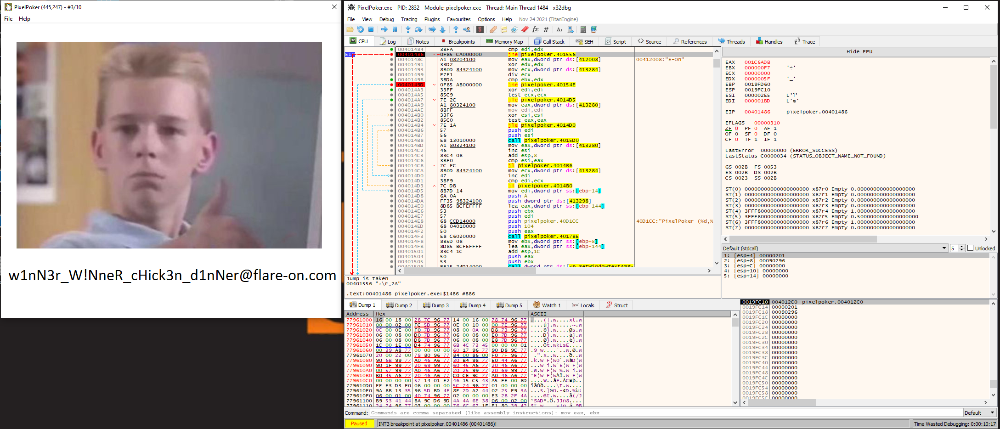

Here are (some ?) writeups for this year Flare-On challenge.
I'll add more in the coming days.

For reference here is my timing:


# 0. TOC


1. [Flaredle](#1-flaredle)

2. [PixelPoker](#2-pixelpoker)

3. [Magic 8 Ball](#3-magic-8-ball)

4. [darn_mice](#4-darn_mice)

5. [T8](#5-t8)

6. [a la mode](#6-a-la-mode)

7. [anode](#7-anode)

8. [backdoor](#8-backdoor)

9. [encryptor](#9-encryptor)

10. [Nur getraumt](#10-nur-getraumt)

11. [The challenge that shall not be named](#11-the-challenge-that-shall-not-be-named)


# 1. Flaredle

## 1.1 Challenge Prompt

Welcome to Flare-On 9!

You probably won't win. Maybe you're like us and spent the year playing Wordle. We made our own version that is too
hard to beat without cheating.

## 1.2 Solution

Small javascript webapp where we need to guess a word.

Open ```script.js```, starts with:

```javascript
import { WORDS } from "./words.js";

const NUMBER_OF_GUESSES = 6;
const WORD_LENGTH = 21;
const CORRECT_GUESS = 57;
let guessesRemaining = NUMBER_OF_GUESSES;
let currentGuess = [];
let nextLetter = 0;
let rightGuessString = WORDS[CORRECT_GUESS];
```

find correct flag condition:

```javascript
    if (guessString === rightGuessString) {
        let flag = rightGuessString + '@flare-on.com';
        toastr.options.timeOut = 0;
        toastr.options.onclick = function() {alert(flag);} 
        toastr.success('You guessed right! The flag is ' + flag);
        
        guessesRemaining = 0
        return
    } 
```

we know that ```rightGuessString = WORDS[CORRECT_GUESS]``` and that ```CORRECT_GUESS = 57```, so we can just pick it up in the array from ```words.js```

```bash
% cat -n words.js | grep " $((57+1))"       # because array starts at 0
    58		'flareonisallaboutcats',
```


flag: ```flareonisallaboutcats@flare-on.com```


# 2. PixelPoker

## 2.1 Challenge Prompt

I said you wouldn't win that last one. I lied. The last challenge was basically a captcha. Now the real work begins. Shall
we play another game?

## 2.2 Solution

launching the executable, we get this fancy looking window.
We need to click the right pixel, and we have 10 attempts.


Following the entry point, we find the main function, which in turn calls

```C
void FUN_00401120(HINSTANCE param_1)

{
    WNDCLASSEXW wc;

    wc.cbSize = 0x30;
    wc.style = 3;
    wc.lpfnWndProc = WindowProc;
    wc.cbClsExtra = 0;
    wc.cbWndExtra = 0;
    wc.hInstance = param_1;
    wc.hIcon = LoadIconW(param_1,(LPCWSTR)0x6b);
    wc.hCursor = LoadCursorW(NULL,(LPCWSTR)0x7f00);
    wc.hbrBackground = (HBRUSH)0x6;
    wc.lpszMenuName = (LPCWSTR)0x6d;
    wc.lpszClassName = (LPCWSTR)&DAT_004131b0;
    wc.hIconSm = LoadIconW(wc.hInstance,(LPCWSTR)0x6c);
    RegisterClassExW(&wc);
    return;
}
```

which registers a window class, which lpfnWndProc pointing the Window Procedure, which will handle our window events.

References from MSDN:
- [Writing the Window Procedure](https://learn.microsoft.com/en-us/windows/win32/learnwin32/writing-the-window-procedure)
- [WM_LBUTTONDOWN message](https://learn.microsoft.com/en-us/windows/win32/inputdev/wm-lbuttondown)


With the above references, we can retype the WindowProc prototype in ghidra, as well as use the appropriate WM_* constants on the ```uMsg``` comparisons and then focus on the click events:

```C
LRESULT WindowProc(HWND hwnd,uint uMsg,WPARAM wParam,LPARAM lpParam)

{
    // snip

        sVar1 = (short)((uint)lpParam >> 0x10);

        if (uMsg == WM_MOUSEMOVE) {
            update_window_title(buff,0x104,"PixelPoker (%d,%d) - #%d/%d",(int)(short)lpParam,(int)sVar1,TRIES,10);
            SetWindowTextA(hwnd,buff);
            return 0;
        }

        if (uMsg == WM_LBUTTONDOWN) {
            px_x = (uint)(short)lpParam;
            px_y = (uint)sVar1;
            if (TRIES == 10) {
                MessageBoxA(NULL,"Womp womp... :(","Please play again!",0);
                DestroyWindow(hwnd);
            }
            else {
                TRIES = TRIES + 1;
                if ((px_x == s_FLARE-On_00412004._0_4_ % DAT_00413280) && (px_y == s_FLARE-On_00412004._4_4_ % DAT_00413284)) {
                    if (0 < (int)DAT_00413284) {
                        iVar7 = 0;
                        uVar4 = DAT_00413280;
                        uVar5 = DAT_00413284;
                        do {
                            iVar6 = 0;
                            if (0 < (int)uVar4) {
                                do {
                                    FUN_004015d0(iVar6,iVar7);
                                    iVar6 = iVar6 + 1;
                                    uVar4 = DAT_00413280;
                                    uVar5 = DAT_00413284;
                                } while (iVar6 < (int)DAT_00413280);
                            }
                            iVar7 = iVar7 + 1;
                        } while (iVar7 < (int)uVar5);
                    }
                }
                else if ((px_x < DAT_00413280) && (px_y < DAT_00413284)) {
                    FUN_004015d0(px_x,px_y);
                }
            }
            update_window_title(buff,0x104,"PixelPoker (%d,%d) - #%d/%d",px_x,px_y,TRIES,10);
            SetWindowTextA(hwnd,buff);
            pHVar2 = GetDC(hwnd);
            BitBlt(pHVar2,0,0,DAT_00413280,DAT_00413284,DAT_00413278,0,0,0xcc0020);
            ReleaseDC(hwnd,pHVar2);
            return 0;
        }
```

We can see than we the mouse is moved around the window (```WM_MOUSEMOVE``), the window title is updated with x/y coordinates.

On the click event (``WM_LBUTTONDOWN```), there's a conditionnal check

```C
if ((px_x == s_FLARE-On_00412004._0_4_ % DAT_00413280) && (px_y == s_FLARE-On_00412004._4_4_ % DAT_00413284)) {
```

which leads further down to some RC4 routine.

Let's run it in a debugger and patch the condition.


Fire x32dbg, set 2 breakpoints:

```
bp 00401486
bp 0040149d
```

Continue execution and click anywhere.
On the 2 breakpoints, modify the Zero Flag (ZF) and then watch the flag:




# 3. Magic 8 Ball

(coming soon ?)


# 4. darn_mice

## 4.1 Challenge Prompt

"If it crashes its user error."

-Flare Team

## 4.2 Solution

If we run the executable an arguments it prints something then exits:

```
C:\Users\me\Desktop>darn_mice.exe aaa
On your plate, you see four olives.
You leave the room, and a mouse EATS one!
```

We can find this string in ghidra and follow XREF to this function:

```C

void __cdecl main(PUCHAR input_string)

{
    size_t len;
    undefined extraout_DL;
    undefined extraout_DL_00;
    undefined uVar1;
    undefined uVar2;
    uint n;
    char some_array [36];
    uint stack_cookie;
    code *buffer;
    
    stack_cookie = DAT_00419178 ^ (uint)&stack0xfffffffc;
    buffer = NULL;
    some_array[0] = '\x50';
    some_array[1] = 0x5e;
    some_array[2] = 0x5e;
    some_array[3] = 0xa3;
    some_array[4] = 0x4f;
    some_array[5] = 0x5b;
    some_array[6] = 0x51;
    some_array[7] = 0x5e;
    some_array[8] = 0x5e;
    some_array[9] = 0x97;
    some_array[10] = 0xa3;
    some_array[11] = 0x80;
    some_array[12] = 0x90;
    some_array[13] = 0xa3;
    some_array[14] = 0x80;
    some_array[15] = 0x90;
    some_array[16] = 0xa3;
    some_array[17] = 0x80;
    some_array[18] = 0x90;
    some_array[19] = 0xa3;
    some_array[20] = 0x80;
    some_array[21] = 0x90;
    some_array[22] = 0xa3;
    some_array[23] = 0x80;
    some_array[24] = 0x90;
    some_array[25] = 0xa3;
    some_array[26] = 0x80;
    some_array[27] = 0x90;
    some_array[28] = 0xa3;
    some_array[29] = 0x80;
    some_array[30] = 0x90;
    some_array[31] = 0xa2;
    some_array[32] = 0xa3;
    some_array[33] = 0x6b;
    some_array[34] = 0x7f;
    some_array[35] = 0;

    print_str((wchar_t *)s_On_your_plate,_you_see_four_oliv_00419034,NULL);

    /* input length must be 35 chrs */
    len = _strlen((char *)input_string);
    if ((len == 0) || (35 < len)) {
        print_str((wchar_t *)s_No,_nevermind._0041905c,(char *)buffer);
        uVar2 = SUB41(buffer,0);
        uVar1 = extraout_DL;
    }
    else {
        print_str((wchar_t *)s_You_leave_the_room,_and_a_mouse_E_0041906c,(char *)buffer);
        for (n = 0; ((uVar2 = SUB41(buffer,0), n < 36 && (some_array[n] != '\0')) && (input_string[n] != '\0')); n = n + 1) {
                    /* allocate buffer */
            buffer = (code *)VirtualAlloc(NULL,0x1000,0x3000,0x40);
                    /* write byte to buffer */
            *buffer = (code)(some_array[n] + input_string[n]);
                    /* execute buffer */
            (*buffer)();
            print_str((wchar_t *)s_Nibble..._00419098,(char *)buffer);
        }
        print_str((wchar_t *)s_When_you_return,_you_only:_%s_004190a4,(char *)input_string);
        decrypt_string(ENCRYPTED_STRING,SIZE,input_string,(PUCHAR)s_salty_004190c4,(int)ENCRYPTED_STRING,SIZE);
        print_str((wchar_t *)s_%s_004190cc,(char *)ENCRYPTED_STRING);
        uVar1 = extraout_DL_00;
    }
    check_stack_cookie(stack_cookie ^ (uint)&stack0xfffffffc,uVar1,uVar2);
    return;
}

```

we see that the input must be at least 35 characters

```
C:\Users\me\Desktop>darn_mice.exe aaaaaaaaaaaaaaaaaaaaaaaaaaaaaaaaaaa
On your plate, you see four olives.
You leave the room, and a mouse EATS one!
```

doing in the same in x32dbg, we see that it crashes:


What actually happens is that for each input character, a buffer is allocated using ```VirtualAlloc()``` and that char value is added to a value of an array element and written to the allocated buffer.

The buffer is then executed.

```C
        for (n = 0; ((uVar2 = SUB41(buffer,0), n < 36 && (some_array[n] != '\0')) && (input_string[n] != '\0')); n = n + 1) {
                    /* allocate buffer */
            buffer = (code *)VirtualAlloc(NULL,0x1000,0x3000,0x40);
                    /* write byte to buffer */
            *buffer = (code)(some_array[n] + input_string[n]);
                    /* execute buffer */
            (*buffer)();
            print_str((wchar_t *)s_Nibble..._00419098,(char *)buffer);
        }
```

The goal is to end up with valid instructions so the loop can continue and finally decrypt our flag.

We can't just patch it since the decryption key is our input value.

```C
decrypt_string(ENCRYPTED_STRING,SIZE,input_string,(PUCHAR)s_salty_004190c4,(int)ENCRYPTED_STRING,SIZE);
```

Let's write some ```ret``` instructions, so we return from the CALL and keep looping.


The opcode ```RET``` is 32 bits:

```
% rz-asm -b 32 "ret"
c3
```

so we need ```array_value[n] + input_value[n] == 0xc3```

```python
>>> dat = [ 0x50, 0x5e, 0x5e, 0xa3, 0x4f, 0x5b, 0x51, 0x5e, 0x5e, 0x97, 0xa3, 0x80, 0x90, 0xa3, 0x80, 0x90, 0xa3, 0x80, 0x90, 0xa3, 0x80, 0x90, 0xa3, 0x80, 0x90, 0xa3, 0x80, 0x90, 0xa3, 0x80, 0x90, 0xa2, 0xa3, 0x6b, 0x7f ]
>>> ''.join([chr(0xc3 - _) for _ in dat])
'see three, C3 C3 C3 C3 C3 C3 C3! XD'
```

use it as input and get the flag:

```
C:\Users\me\Desktop>darn_mice.exe "see three, C3 C3 C3 C3 C3 C3 C3! XD"
On your plate, you see four olives.
You leave the room, and a mouse EATS one!
Nibble...
Nibble...
Nibble...
Nibble...
Nibble...
Nibble...
Nibble...
Nibble...
Nibble...
Nibble...
Nibble...
Nibble...
Nibble...
Nibble...
Nibble...
Nibble...
Nibble...
Nibble...
Nibble...
Nibble...
Nibble...
Nibble...
Nibble...
Nibble...
Nibble...
Nibble...
Nibble...
Nibble...
Nibble...
Nibble...
Nibble...
Nibble...
Nibble...
Nibble...
Nibble...
When you return, you only: see three, C3 C3 C3 C3 C3 C3 C3! XD
i_w0uld_l1k3_to_RETurn_this_joke@flare-on.com
```


# 5. T8

(maybe some day ?)


# 6. a la mode

## 6.1 Challenge Prompt

FLARE FACT #824: Disregard flare fact #823 if you are a .NET Reverser too.
We will now reward your fantastic effort with a small binary challenge. You've earned it kid!

## 6.2 Solution

We get 2 files:
- HowDoesThisWork.dll
- IR chat log.txt

```
[FLARE Team]  Hey IR Team, it looks like this sample has some other binary that might
              interact with it, do you have any other files that might be of help.

[IR Team]     Nope, sorry this is all we got from the client, let us know what you got.
```

Looking at the dll in dnSpy, we can see this:


It's basically a client to client for named pipe, that will send a **password** and get something back.
Nothing else, and actually nothing much we can do with...

Let's change our perspective and open the same dll with ghidra.

Inspecting the strings, we can see a serie of weird looking strings:


Following XREF, we end up in a function where all or most those strings are used as a parameter to the same function:

```C
void init_imports(void)

{
    int kernel32;
    int func_name;
    
    _g_memset = wr_memset;
    g_strcmp = wr_strcmp;
    g_strcpy = wr_strcpy;
    kernel32 = get_kernel32();
    func_name = XOR_17((byte *)s_T{xdr_vys{r_10015060,(int)&DAT_10015a50);
    CloseHandle = get_proc(kernel32,func_name);
    func_name = XOR_17((byte *)s_TxyyrtcYvzrsG~gr_10015070,(int)&DAT_10015a50);
    ConnectNamedPipe = get_proc(kernel32,func_name);
    func_name = XOR_17((byte *)s_TervcrYvzrsG~grV_10015084,(int)&DAT_10015a50);
    CreateNamedPipeA = get_proc(kernel32,func_name);
    func_name = XOR_17((byte *)s_TervcrC_ervs_10015098,(int)&DAT_10015a50);
    CreateThread = get_proc(kernel32,func_name);
    func_name = XOR_17((byte *)s_S~dtxyyrtcYvzrsG~gr_100150a8,(int)&DAT_10015a50);
    DisconnectNamedPipe = get_proc(kernel32,func_name);
    func_name = XOR_17((byte *)s_Q{bd_Q~{rUbqqred_100150bc,(int)&DAT_10015a50);
    FlushFileBuffers = get_proc(kernel32,func_name);
    func_name = XOR_17((byte *)s_Prc[vdcReexe_100150d0,(int)&DAT_10015a50);
    GetLastError = get_proc(kernel32,func_name);
    func_name = XOR_17((byte *)s_PrcGextrdd_rvg_100150e0,(int)&DAT_10015a50);
    GetProcessHeap = get_proc(kernel32,func_name);
    func_name = XOR_17((byte *)s_{dcetzgV_100150f0,(int)&DAT_10015a50);
    lstrcmpA = get_proc(kernel32,func_name);
    func_name = XOR_17((byte *)s_ErvsQ~{r_100150fc,(int)&DAT_10015a50);
    ReadFile = get_proc(kernel32,func_name);
    func_name = XOR_17((byte *)s_@e~crQ~{r_10015108,(int)&DAT_10015a50);
    WriteFile = get_proc(kernel32,func_name);
    return;
}

```

The function i call ```XOR_17``` is just xoring the strings with 0x17:

```C
int __cdecl XOR_17(byte *param_1,int param_2)

{
    byte bVar1;
    int iVar2;
    int iVar3;
    
    iVar2 = 0;
    bVar1 = *param_1;
    if (bVar1 != 0) {
        iVar3 = param_2 - (int)param_1;
        do {
            iVar2 = iVar2 + 1;
            param_1[iVar3] = bVar1 ^ 0x17;
            param_1 = param_1 + 1;
            bVar1 = *param_1;
        } while (bVar1 != 0);
    }
    *(undefined *)(iVar2 + param_2) = 0;
    return param_2;
}
```

it's easy then to decrypt all those strings:

```
>>> xor("TxyyrtcYvzrsG~gr", 0x17)
b'ConnectNamedPipe'
```

etc...

The decrypted string is passed to a function, which will return a pointer to the given function by accessing the PEB->PEB_LDR_DATA->InMemoryOrderModuleList and then walking the
export table.

Classic malware technique to hide imports, and build them at runtime.


Following XREF of what we called ```init_imports```, we find a function starting a new thread:

```C
undefined4 dll_main(undefined4 param_1,int param_2)

{
    if (param_2 == 1) {
        init_imports();
        (*CreateThread)(0,0,do_stuff_with_pipe,0,0,0);
    }
    return 1;
}
```

the thread will create the named pipe, read 64 bytes from it and call a ```check_password``` function:

```C
undefined4 do_stuff_with_pipe(void)

{
    int hFile;
    int iVar1;
    undefined4 uVar2;
    undefined4 uVar3;
    undefined4 uVar4;
    undefined4 uVar5;
    undefined4 uVar6;
    undefined4 uVar7;
    undefined4 uVar8;
    undefined lpBuffer [64];
    undefined local_10 [4];
    undefined4 local_c;
    int lpNumberOfBytesRead;
    
    _memset(lpBuffer,0,0x40);
    (*GetProcessHeap)();
    uVar8 = 0;
    uVar7 = 0;
    uVar6 = 0x40;
    uVar5 = 0x40;
    uVar4 = 0xff;
    uVar3 = 6;
    uVar2 = 3;
                    /* '\\.\pipe\FlareOn' */
    hFile = XOR_17((byte *)s_KK9Kg~grKQ{verXy_1001504c,(int)&DAT_100159d8);
    hFile = (*CreateNamedPipeA)(hFile,uVar2,uVar3,uVar4,uVar5,uVar6,uVar7,uVar8);
    if (hFile != -1) {
        iVar1 = (*ConnectNamedPipe)(hFile,0);
        if (iVar1 == 0) {
            (*GetLastError)();
        }
        iVar1 = (*ReadFile)(hFile,lpBuffer,0x40,&lpNumberOfBytesRead,0);
        if ((iVar1 == 0) || (lpNumberOfBytesRead == 0)) {
            (*GetLastError)();
        }
        else {
            (*FlushFileBuffers)(hFile);
            lpBuffer[lpNumberOfBytesRead] = 0;
            check_password(lpBuffer,&local_c);
            (*WriteFile)(hFile,lpBuffer,local_c,local_10,0);
        }
        (*FlushFileBuffers)(hFile);
        (*DisconnectNamedPipe)(hFile);
        (*CloseHandle)(hFile);
    }
    return 0;
}
```


```check_password``` will initialize a RC4 keystream using the key ```{ 0x55, 0x8b, 0xec, 0x83, 0xec, 0x20, 0xeb, 0xfe }```, use it to decrypt the password and then decrypt the flag.


```C
bool __cdecl check_password(undefined4 password,undefined4 *param_2)

{
    int iVar1;
    byte *pbVar2;
    uint local_40c [258];

    rc4_init(local_40c,(int)RC4KEY,8);
    rc4_crypt(local_40c,(int)PASSWORD,9);
    iVar1 = (*lstrcmpA)(PASSWORD,password);
    if (iVar1 == 0) {
        pbVar2 = FLAG;
        rc4_crypt(local_40c,(int)FLAG,0x1f);
        *param_2 = 0x1f;
    }
    else {
        *param_2 = 0x15;
                    /* b'Authorization Failed' */
        pbVar2 = (byte *)XOR_17((byte *)s_Vbc_xe~mvc~xy7Qv~{rs_10015034,(int)&DAT_100159d8);
    }
    (*g_strcpy)(password,pbVar2);
    return iVar1 == 0;
}
```

We can replicate that in python:

```python
from Crypto.Cipher import ARC4


RC4KEY = b'\x55\x8b\xec\x83\xec\x20\xeb\xfe'
PASSWORD = b'\x3e\x39\x51\xfb\xa2\x11\xf7\xb9\x2c'
FLAG = b'\xe1\x60\xa1\x18\x93\x2e\x96\xad\x73\xbb\x4a\x92\xde\x18\x0a\xaa\x41\x74\xad\xc0\x1d\x9f\x3f\x19\xff\x2b\x02\xdb\xd1\xcd\x1a'

c = ARC4.new(RC4KEY)

#do not re-init the stream
print(c.decrypt(PASSWORD))
print(c.decrypt(FLAG))
```


this gives use the password and the flag:

```
 python slv.py
b'MyV0ic3!\x00'
b'M1x3d_M0dE_4_l1f3@flare-on.com\x00'
```


# 7. anode

## 7.1 Challenge Prompt

You've made it so far! I can't believe it! And so many people are ahead of you!

## 7.2 Solution

We're getting a big fat 55MB binary which after poking a bit with a stick, turns out to be a javascript script, packed with [nexe](https://github.com/nexe/nexe).

If we run ```strings``` on it we can actually see the script at the end along with the ```<nexe~~sentinel>``` marker.

Unpacking (such big word...) the script using some random nexe unpacker or even with ```strings```, we're left with something like that:

```javascript
readline.question(`Enter flag: `, flag => { 
  readline.close();
  if (flag.length !== 44) {
    console.log("Try again.");
    process.exit(0);
  }
  var b = [];
  for (var i = 0; i < flag.length; i++) {
    b.push(flag.charCodeAt(i));
  }

  // something strange is happening...
  if (1n) {
    console.log("uh-oh, math is too correct...");
    process.exit(0);
  }

  var state = 1337;
  while (true) {
    state ^= Math.floor(Math.random() * (2**30));
    switch (state) {
      case 306211:
        if (Math.random() < 0.5) {
          b[30] -= b[34] + b[23] + b[5] + b[37] + b[33] + b[12] + Math.floor(Math.random() * 256);
          b[30] &= 0xFF;
        } else {
          b[26] -= b[24] + b[41] + b[13] + b[43] + b[6] + b[30] + 225; 
          b[26] &= 0xFF;
        }
        state = 868071080;
        continue;
      case 311489:
        if (Math.random() < 0.5) {
          b[10] -= b[32] + b[1] + b[20] + b[30] + b[23] + b[9] + 115;
          b[10] &= 0xFF;
        } else {
          b[7] ^= (b[18] + b[14] + b[11] + b[25] + b[31] + b[21] + 19) & 0xFF;
        }
        state = 22167546;
        continue;

// snipp... there's 1025 case statement

      default:
        console.log("uh-oh, math.random() is too random...");
        process.exit(0); 
    }   
    break;
  }     
      
  var target = [106, 196, 106, 178, 174, 102, 31, 91, 66, 255, 86, 196, 74, 139, 219, 166, 106, 4, 211, 68, 227, 72, 156, 38, 239, 153, 223, 225, 73, 171, 51, 4, 234, 50, 207, 82, 18, 111, 180, 212, 81, 189, 73, 76];     
  if (b.every((x,i) => x === target[i])) {
    console.log('Congrats!');
  } else {
    console.log('Try again.');
  }     
});
```

We're just asked to enter a string of 44 characters, which is then processed by the state machine and finally compared byte by byte with the target array.

When i saw that state machine loop i initially thought it would be some sort of control flow flattening to break, but noticed none of the next state calculation actually depends on any condition, so
easy game: run with nodejs, dump state to get correct order and profit (or something like that).

However:

```
% node anode.js
Enter flag: aaaaaaaaaaaaaaaaaaaaaaaaaaaaaaaaaaaaaaaaaaaa
uh-oh, math is too correct...
```


2 things here are complicating my initial statement:
- the state machine is not going to work properly when the state is "random":
```javascript
state ^= Math.floor(Math.random() * (2**30));
```
- there's some funky things happening with BigInt (comment is not lying):
```javascript
  // something strange is happening...
  if (1n) {
    console.log("uh-oh, math is too correct...");
    process.exit(0);
  }
```

soooo... that nexe bundle must be packed with a modified node.exe, like with a not so random random().


Looking at it in ghidra, finding ```v8::base::RandomNumberGenerator::SetSeed```


```C
void thiscall v8::base::RandomNumberGenerator::SetSeed(RandomNumberGenerator *this,int64 param_1)

{
                    /* 0xd8dc60  11842  ?SetSeed@RandomNumberGenerator@base@v8@@QEAAX_J@Z */
    (__int64)this = param_1;
    (undefined8)(this + 8) = 0x60c43c4809ad2d74;
    (undefined8)(this + 0x10) = 0xce6a1a53db4c5403;
    return;
}
```

We can see that it has indeed be patched to set the PRNG initial state to a fixed value, instead of anyting supplied to the SetSeed() function.

As compared to the original: [https://chromium.googlesource.com/v8/v8/+/6d706ae3a0153cf0272760132b775ae06ef13b1a/src/base/utils/random-number-generator.cc#207](https://chromium.googlesource.com/v8/v8/+/6d706ae3a0153cf0272760132b775ae06ef13b1a/src/base/utils/random-number-generator.cc#207)


Lot of crazy ideas going into my head at this time, like reimplementing the PRNG and/or dumping all its (firsts) values, etc... 

But all of these would also require to dig more into the patched node.exe and also find out what has been done to BigInt as well, nothing i wanted to do at the moment...

Since the script's logic is only valid when ran with the patched node.exe, if i wanted to debug the js, i needed a way to have a modified script executed by this binary.

Turned out, you can edit the script straight inside the binary and you don't have to change anything else as long as its size doesn't change.

Handy, and now, time to cringe...


In the extracted script, let's change this:
```javascript
  // something strange is happening...
  if (1n) {
    console.log("uh-oh, math is too correct...");
    process.exit(0);
  }
```

by

```javascript
  // happening.....
  l = console.log;
  if (1n) {
    console.log("uh-oh, math is too correct...");
    process.exit(0);
  }

```

so we can use ```l()``` instead of ```console.log()```: that should fit fine in all the useless whitespaces (aka indentations).

Then use a stupid script make the JS print all operation:

```python
import re

def fix_line(line):
    ori_len = len(line)
    expr = re.findall("^ +(.*?);$", line)[0]
    new_line = 'l("%s");'%expr

    new_line = new_line.replace('Math.floor(Math.random() * 256)',
                                '"+Math.floor(Math.random() * 256)+"')

    n_space = ori_len - len(new_line) - 1
    new_line = ' '*n_space + new_line
    return new_line

with open("patched_anode.tmpl", "r") as fp:
    for line in fp:
        if re.match("^ +b\[", line):
            print(fix_line(line))
        else:
            pass
            print(line, end='')
```

the result looks like:
```javascript
  while (true) {
    state ^= Math.floor(Math.random() * (2**30));
    switch (state) {
      case 306211:
        if (Math.random() < 0.5) {
 l("b[30] -= b[34] + b[23] + b[5] + b[37] + b[33] + b[12] + "+Math.floor(Math.random() * 256)+"");
     l("b[30] &= 0xFF");
        } else {
     l("b[26] -= b[24] + b[41] + b[13] + b[43] + b[6] + b[30] + 225");
     l("b[26] &= 0xFF");
        }
        state = 868071080;
        continue;
      case 311489:
        if (Math.random() < 0.5) {
     l("b[10] -= b[32] + b[1] + b[20] + b[30] + b[23] + b[9] + 115");
     l("b[10] &= 0xFF");
        } else {
     l("b[7] ^= (b[18] + b[14] + b[11] + b[25] + b[31] + b[21] + 19) & 0xFF");
        }
        state = 22167546;
        continue;
```

and should have the same size than the original script:
```
% ls -l inj.js patched_anode.tmpl
316 -rw-r--r-- 1 matth matth 321847 Oct  3 09:19 inj.js
316 -rw-r--r-- 1 matth matth 321847 Oct  3 09:09 patched_anode.tmpl
```

we can then push it back into the binary using advanced parasite code injection (sic):

```python
import sys

with open("anode.exe", "rb") as fp:
    header = fp.read(0x35e3806)
    fp.seek(0x363213d)
    footer = fp.read()

patch = open(sys.argv[1], "rb").read()

with open("ppp_anode.exe", "wb") as fp:
    fp.write(header)
    fp.write(patch)
    fp.write(footer)
```


We get a new binary ```ppp_anode.exe```, which when executed produces a trace like:

```
% head -20 conds.txt
b[29] -= b[37] + b[23] + b[22] + b[24] + b[26] + b[10] + 7
b[29] &= 0xFF
b[39] += b[34] + b[2] + b[1] + b[43] + b[20] + b[9] + 79
b[39] &= 0xFF
b[19] ^= (b[26] + b[0] + b[40] + b[37] + b[23] + b[32] + 255) & 0xFF
b[28] ^= (b[1] + b[23] + b[37] + b[31] + b[43] + b[42] + 245) & 0xFF
b[39] += b[42] + b[10] + b[3] + b[41] + b[14] + b[26] + 177
b[39] &= 0xFF
b[9] -= b[20] + b[19] + b[22] + b[5] + b[32] + b[35] + 151
b[9] &= 0xFF
b[14] -= b[4] + b[5] + b[31] + b[15] + b[36] + b[40] + 67
b[14] &= 0xFF
b[33] += b[25] + b[12] + b[14] + b[34] + b[4] + b[36] + 185
b[33] &= 0xFF
b[12] -= b[21] + b[23] + b[0] + b[32] + b[28] + b[17] + 252
b[12] &= 0xFF
b[43] += b[10] + b[15] + b[28] + b[29] + b[27] + b[26] + 168
b[43] &= 0xFF
b[18] ^= (b[32] + b[30] + b[26] + b[22] + b[9] + b[33] + 19) & 0xFF
b[8] += b[18] + b[41] + b[1] + b[3] + b[16] + b[43] + 139
```

so we know what have to solve, the issue is there's a lot of operations:

```
% wc -l conds.txt
1704 conds.txt
```

Despites hearing several people claiming z3 wont work on this, i convinced myself i was smarter (spoiler alert, i'm not) and squeezed everything into z3 and went for lunch or something.

It kept running and running until i got bored and convinced myself to change the approach and try something which was too dumb to be true: just execute from the bottom up, switching + and - operations...

warning: what follows can hurt the eyes :)

- reverse all lines and switch additions and substractions:
```
%  cat conds.txt | tac | sed -e 's/+=/@=/' -e 's/-=/+=/' -e 's/@=/-=/' > rev.txt
```

- execute with a small wrapper:
```python
from claripy import BVV

# from js
target = [106, 196, 106, 178, 174, 102, 31, 91, 66, 255, 86, 196, 74, 139, 219, 166, 106, 4, 211, 68, 227, 72, 156, 38, 239, 153, 223, 225, 73, 171, 51, 4, 234, 50, 207, 82, 18, 111, 180, 212, 81, 189, 73, 76]

# keep it on 8 bits the lazy way...
b = [BVV(_, 8) for _ in target]

# more advanced stuff... :)
exec(open("rev.txt").read())

# result of heavy calculations
print(b)
```

- get byte values (too lazy to find out how to convert claripy BVV to actual int):
```bash
% python exe.py | sed -e 's/<BV8//g' -e 's/>//g'
[ 110,  48,  116,  95,  106,  117,  53,  116,  95,  65,  95,  106,  52,  118,  97,  83,  67,  114,  105,  80,  55,  95,  99,  104,  52,  108,  49,  101,  110,  103,  51,  64,  102,  108,  97,  114,  101,  45,  111,  110,  46,  99,  111,  109]
```

- profit:

```
% python
Python 3.10.8 (main, Nov  4 2022, 09:21:25) [GCC 12.2.0] on linux
Type "help", "copyright", "credits" or "license" for more information.
>>> lolz = [ 110,  48,  116,  95,  106,  117,  53,  116,  95,  65,  95,  106,  52,  118,  97,  83,  67,  114,  105,  80,  55,  95,  99,  104,  52,  108,  49,  101,  110,  103,  51,  64,  102,  108,  97,  114,  101,  45,  111,  110,  46,  99,  111,  109]
>>> ''.join([chr(_) for _ in lolz])
'n0t_ju5t_A_j4vaSCriP7_ch4l1eng3@flare-on.com'
```


# 8. backdoor

(might open soon ?)


# 9. encryptor

(am i losing my time ?)


# 10. Nur getraumt

(99 luftballon)


# 11. The challenge that shall not be named

(do i need a shrubbery ?)

