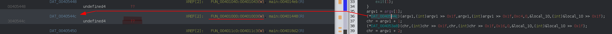
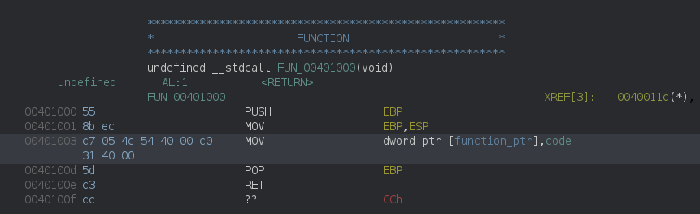
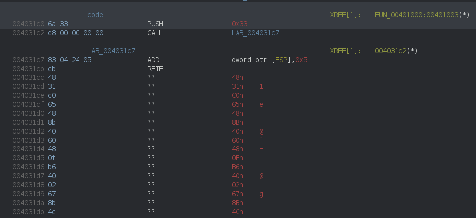
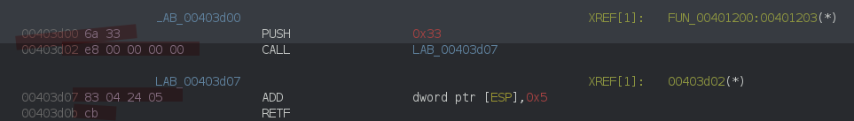

This is a 32 bit PE file using an interesting trick.

You can grab the file [here](meow_way-d3c58f1d74aae3647cfb5c5bb2791da4d900dc16.zip).

# 1. Quick Recon

Opening the file in ghidra and navigating from the entry point to the main function we find something like:

```C
    if (argc < 2) {
        printf("Usage: %s <flag>\n",(char)*argv);
                    /* WARNING: Subroutine does not return */
        exit(1);
    }
    f = argv[1];
    argv1 = f + 1;
    do {
        cVar1 = *f;
        f = f + 1;
    } while (cVar1 != '\0');
    if ((int)f - (int)argv1 != 48) {
        printf("Wrong length\n",in_stack_ffffffd8);
                    /* WARNING: Subroutine does not return */
        exit(1);
    }
```

So we already know that we need to pass the flag as argument and that this flag must be 48 characters.

What follows is a serie of calls, checking the flag characters one by one:

```C
    argv1 = argv[1];
    (*DAT_0040544c)(argv1,(int)argv1 >> 0x1f,argv1,(int)argv1 >> 0x1f,0xc4,0,&local_10,(int)&local_10 >> 0x1f);
    chr = argv1 + 1;
    (*DAT_004053a8)(chr,(int)chr >> 0x1f,chr,(int)chr >> 0x1f,0x16,0,&local_10,(int)&local_10 >> 0x1f);
    chr = argv1 + 2;
    (*DAT_004053b4)(chr,(int)chr >> 0x1f,chr,(int)chr >> 0x1f,0x8e,0,&local_10,(int)&local_10 >> 0x1f);
    chr = argv1 + 3;
    (*DAT_004053f0)(chr,(int)chr >> 0x1f,chr,(int)chr >> 0x1f,0x77,0,&local_10,(int)&local_10 >> 0x1f);
    chr = argv1 + 4;
    (*DAT_00405448)(chr,(int)chr >> 0x1f,chr,(int)chr >> 0x1f,5,0,&local_10,(int)&local_10 >> 0x1f);
    chr = argv1 + 5;
    (*DAT_004053fc)(chr,(int)chr >> 0x1f,chr,(int)chr >> 0x1f,0xb9,0,&local_10,(int)&local_10 >> 0x1f);
    /*
        cut for brevity
    */
    chr = argv1 + 0x2d;
    (*DAT_0040540c)(chr,(int)chr >> 0x1f,chr,(int)chr >> 0x1f,0xf9,0,&local_10,(int)&local_10 >> 0x1f);
    chr = argv1 + 0x2e;
    (*DAT_004053f4)(chr,(int)chr >> 0x1f,chr,(int)chr >> 0x1f,0x98,0,&local_10,(int)&local_10 >> 0x1f);
    argv1 = argv1 + 0x2f;
    (*DAT_00405438)(argv1,(int)argv1 >> 0x1f,argv1,(int)argv1 >> 0x1f,0x65,0,&local_10,(int)&local_10 >> 0x1f);
```

Finally a ```memcmp``` call against a global array:

```C
    iVar2 = memcmp(FLAG,argv[1],0x30);
    if (iVar2 != 0) {
        printf("Wrong\n",(char)iVar2);
                    /* WARNING: Subroutine does not return */
        exit(-1);
    }
    printf("I know you know the flag!\n",(char)iVar2);
```


The content of this array is, we can already save it for later:
```
                         FLAG                                                         XREF[1]:   main:00401c05(*)
      00405018 96 50 cf 2c eb 9b aa     db[48]
               fb 53 ab 73 dd 6c 9e
               db bc ee ab 23 d6 1
         00405018 [0]           96h, 50h, CFh, 2Ch,
         0040501c [4]           EBh, 9Bh, AAh, FBh,
         00405020 [8]           53h, ABh, 73h, DDh,
         00405024 [12]          6Ch, 9Eh, DBh, BCh,
         00405028 [16]          EEh, ABh, 23h, D6h,
         0040502c [20]          16h, FDh, F1h, F0h,
         00405030 [24]          B9h, 75h, C3h, 28h,
         00405034 [28]          A2h, 74h, 7Dh, E3h,
         00405038 [32]          27h, D5h, 95h, 5Ch,
         0040503c [36]          F5h, 76h, 75h, C9h,
         00405040 [40]          8Ch, FBh, 42h,  Eh,
         00405044 [44]          BDh, 51h, A2h, 98h
```

So we know what we need to find, we just have to reverse all the flag character check functions.

Each check is actually a call to a different function pointer and these pointers are initialized at runtime:




If we follow the XREF, we see that each of them are resolved by a serie of stub functions

```
                         DAT_004030cc                                                 XREF[1]:   entry:00401d92(*)
      004030cc 00                       ??                   00h
      004030cd 00                       ??                   00h
      004030ce 00                       ??                   00h
      004030cf 00                       ??                   00h
      004030d0 0e 1d 40 00              addr                 LAB_00401d0e
      004030d4 00 10 40 00              addr                 FUN_00401000
      004030d8 10 10 40 00              addr                 FUN_00401010
      004030dc 20 10 40 00              addr                 FUN_00401020
      004030e0 30 10 40 00              addr                 FUN_00401030
      004030e4 40 10 40 00              addr                 FUN_00401040
      004030e8 50 10 40 00              addr                 FUN_00401050
      004030ec 60 10 40 00              addr                 FUN_00401060
      004030f0 70 10 40 00              addr                 FUN_00401070
      004030f4 80 10 40 00              addr                 FUN_00401080
      004030f8 90 10 40 00              addr                 FUN_00401090
      004030fc a0 10 40 00              addr                 FUN_004010a0
      00403100 b0 10 40 00              addr                 FUN_004010b0
      00403104 c0 10 40 00              addr                 FUN_004010c0
      00403108 d0 10 40 00              addr                 FUN_004010d0
      0040310c e0 10 40 00              addr                 FUN_004010e0
      00403110 f0 10 40 00              addr                 FUN_004010f0
      00403114 00 11 40 00              addr                 FUN_00401100
      00403118 10 11 40 00              addr                 FUN_00401110
      0040311c 20 11 40 00              addr                 FUN_00401120
      00403120 30 11 40 00              addr                 FUN_00401130
      00403124 40 11 40 00              addr                 FUN_00401140
      00403128 50 11 40 00              addr                 FUN_00401150
      0040312c 60 11 40 00              addr                 FUN_00401160
      00403130 70 11 40 00              addr                 FUN_00401170
      00403134 80 11 40 00              addr                 FUN_00401180
      00403138 90 11 40 00              addr                 FUN_00401190
      0040313c a0 11 40 00              addr                 FUN_004011a0
      00403140 b0 11 40 00              addr                 FUN_004011b0
      00403144 c0 11 40 00              addr                 FUN_004011c0
      00403148 d0 11 40 00              addr                 FUN_004011d0
      0040314c e0 11 40 00              addr                 FUN_004011e0
      00403150 f0 11 40 00              addr                 FUN_004011f0
      00403154 00 12 40 00              addr                 FUN_00401200
      00403158 10 12 40 00              addr                 FUN_00401210
      0040315c 20 12 40 00              addr                 FUN_00401220
      00403160 30 12 40 00              addr                 FUN_00401230
      00403164 40 12 40 00              addr                 FUN_00401240
      00403168 50 12 40 00              addr                 FUN_00401250
      0040316c 60 12 40 00              addr                 FUN_00401260
      00403170 70 12 40 00              addr                 FUN_00401270
      00403174 80 12 40 00              addr                 FUN_00401280
      00403178 90 12 40 00              addr                 FUN_00401290
      0040317c a0 12 40 00              addr                 FUN_004012a0
      00403180 b0 12 40 00              addr                 FUN_004012b0
      00403184 c0 12 40 00              addr                 FUN_004012c0
      00403188 d0 12 40 00              addr                 FUN_004012d0
      0040318c e0 12 40 00              addr                 FUN_004012e0
      00403190 f0 12 40 00              addr                 FUN_004012f0
```

during the ```_initterm()``` call before the main invocation

```
      00401d92 68 cc 30 40 00           PUSH                 DAT_004030cc
      00401d97 e8 57 0a 00 00           CALL                 API-MS-WIN-CRT-RUNTIME-L1-1-0.DLL::_initterm                                             undefined _initterm()
```


# 2. The Magic

Eeach stub looks the same, only initializing a different pointer with a different address:



we can follow *code* and force disassembly to find something like:



and this where the magic happen: the ```RETF```instruction (RET *FAR*), will not only pop the EIP register but also the CS register.

```asm
004031c0    PUSH    0x33            ; push 0x33 to the stack
004031c2    CALL    LAB_004031c7    ; push return address to the stack (right after the call: 004031c7)
    LAB_004031c7:
004031c7    ADD     [ESP], 5        ; increment saved return address by 5 (ADD is 4 bytes, RETF 1 bytes)
                                    ; saved EIP is now 004031cc
004031cb    RETF                    ; pop EIP from the stack (so EIP = 004031cc) and CS (0x33)
; continues execution
004031cc    ??
```

By putting 0x33 into CS, the processor switches to 64 bits mode, that's why ghidra is getting all confused after the RETF.

we can quickly disassemble the bytes using radare2 or rizin:

```asm
; % rz-asm -b 64 -d 4831c065488b4060480fb64002678b4c241c67890185c07518678b7c2404678b74240c678b4c241467020e80f1ba67880fe800000000c7442404230000008304240dcbc3
xor rax, rax
mov rax, qword gs:[rax + 0x60]
movzx rax, byte [rax + 2]
mov ecx, dword [esp + 0x1c]
mov dword [ecx], eax
test eax, eax
jne 0x31
mov edi, dword [esp + 4]
mov esi, dword [esp + 0xc]
mov ecx, dword [esp + 0x14]
add cl, byte [esi]
xor cl, 0xba
mov byte [edi], cl
call 0x36
mov dword [rsp + 4], 0x23
add dword [rsp], 0xd
retf
ret
```


this piece of code starts with some anti debug:

```asm
xor rax, rax 
mov rax, qword gs:[rax + 0x60]      ; PEB
movzx rax, byte [rax + 2]           ; PEB->BeingDebugged
mov ecx, dword [esp + 0x1c]
mov dword [ecx], eax 
test eax, eax 
jne 0x31
```

It check ```PEB->BeingDebugged```  for the presence of a debugger and skips the rest if found.

More info on the TEB/PEB here:
- https://www.geoffchappell.com/studies/windows/km/ntoskrnl/inc/api/pebteb/teb/index.htm
- https://www.geoffchappell.com/studies/windows/km/ntoskrnl/inc/api/pebteb/peb/index.htm


Then it manipulates the flag character it's checking:

```asm
mov edi, dword [esp + 4]        ; ptr to the character we're checking in argv[1]
mov esi, dword [esp + 0xc]      ; same as above
mov ecx, dword [esp + 0x14]     ; ptr to some constant passed during the call - let's call the value V
add cl, byte [esi]
xor cl, 0xba
mov byte [edi], cl
```

The stack layout was dumped using a debugger before the CPU switches to 64 bits mode (and makes the debugger go banana), and this piece of code is doing:

```
argv[1][0] = (argv[1][0] + V) ^ 0xba
```


we can get the value *V* (0xc4 in this case) from the function call in main:

```C
    argv1 = argv[1];
    (*function_ptr)(argv1 , (int)argv1 >> 0x1f ,  argv1  ,  (int)argv1 >> 0x1f,  0xc4   ,0,&local_10,(int)&local_10 >> 0x1f);
                                                                           ----->  V
            ESP      +4   ,         +8         ,  +0xc   ,      +0x10         ,  +0x14  , .....              
```


The last bit of code is responsible for switching back to 32 bits mode, this time by setting CS to 0x23:

```asm
call 0x36
mov dword [rsp + 4], 0x23
add dword [rsp], 0xd
retf
```


Alright so here we know that:

```
argv[1][0] = (argv[1][0] + 0xc4) ^ 0xba
```

and that is should be equal to 0x96 (first byte of the memcmp'd array)

which means the firt character of the flag must be ```h``` (even though we already know that because flags are like hitcon{....}):

```
>>> chr((0x96 ^ 0xba) - 0xc4 & 0xff)
'h'
```

At least the track seems solid...


# 3. Rinse and Repeat

48 characters, 48 different functions, time to go dirty.

I've noticed 2 interesting properties:
- the flag char check functions are in the correct "memory order" (meaning that the function checking chr 2 is at a higher address than the one checking chr 1, and the one checking chr 3 is at a higher address than the one checking chr 2, etc..)
- these functions always start/end with the same byte sequence

which make a good and simple "automation" case.

The start byte sequence is ```\x6a\x33\xe8\x00\x00\x00\x00\x83\x04\x24\x05\xcb```, the end byte sequence is ```\xcb\x3c``` (RETF; RET)



using the following script we can disassemble all the functions we need:

```python
from capstone import *

def disasm(code):
    md = Cs(CS_ARCH_X86, CS_MODE_64)
    for i in md.disasm(code, 0x1000):
        print("0x%x:\t%s\t%s" %(i.address, i.mnemonic, i.op_str))


dat = open('meow_way.exe', 'rb').read()

for x in dat.split(b"\x6a\x33\xe8\x00\x00\x00\x00\x83\x04\x24\x05\xcb"):
    if x.startswith(b'H1'):
        print("#############################")
        disasm(x.split(b'\xcb\xc3')[0])
```

and we can notice that some of these functions are not adding the value, but substracting:


```
% python disasm64.py| more
[....]

#############################
0x1000:	xor	rax, rax
0x1003:	mov	rax, qword ptr gs:[rax + 0x60]
0x1008:	movzx	rax, byte ptr [rax + 2]
0x100d:	mov	ecx, dword ptr [esp + 0x1c]
0x1012:	mov	dword ptr [ecx], eax
0x1015:	test	eax, eax
0x1017:	jne	0x1031
0x1019:	mov	edi, dword ptr [esp + 4]
0x101e:	mov	esi, dword ptr [esp + 0xc]
0x1023:	mov	ecx, dword ptr [esp + 0x14]
0x1028:	add	cl, byte ptr [esi]                  <-- ADD
0x102b:	xor	cl, 0x9f
0x102e:	mov	byte ptr [edi], cl
0x1031:	call	0x1036
0x1036:	mov	dword ptr [rsp + 4], 0x23
0x103e:	add	dword ptr [rsp], 0xd
#############################
0x1000:	xor	rax, rax
0x1003:	mov	rax, qword ptr gs:[rax + 0x60]
0x1008:	movzx	rax, byte ptr [rax + 2]
0x100d:	mov	ecx, dword ptr [esp + 0x1c]
0x1012:	mov	dword ptr [ecx], eax
0x1015:	test	eax, eax
0x1017:	jne	0x1031
0x1019:	mov	edi, dword ptr [esp + 4]
0x101e:	mov	esi, dword ptr [esp + 0xc]
0x1023:	mov	ecx, dword ptr [esp + 0x14]
0x1028:	sub	cl, byte ptr [esi]                  <--- SUB
0x102b:	xor	cl, 0xd0
0x102e:	mov	byte ptr [edi], cl
0x1031:	call	0x1036
0x1036:	mov	dword ptr [rsp + 4], 0x23
0x103e:	add	dword ptr [rsp], 0xd
[...]
```

At this point we know all the information we need to get in order to find the flag:
- the memcmp array it's checked against
- the XOR value hardcoded in each function
- the operation performed by each function (SUB or ADD)
- the value parameter passed to the functions


## 3.1 The memcmp array

easy, it's in the code:
```
[ 0x96, 0x50, 0xcf, 0x2c, 0xeb, 0x9b, 0xaa, 0xfb, 0x53, 0xab, 0x73, 0xdd, 0x6c, 0x9e, 0xdb, 0xbc, 0xee, 0xab, 0x23, 0xd6, 0x16, 0xfd, 0xf1, 0xf0, 0xb9, 0x75, 0xc3, 0x28, 0xa2, 0x74, 0x7d,
0xe3, 0x27, 0xd5, 0x95, 0x5c, 0xf5, 0x76, 0x75, 0xc9, 0x8c, 0xfb, 0x42, 0x0e, 0xbd, 0x51, 0xa2, 0x98 ]
```

## 3.2 The XOR values

just grep them:
```
% python disasm64.py | egrep "xor.*cl" | cut -d, -f2 | xargs | tr " " ","
0xba,0x2f,0xcd,0xf6,0x9f,0xd0,0x22,0xf7,0xd0,0x1f,0xa8,0x3d,0xc7,0xa5,0x47,0x68,0xd7,0x4a,0x96,0x91,0x2e,0x19,0xc5,0xe3,0x88,0xbd,0x4e,0x93,0x13,0xf1,0xcc,0x47,0xab,0xc9,0x48,0x2b,9,0x50,0x4f,0xe9,0xc0,0x5e,0xef,0x8b,0x85,0xcb,0x55,0x70
```

## 3.3 The operations

grep them too:
```
% python disasm64.py| egrep "(add|sub).*cl" | cat -n | grep sub | awk '{ print $1-1}' | xargs | tr " " ","
5,7,10,11,14,17,19,25,28,29,34,35,37,39,40,42,43,44,45,47
```

for character 5, 7, 10, ... it's doing a sub, for the others, an add.

## 3.4 The parameter values.

Just copy the ghidra decompiler output of the main function to a file:

```
% cat bla.txt
    (*DAT_0040544c)(argv1,(int)argv1 >> 0x1f,argv1,(int)argv1 >> 0x1f,0xc4,0,&local_10,(int)&local_10 >> 0x1f);
    chr = argv1 + 1;
    (*DAT_004053a8)(chr,(int)chr >> 0x1f,chr,(int)chr >> 0x1f,0x16,0,&local_10,(int)&local_10 >> 0x1f);
    chr = argv1 + 2;
    (*DAT_004053b4)(chr,(int)chr >> 0x1f,chr,(int)chr >> 0x1f,0x8e,0,&local_10,(int)&local_10 >> 0x1f);
    chr = argv1 + 3;
    (*DAT_004053f0)(chr,(int)chr >> 0x1f,chr,(int)chr >> 0x1f,0x77,0,&local_10,(int)&local_10 >> 0x1f);
// etc....
```

and get the values:

```
% cat bla.txt| grep DAT | cut -d, -f 5 | xargs | tr " " ","
0xc4,0x16,0x8e,0x77,5,0xb9,0xd,0x6b,0x24,0x55,0x12,0x35,0x76,0xe7,0xfb,0xa0,0xda,0x34,0x84,0xb4,200,0x9b,0xef,0xb4,0xb9,10,0x57,0x5c,0xfe,0xc5,0x6a,0x73,0x49,0xbd,0x11,0xd6,0x8f,0x6b,10,0x97,0xab,0x4e,0xed,0xfe,0x97,0xf9,0x98
```

# 4. The solution

Put all these arrays in a python script and watch the flag:

```python
# xor values
x = [0xba,0x2f,0xcd,0xf6,0x9f,0xd0,0x22,0xf7,0xd0,0x1f,0xa8,0x3d,0xc7,0xa5,0x47,0x68,0xd7,0x4a,0x96,0x91,0x2e,0x19,0xc5,0xe3,0x88,0xbd,0x4e,0x93,0x13,0xf1,0xcc,0x47,0xab,0xc9,0x48,0x2b,9,0x50,0x4f,0xe9,0xc0,0x5e,0xef,0x8b,0x85,0xcb,0x55,0x70]

# parameters values
param = [0xc4,0x16,0x8e,0x77,5,0xb9,0xd,0x6b,0x24,0x55,0x12,0x35,0x76,0xe7,0xfb,0xa0,0xda,0x34,0x84,0xb4,200,0x9b,0xef,0xb4,0xb9,10,0x57,0x5c,0xfe,0xc5,0x6a,0x73,0x49,0xbd,0x11,0xd6,0x8f,0x6b,10,0x97,0xab,0x4e,0xed,0xfe,0x97,0xf9,0x98,0x65]

# memcmp
memcmp = [0x96,0x50,0xcf,0x2c,0xeb,0x9b,0xaa,0xfb,0x53,0xab,0x73,0xdd,0x6c,0x9e,0xdb,0xbc,0xee,0xab,0x23,0xd6,0x16,0xfd,0xf1,0xf0,0xb9,0x75,0xc3,0x28,0xa2,0x74,0x7d,0xe3,0x27,0xd5,0x95,0x5c,0xf5,0x76,0x75,0xc9,0x8c,0xfb,0x42,0x0e,0xbd,0x51,0xa2,0x98]

# index of 'sub' functions
subs = [5,7,10,11,14,17,19,25,28,29,34,35,37,39,40,42,43,44,45,47]


f = ''
for i in range(48):
    if i in subs:
        p = param[i] - ((memcmp[i] ^ x[i])) & 0xff
    else:
        p = ((memcmp[i] ^ x[i]) - param[i]) & 0xff
    f += chr(p)
print(f)
```

-> ```hitcon{___7U5T_4_S1mpIE_xB6_M@G1C_4_mE0w_W@y___}```


# 5. Bonus

Some of the check functions have an alternative anti-debug check:

```asm
xor rax, rax
mov rax, qword gs:[rax + 0x60]  ; PEB
movzx rax, byte [rax + 0xbc]    ; PEB->NtGlobalFlag
mov ecx, dword [esp + 0x1c]
and eax, 0x70                   ; FLG_HEAP_ENABLE_TAIL_CHECK|FLG_HEAP_ENABLE_FREE_CHECK|FLG_HEAP_VALIDATE_PARAMETERS
mov dword [ecx], eax
test eax, eax
jne 0x37
```

it tests ```PEB->NtGlobalFlag & 0x70``` to check for the presence of a debugger (more info here: [https://www.aldeid.com/wiki/PEB-Process-Environment-Block/NtGlobalFlag](https://www.aldeid.com/wiki/PEB-Process-Environment-Block/NtGlobalFlag))

