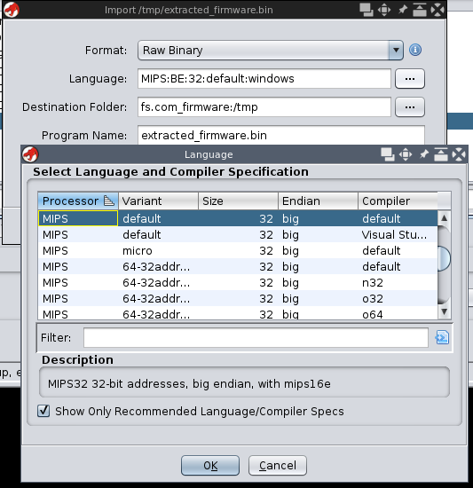
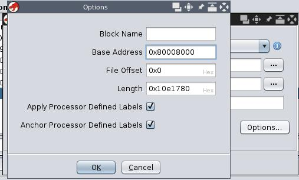
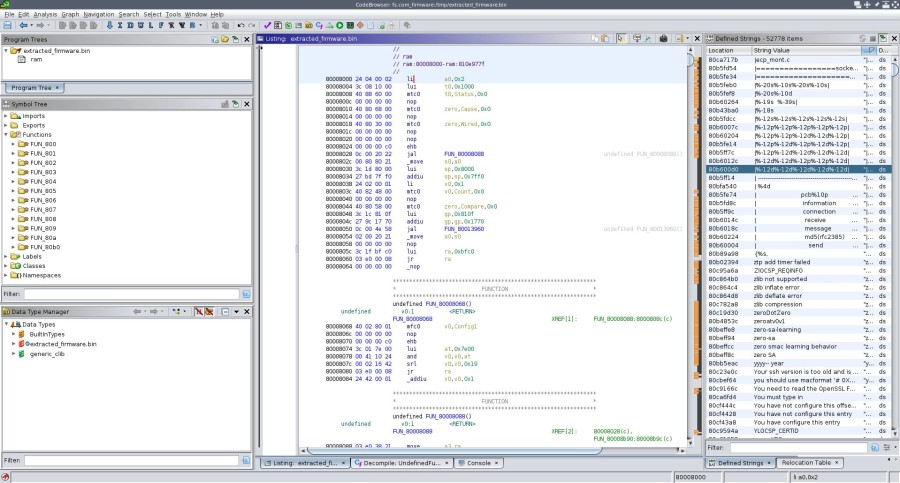
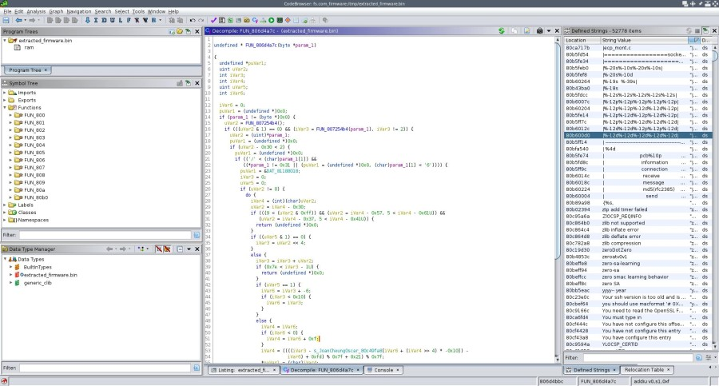
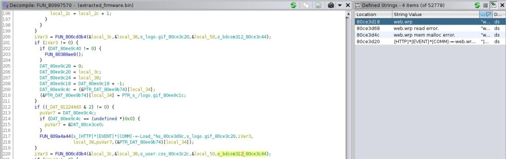

I recently had to buy a new 24x1G fanless switch for my home network. I had a mikrotik switch for years (which i was happy with but suffered a power surge) and wanted to try something new so I ended up with a [FS S3700-24T4F](https://www.fs.com/de-en/products/84912.html).

Their CLI is close to Cisco's IOS, it's overall a fun device for home network and not too expensive.
Found few small bugs here and there without really looking for them but in the end nothing too annoying in my context.

Looking at the form factor and the number of BDCOM reference in the firmware, it's most likely a rebranded BDCOM S2528-C.


# 1. Scope

The following seems applicable to most [BDCOM](https://www.bdcom.cn/) switches and to [FS](https://www.fs.com/) S3150, S3260, S3400 and S3700 (rebranded BDCOM ?)
This is not a full analysis of the firmware, but that should be enough information to easily get started with reversing them.

# 2. First look

You can either get the firmware straight from the switch via TFTP (i had issue with SCP) or from their websites:
- BDCOM: https://sites.google.com/bdcom.cn/international/download/firmware/switch
- FS: https://img-en.fs.com/file/user_manual/poe+-series-switches-fsos-v2-2-0d-a79995-software.zip

There's usually 2 files:
```
Switch#dir
Directory of /:
1    Switch.bin             <FILE>     4352907    THU JAN 01 00:02:10 1970
0    web.wrp                <FILE>       30740    THU JAN 01 00:02:13 1970
```

- ``Switch.bin`` is the actual firmware
- ``web.wrp`` is a password protected rar containing some branding/customs for the web interface 


```
% file Switch.bin web.wrp
Switch.bin: data
web.wrp:    RAR archive data, v2.0, os: Win32

% unrar l web.wrp      

UNRAR 6.10 beta 2 freeware      Copyright (c) 1993-2021 Alexander Roshal

Archive: web.wrp
Details: RAR 4

 Attributes      Size     Date    Time   Name
----------- ---------  ---------- -----  ----
*   I.A....       660  2021-01-08 15:17  cn.png
*   I.A....       674  2021-01-08 15:17  en.png
*   I.A....     52920  2021-01-08 15:17  extipaclitem.asp
*   I.A....       824  2021-01-08 15:17  footer.asp
*   I.A....      1795  2021-01-08 15:17  icon.png
*   I.A....      1141  2021-01-08 15:17  index.asp
*   I.A....     37192  2021-01-08 15:17  logo.asp
*   I.A....      1057  2021-01-08 15:17  logo.gif
*   I.A....      2594  2021-01-08 15:17  nav.png
*   I.A....     36188  2021-01-08 15:18  navbar.asp
*   I.A....      9753  2021-01-08 15:17  nav_style.css
*   I.A....      3899  2021-01-08 15:17  tabctrl.asp
----------- ---------  ---------- -----  ----
               148697                    12

```


# 3. Extracting Switch.bin

The ``Switch.bin`` has 2 parts.  
The first part starts with the magic "BDCO\x00" and possibly contains some informations like base address and maybe some code responsible for loading the rest of the firmware (unconfirmed).

The 2nd part starts at offset 0x2030 and is identified by a "SYS\x00" marker.
At offset 0x2040 is a rar file.

```
% hexdump -C Switch.bin  | more
--- 1st part ---
00000000  42 44 43 4f 00 00 00 03  80 00 80 00 80 00 80 00  |BDCO............|
00000010  00 40 16 a2 00 00 20 40  02 02 00 44 07 e5 00 02  |.@.... @...D....|
00000020  05 0e 19 0f ee 3f 5a 73  00 00 00 00 00 00 00 02  |.....?Zs........|
00000030  00 02 1e fd 00 02 8c 12  00 02 78 c9 00 02 e8 92  |..........x.....|
00000040  00 02 ba 94 00 02 45 f6  00 02 c3 5f 00 02 90 f1  |......E...._....|
00000050  00 02 4d d1 00 00 f6 ed  00 00 fc 89 00 00 f8 d9  |..M.............|
00000060  00 02 b5 32 00 02 cd b6  00 02 bd c6 00 02 a4 69  |...2...........i|
00000070  00 02 d5 cf 00 02 0f f2  00 01 a8 41 00 02 e8 cc  |...........A....|
00000080  00 01 12 e7 00 01 18 d2  00 02 13 de 00 01 f6 07  |................|
00000090  00 02 2e ba 00 02 7f 17  00 01 1d b7 00 01 6a 1c  |..............j.|
000000a0  00 00 ec 16 00 00 6e 61  00 00 e0 3e 00 00 cf 58  |......na...>...X|
000000b0  00 00 c7 e1 00 00 e2 29  00 00 00 00 00 00 00 00  |.......)........|
000000c0  00 00 00 00 00 00 00 00  00 00 00 00 00 00 00 00  |................|
*
00001030  cd 67 79 69 ec a8 3e d3  41 66 81 8c b9 2c 6d 10  |.gyi..>.Af...,m.|
00001040  4a db 4a 70 07 49 f0 fd  88 97 71 06 c1 8f d2 59  |J.Jp.I....q....Y|
00001050  4d 92 e6 b3 fc 3f 46 a6  cc 7d 25 b3 96 b4 41 8d  |M....?F..}%...A.|
00001060  c8 8d a7 f6 94 54 80 86  b3 47 aa ff a8 dc 73 09  |.....T...G....s.|
00001070  f5 60 4e 8c 00 00 00 00  00 00 00 00 00 00 00 00  |.`N.............|
00001080  00 00 00 00 00 00 00 00  00 00 00 00 00 00 00 00  |................|
*
--- 2nd part ---
00002030  53 59 53 00 00 00 00 00  00 00 00 00 00 00 00 00  |SYS.............|
--- RAR file ---
00002040  52 61 72 21 1a 07 00 cf  90 73 00 00 0d 00 00 00  |Rar!.....s......|
00002050  00 00 00 00 e0 8d 74 80  80 25 00 c4 1e 02 00 00  |......t..%......|
00002060  00 08 00 02 53 ed 8e e8  28 73 45 52 14 33 05 00  |....S...(sER.3..|
```

While this is true for most the files i could get my hands on, some of them like ``FSOS_2.2.0D_75857.bin`` are different:
- no rar file at 0x2040
- 1st part contains more data (i mean less NULL bytes)
hence my previous assumption about the first part of the bin file.

the following will split the first part and the rar file:
```python
#!/usr/bin/env python

import sys

with open(sys.argv[1], "rb") as fp:
    with open('out_1.bin', 'wb') as fp_out:
        fp_out.write(fp.read(0x2030))

    assert fp.read(16) == b'SYS\x00' + b'\x00'*12

    with open("out_2.bin", "wb") as fp_out:
        fp_out.write(fp.read())
```

```
% ./extract.py Switch.bin 
% unrar l out_2.bin 

UNRAR 6.10 beta 2 freeware      Copyright (c) 1993-2021 Alexander Roshal

Archive: out_2.bin
Details: RAR 4

 Attributes      Size     Date    Time   Name
----------- ---------  ---------- -----  ----
    ..A....    524288  2021-02-05 14:25  .temp
    ..A....    524288  2021-02-05 14:25  .temp
    ..A....    524288  2021-02-05 14:25  .temp
    ..A....    524288  2021-02-05 14:25  .temp
    ..A....    524288  2021-02-05 14:25  .temp
    ..A....    524288  2021-02-05 14:25  .temp
    ..A....    524288  2021-02-05 14:25  .temp
    ..A....    524288  2021-02-05 14:25  .temp
    ..A....    524288  2021-02-05 14:25  .temp
    ..A....    524288  2021-02-05 14:25  .temp
    ..A....    524288  2021-02-05 14:25  .temp
    ..A....    524288  2021-02-05 14:25  .temp
    ..A....    524288  2021-02-05 14:25  .temp
    ..A....    524288  2021-02-05 14:25  .temp
    ..A....    524288  2021-02-05 14:25  .temp
    ..A....    524288  2021-02-05 14:25  .temp
    ..A....    524288  2021-02-05 14:25  .temp
    ..A....    524288  2021-02-05 14:25  .temp
    ..A....    524288  2021-02-05 14:25  .temp
    ..A....    524288  2021-02-05 14:25  .temp
    ..A....    524288  2021-02-05 14:25  .temp
    ..A....    524288  2021-02-05 14:25  .temp
    ..A....    524288  2021-02-05 14:25  .temp
    ..A....    524288  2021-02-05 14:25  .temp
    ..A....    524288  2021-02-05 14:25  .temp
    ..A....    524288  2021-02-05 14:25  .temp
    ..A....    524288  2021-02-05 14:25  .temp
    ..A....    524288  2021-02-05 14:25  .temp
    ..A....    524288  2021-02-05 14:25  .temp
    ..A....    524288  2021-02-05 14:25  .temp
    ..A....    524288  2021-02-05 14:25  .temp
    ..A....    524288  2021-02-05 14:25  .temp
    ..A....    524288  2021-02-05 14:25  .temp
    ..A....    399232  2021-02-05 14:25  .temp
Corrupt header is found
----------- ---------  ---------- -----  ----
             17700736                    34
```

all files in the archive (except the last) are 0x80000 bytes.
The archive can be extracted using ``unrar -or`` which will rename conflicting filenames

```
% unrar -or x out_2.bin 

UNRAR 6.10 beta 2 freeware      Copyright (c) 1993-2021 Alexander Roshal


Extracting from out_2.bin

Extracting  .temp                                                     OK 
Extracting  (1).temp                                                  OK 
Extracting  (2).temp                                                  OK 
[...]
Extracting  (33).temp                                                 OK 
Corrupt header is found
Total errors: 34
```

all that's left to do now is to concatenate all the extracted files:

```
% mv .temp \(0\).temp
% for x in $(seq 0 33); do cat \($x\).temp >> extracted_firmware.bin; done
% ls -h extracted_firmware.bin
17M extracted_firmware.bin
```

# 4. Disassembling

According to the [datasheet](https://img-en.fs.com/file/datasheet/s3700-24t4f-switch-datasheet.pdf), the switch runs on a Realtek RTL8382M SoC and a MIPS 4kEC processor.

The base address is 0x80008000.

It can be obtained from the switch with the ``show version`` command:

```
Switch#show version
Fiberstore Co., Limited Internetwork Operating System Software
S3700-24T4F Series Software, Version 2.2.0D Build 80921, RELEASE SOFTWARE
Copyright (c) 2019 by FS.COM All Rights Reserved
Compiled: 2021-2-5 14:25:15 by SYS, Image text-base: 0x80008000        <----- HERE
ROM: System Bootstrap, Version 0.5.2,hardware version:A
```

i suspect it's also in the 1st part of the Switch.bin file:
```
% hexdump -C Switch.bin| head -1
00000000  42 44 43 4f 00 00 00 03  80 00 80 00 80 00 80 00  |BDCO............|
                                   |  here?  | | or here?|
```

It loads fine in Ghidra:
- langage: MIPS:BE:32:default:default
- base address: 0x80008000






From there everything is smooth.



even the decompiler works quite fine:



# 5. Quick Analysis For Fun

## 5.1 Decrypting Type 7 Passwords

By default, passwords are in clear text in the config, however you can change that by using ``service password-encryption``.  
I made a tool to decrypt/encrypt such passwords, which is available [here](https://github.com/matthw/fs_switch_type_7_password_decoder).

## 5.2 web.wrp

Since all strings references are correct, if we search for ``web.wrp`` we see it's only referenced in a single function.  
Doesn't take much work from here to figure the password for the rar file is ``bdcom312``



```
% unrar x -pbdcom312 ../web.wrp

UNRAR 6.10 beta 2 freeware      Copyright (c) 1993-2021 Alexander Roshal


Extracting from ../web.wrp

Extracting  cn.png                                                    OK 
Extracting  en.png                                                    OK 
Extracting  extipaclitem.asp                                          OK 
Extracting  footer.asp                                                OK 
Extracting  icon.png                                                  OK 
Extracting  index.asp                                                 OK 
Extracting  logo.asp                                                  OK 
Extracting  logo.gif                                                  OK 
Extracting  nav.png                                                   OK 
Extracting  navbar.asp                                                OK 
Extracting  nav_style.css                                             OK 
Extracting  tabctrl.asp                                               OK 
All OK
```

## 5.3 HTTP Server

It uses [GoAhead-Webs](https://www.embedthis.com/goahead/) version 2.1.8 which is a popular http server for embedded devices.  
This particular version can be found [here](https://github.com/trenta3/goahead-versions).

There's an ASP style server page.

All ASP functions are registered like this:

```cpp
void ASP_register_all_functions(void)

{
  ASP_register_one_func(s_aspGenerateWebTitleInfoJS_80ce14c8,FUN_809a4bd0);
  ASP_register_one_func(s_aspGenerateAboutInfoJS_80ce14e4,FUN_809a4de0);
  ASP_register_one_func(s_aspGenerateWebParamsJS_80ce14fc,FUN_8095d068);
  ASP_register_one_func(s_aspGenerateUserPrivilegeJS_80ce1514,FUN_8096c908);
  ASP_register_one_func(s_aspGenerateRingInterfaceInfoJS_80ce1530,FUN_8097f680);
  ASP_register_one_func(s_aspGenerateInterfaceInfoJS_80ce1550,FUN_80964138);
  ASP_register_one_func(s_aspGenerateSystemStateJS_80ce156c,FUN_8095d24c);
  ASP_register_one_func(s_aspGenerateRangeOfVariableJS_80ce1588,FUN_8095d700);
  ASP_register_one_func(s_aspGenerateUMJS_80ce15a8,FUN_8095d758);
  ASP_register_one_func(s_aspGenerateFunctionGobackUrlJS_80ce15b8,FUN_8095deb0);
  // [...]
  ASP_register_one_func(s_aspGenerateDhcpdIPBindInfoJS_80ce2e1c,FUN_80980c58);
  ASP_register_one_func(s_aspGenerateAccessRestrictInfoJS_80ce2e3c,FUN_8098c904);
  return;
}
```

The same with all forms actions:

```cpp

void http_register_all_goform_funcs(void)

{
  http_register_one_goform_func(s_formTest_80cd9c5c,http_asp_formTest);
  http_register_one_goform_func(s_langform_80cd9c68,&LAB_8092cb9c);
  http_register_one_goform_func(s_WebAdminDelete_80cd9c74,&LAB_8092d4c4);
  http_register_one_goform_func(s_WebAdminConfig_80cd9c84,FUN_8092d790);
  http_register_one_goform_func(s_SysClockConfig_80cd9c94,&LAB_8092dca0);
  http_register_one_goform_func(s_BackupFirmware_80cd9ca4,FUN_8092e37c);
  http_register_one_goform_func(s_UpdateFirmware_80cd9cb4,FUN_8092e400);
  http_register_one_goform_func(s_BackupConfigFile_80cd9cc4,FUN_8092e540);
  http_register_one_goform_func(s_UpdateConfigFile_80cd9cd8,FUN_8092e5ac);
  // [...]
  http_register_one_goform_func(s_RestoreConfigFile_80cd9cec,FUN_8092e898);
  http_register_one_goform_func(s_RebootDevice_80cd9d00,FUN_8092e7cc);
  http_register_one_goform_func(s_CustomerinfoRestoreConfig_80cdaa68,FUN_8092f858);
  http_register_one_goform_func(s_AccessRestrictConfig_80cdaa84,&LAB_8093dc90);
  return;
}
```

The HTTP code is easy to follow, especially with the source code next to it...


# 6. Debugging

It's possible to enable core dump (``core_dump enable``) and read core files with ``show break`` (should you crash the switch :-):

```
Switch#show break
=========================================================
BreakNum: 1
Exception Type:2-TLB miss exception (load or instruction fetch)
TaskID=826380b0, TaskName=HTTD
date: 2021-8-25  time: 17:13:23
zero at v0 v1
00000000 811c0000 00000016 00000af2
a0 a1 a2 a3
80cdd9f4 00000000 8099d5fc 00000000
t0 t1 t2 t3
00000000 1000fc00 1000fc01 00005000
t4 t5 t6 t7
00000140 00000002 02beff43 00000000
s0 s1 s2 s3
80cdab10 00000000 0000003c 86b591f0
s4 s5 s6 s7
87a18b78 00000000 00000000 00000000
t8 t9 k0 k1
00000001 0000006e 00000000 00000000
gp sp s8 ra
810f1770 82637240 00000000 80972600
pc
80725134
sr    = 1000fc01
cause = 10000008
call procedure--
0x80972600--
0x80994e40--
0x80993ed0--
0x80993aa8--
0x80993984--
0x8099f718--
0x809931d4--
0x809a6b60--
0x809a86c0--
0x8099ba18--
0x8099b4bc--
0x809a5f20--

Stack:
82637240: fae33ffe 9e5bcec9 b3ebb644 fdfde7cd
82637250: 7729ed3a e11a6f6c bfedd7ed dfbf7a36
82637260: 93fdb2ee 9d89f697 ce5fc7f7 25edf589
82637270: f3afedaf a1799781 70fbad55 97e1f55c
82637280: 575ea857 b5b7fc8f 9ebcdbcd c8cd5ec1
82637290: f5cd6dd4 cf4bbb37 b7b08cdd de356661
826372a0: fff16cc7 28fbf9f9 aeb6a6ee ffefbf7b
826372b0: 905ff665 ded9bb9b 599b9ae9 2bfefbdf
826372c0: 75c3a5ed b5d7af7f ddbdf119 932f7837
826372d0: f4ffefaf fef72ff5 fcbf7ddd cd9bd338
826372e0: 6db5eff9 99a2e9f3 a5a6176c eda7f721
826372f0: b1f2b951 ef5c7f2f 3feba1a5 ed39efe5
82637300: c8b7bbf7 cf5968ca f599dfff ff771587
82637310: 7bc7927b fdb8bfea b7d8b725 945e0666
82637320: d87bd1bd a0faa875 00000000 1000fc01
```

It's also available in the file ``flash:SYS_CORE_DUMP``


Happy reversing.
