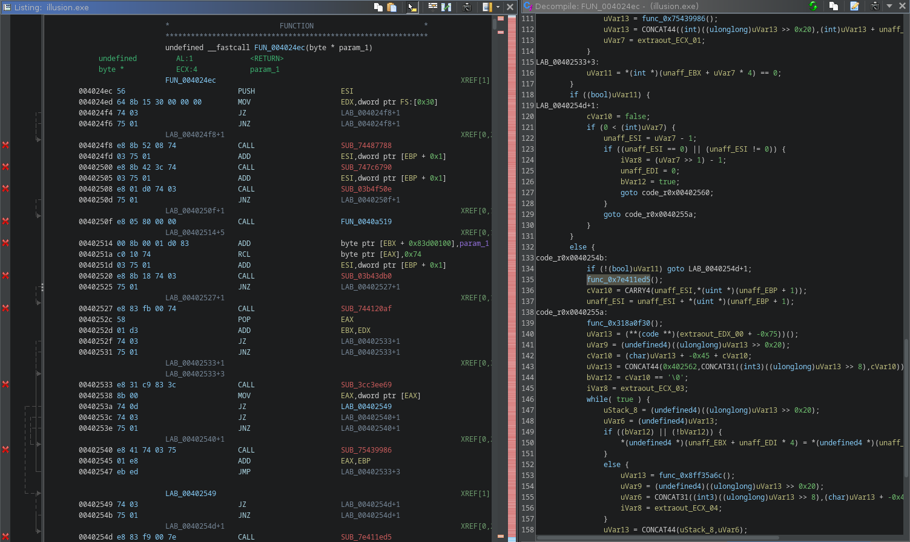
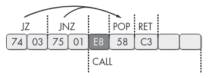
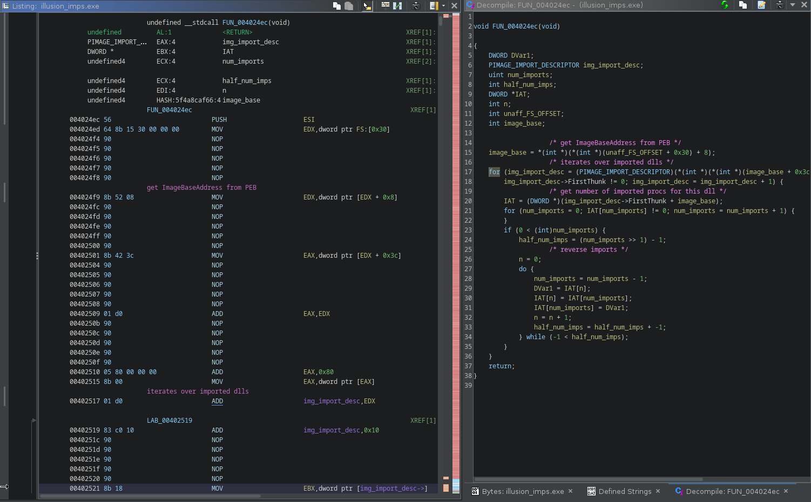
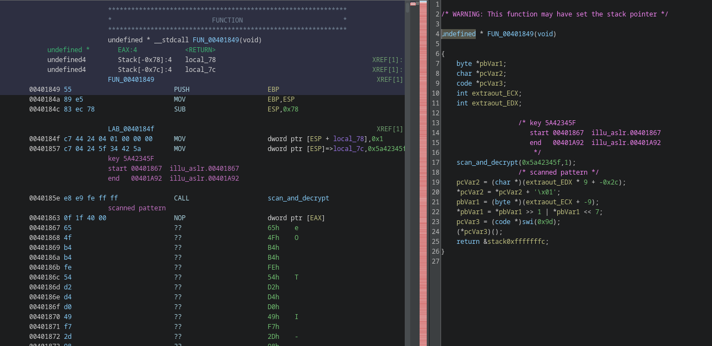
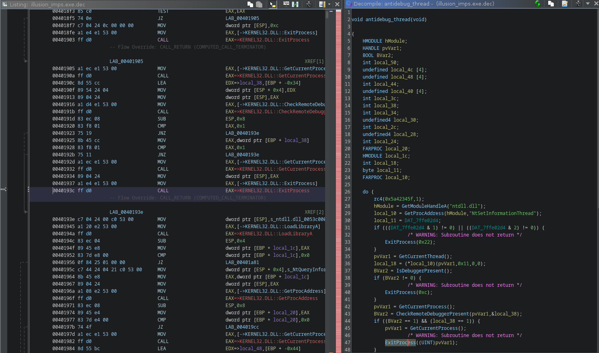
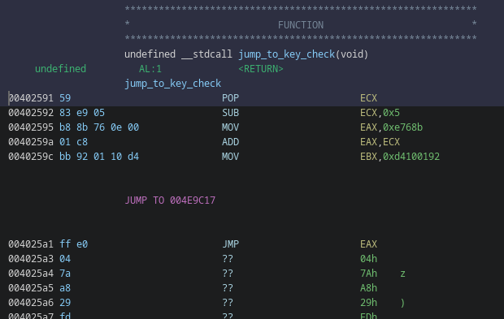
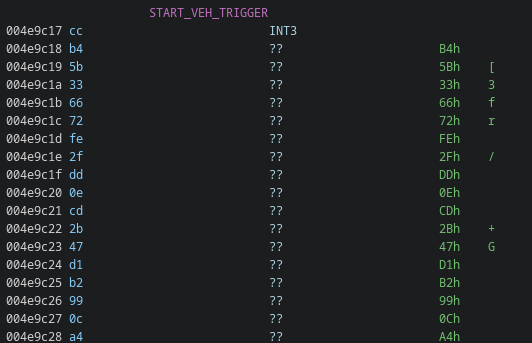

[BarbHack 2023](https://www.barbhack.fr/2023/en/) had some pretty cool reversing challenges.
I could not attend the conf, so i solved them afterwards (not sure i would have time to solve this one during the CTF anyway).

This writeup is about [illusion.exe](illusion.exe), a fun binary by [sar](https://twitter.com/sar5430) - thanks to him for providing it to me afterwards and allowing me to host it here :)

# 1. Clicky click

if we run the binary it just produces this output and exits:
```
C:\Users\me\Desktop>illusion.exe
Reading key...
```

# 2. Reversing

There's a number TLS callbacks defined. They will be executed before the entry point.

Ghidra will automatically label them as `tls_callback_X` and x64dbg will break on them by
default.

We can see some odd stuff like a call to `VirtualQuery` that doesn't make any sense:
```C
void tls_callback_1(void)

{
    if (DAT_0053d430 == 0) {
                    /* CreateThread */
        VirtualQuery(NULL,NULL,(SIZE_T)FUN_00401849);
        DAT_0053d430 = 1;
    }
    return;
}
``` 

## 2.1 tls_callback_0

### 2.1.1 Anti Disassembly

The first TLS callback calls a function that doesn't make much sense at first



It's using a common obfuscation technique with JZ/JNZ to produce a non-conditionnal jump but
still confuse the disassembler.

The method is well described in the great [Practical Malware Analysis](https://nostarch.com/malware) book, which i highly recommend everyone to read.



We can get rid of it by looking for the `JZ +3; JNZ +1; CALL` pattern and NOPing it:

```python
dat = open("illusion.exe", "rb").read()

# nop the jz/jnz trick
dat = dat.replace(b'\x74\x03\x75\x01\xe8', b'\x90\x90\x90\x90\x90')

with open("illu_patched.exe", "wb") as fp:
    fp.write(dat)
```

after running the patch and doing some retyping it becomes clear what this function is doing:




### 2.1.2 IAT Scrambling

It accesses the `PEB` via `FS:[0x30]`, parses the PE header structures and reverses the IAT.

This explains why the `VirtualQuery` calls wasn't making sense: because it's not VirtualQuery.

The following script will statically reverse the IAT entries (sorry, CTF quality...)

```python
import pefile
import shutil
from pwn import *

def get_string(fp, off):
    out = b''
    curr = fp.tell()
    fp.seek(off)
    for x in range(123):
        out += fp.read(1)
        if out[-1] == 0:
            fp.seek(curr)
            return out[:-1]
    fp.seek(curr)
    return b''


def apply_patches(data, patches):
    for addr in sorted(patches.keys()):
        fp.seek(addr)
        fp.write(patches[addr])


pe = pefile.PE("illusion.exe")
patches = {}
with open("illusion.exe", "rb") as fp:
    assert fp.read(2) == b'MZ'
    fp.seek(0x3c)
    nt = u32(fp.read(4))

    fp.seek(nt + 0x80) # DIRECTORY_IMPORT
    addr = pe.get_offset_from_rva(u32(fp.read(4)))

    fp.seek(addr)
    while True:
        data = fp.read(4*5)
        # end of import dir
        if data == b'\x00'*20:
            break

        img_import_desc = struct.unpack('IIIII', data)
        name_off = pe.get_offset_from_rva(img_import_desc[3])
        name = get_string(fp, name_off)
        print(name)

        # save current offset
        dir_offset = fp.tell()

        imps = []

        imp_offset = pe.get_offset_from_rva(img_import_desc[0])
        fp.seek(imp_offset)
        while True:
            i = fp.read(4)
            if i == b'\x00\x00\x00\x00':
                break
            imps.append(i)

        # reverse shit
        imps = b''.join(imps[::-1])
        patches[imp_offset] = imps

        fp.seek(dir_offset)


shutil.copyfile("illu_patched.exe", "illusion_imps.exe")

with open("illusion_imps.exe", "br+") as fp:
    apply_patches(fp, patches)
```

Before patching:

```
% emit illu_patched.exe | pemeta -I -t | grep KERNEL32
Imports.KERNEL32[0x00] : WideCharToMultiByte
Imports.KERNEL32[0x01] : VirtualQuery
Imports.KERNEL32[0x02] : VirtualProtect
Imports.KERNEL32[0x03] : TlsGetValue
Imports.KERNEL32[0x04] : Sleep
Imports.KERNEL32[0x05] : SetUnhandledExceptionFilter
Imports.KERNEL32[0x06] : MultiByteToWideChar
Imports.KERNEL32[0x07] : LoadLibraryA
Imports.KERNEL32[0x08] : LeaveCriticalSection
Imports.KERNEL32[0x09] : IsDebuggerPresent
Imports.KERNEL32[0x0A] : IsDBCSLeadByteEx
Imports.KERNEL32[0x0B] : InitializeCriticalSection
Imports.KERNEL32[0x0C] : GetStartupInfoA
Imports.KERNEL32[0x0D] : GetProcAddress
Imports.KERNEL32[0x0E] : GetModuleHandleW
Imports.KERNEL32[0x0F] : GetModuleHandleA
Imports.KERNEL32[0x10] : GetModuleFileNameA
Imports.KERNEL32[0x11] : GetLastError
Imports.KERNEL32[0x12] : GetFileSize
Imports.KERNEL32[0x13] : GetCurrentThread
Imports.KERNEL32[0x14] : GetCurrentProcess
Imports.KERNEL32[0x15] : FlushInstructionCache
Imports.KERNEL32[0x16] : ExitProcess
Imports.KERNEL32[0x17] : EnterCriticalSection
Imports.KERNEL32[0x18] : DeleteCriticalSection
Imports.KERNEL32[0x19] : CreateThread
Imports.KERNEL32[0x1A] : CheckRemoteDebuggerPresent
```

after patching:

```
% emit illusion_imps.exe | pemeta -I -t | grep KERNEL32
Imports.KERNEL32[0x00] : CheckRemoteDebuggerPresent
Imports.KERNEL32[0x01] : CreateThread
Imports.KERNEL32[0x02] : DeleteCriticalSection
Imports.KERNEL32[0x03] : EnterCriticalSection
Imports.KERNEL32[0x04] : ExitProcess
Imports.KERNEL32[0x05] : FlushInstructionCache
Imports.KERNEL32[0x06] : GetCurrentProcess
Imports.KERNEL32[0x07] : GetCurrentThread
Imports.KERNEL32[0x08] : GetFileSize
Imports.KERNEL32[0x09] : GetLastError
Imports.KERNEL32[0x0A] : GetModuleFileNameA
Imports.KERNEL32[0x0B] : GetModuleHandleA
Imports.KERNEL32[0x0C] : GetModuleHandleW
Imports.KERNEL32[0x0D] : GetProcAddress
Imports.KERNEL32[0x0E] : GetStartupInfoA
Imports.KERNEL32[0x0F] : InitializeCriticalSection
Imports.KERNEL32[0x10] : IsDBCSLeadByteEx
Imports.KERNEL32[0x11] : IsDebuggerPresent
Imports.KERNEL32[0x12] : LeaveCriticalSection
Imports.KERNEL32[0x13] : LoadLibraryA
Imports.KERNEL32[0x14] : MultiByteToWideChar
Imports.KERNEL32[0x15] : SetUnhandledExceptionFilter
Imports.KERNEL32[0x16] : Sleep
Imports.KERNEL32[0x17] : TlsGetValue
Imports.KERNEL32[0x18] : VirtualProtect
Imports.KERNEL32[0x19] : VirtualQuery
Imports.KERNEL32[0x1A] : WideCharToMultiByte
```

(use [binref](https://github.com/binref/refinery), it's cool)

If we go back to the `tls_callback_1`, we can see that the call to `VirtualQuery` is in fact a call to `CreateThread`, which makes much more sense:

```C
void tls_callback_1(void)

{
    if (DAT_0053d430 == 0) {
        CreateThread(NULL,0,FUN_00401849,NULL,0,NULL);
        DAT_0053d430 = 1;
    }
    return;
}
```


## 2.2 tls_callback_1

Diving into the next callback, and following the thread entry point, we end up into another mess:




there's call to a function that ends up doing some crypto, followed by a 4 bytes nop marker:
```
0f 1f 40 00                  NOP                     dword ptr [EAX]
```

the function will look for the 2 of the above `0f 1f 40 00` markers and use RC4 on the data in
between using the key provided as parameter:

```C
void __cdecl scan_and_decrypt(undefined4 sort_of_key,int increment)

{
    bool bVar1;
    bool bVar2;
    char *pcVar3;
    char *end_scan;
    char *start_scan_addr;
    char *end_addr;
    char *start_addr;

    start_scan_addr = (char *)get_return_addr_from_func();
    bVar1 = false;
    bVar2 = false;
                    /* scan for
                                                    scanned pattern
                       00401863 0f 1f 40 00                  NOP                     dword ptr [EAX]
                        */
    while (pcVar3 = start_addr, end_scan = start_addr, !bVar1) {
        if ((((*start_scan_addr == 0xf) && (start_scan_addr[1] == 0x1f)) && (start_scan_addr[2] == 0x40)) &&
           (start_scan_addr[3] == 0x0)) {
            bVar1 = true;
            start_addr = start_scan_addr;
        }
        start_scan_addr = start_scan_addr + increment;
    }
    while (end_scan = end_scan + increment, !bVar2) {
        if (((*end_scan == 0xf) && (end_scan[1] == 0x1f)) && ((end_scan[2] == 0x40 && (end_scan[3] == 0x0)))) {
            bVar2 = true;
            end_addr = end_scan;
        }
    }
    if (increment == -1) {
        start_addr = end_addr;
        end_addr = pcVar3;
    }

    // decrypt code in place between the 2 markers 
    decrypt(sort_of_key,(BYTE *)(start_addr + 4),(int)end_addr);
    return;
}
``` 

The decryption is done using standard crypto API and the actual RC4 key is derived from the md5 hash of the provided key, nothing fancy.


```C
void __cdecl decrypt(undefined4 key,BYTE *start_address,int end_address)

{
    BOOL r;
    HANDLE hProcess;
    DWORD local_24;
    DWORD old_prots;
    DWORD size;
    HCRYPTHASH phHash;
    HCRYPTKEY phKey;
    HCRYPTPROV hProv;

    size = end_address - (int)start_address;
    VirtualProtect(start_address,end_address - (int)start_address,0x40,&old_prots);
    r = CryptAcquireContextA(&hProv,NULL,NULL,1,CRYPT_VERIFYCONTEXT);
    if (r == 0) {
                    /* WARNING: Subroutine does not return */
        ExitProcess(1000);
    }
    r = CryptCreateHash(hProv,CALG_MD5,0,0,&phHash);
    if (r == 0) {
                    /* WARNING: Subroutine does not return */
        ExitProcess(0x3e9);
    }
    r = CryptHashData(phHash,(BYTE *)&key,4,0);
    if (r == 0) {
                    /* WARNING: Subroutine does not return */
        ExitProcess(0x3ea);
    }
    r = CryptDeriveKey(hProv,CALG_RC4,phHash,0x280011,&phKey);
    if (r == 0) {
                    /* WARNING: Subroutine does not return */
        ExitProcess(0x3eb);
    }
    r = CryptEncrypt(phKey,0,1,0,start_address,&size,end_address - (int)start_address);
    if (r == 0) {
                    /* WARNING: Subroutine does not return */
        ExitProcess(0x3ec);
    }
    VirtualProtect(start_address,end_address - (int)start_address,old_prots,&local_24);
    hProcess = GetCurrentProcess();
    FlushInstructionCache(hProcess,NULL,0);
    return;
}
```


We can use the following script to statically perform decryption:

```python
import sys
import hashlib
from Crypto.Cipher import ARC4


scan_pattern = b'\x0f\x1f\x40\x00'

def find_pattern(data, pat):
    offsets = []
    off = 0
    while True:
        off = data.find(pat, off+1)
        if off == -1:
            break
        offsets.append(off)
    return offsets

def decrypt(data, start, end):
    bla = data[start - 12:start - 12 + 7]
    #         00401857 c7 04 24 5f 34 42 5a         MOV                     dword ptr [ESP]=>local_7c,0x5a42345f
    assert bla[:3] == b'\xc7\x04\x24'
    key = bla[3:]

    enc = data[start+4:end]

    h = hashlib.md5(key).digest()
    # CryptDeriveKey w/ 0x280011 only uses the 5 first bytes
    # https://elis531989.medium.com/dissecting-and-automating-hancitors-config-extraction-1a6ed85d99b8
    c = ARC4.new(key=h[:5])
    return c.decrypt(enc)


data = bytearray(open(sys.argv[1], 'rb').read())

off = find_pattern(data, scan_pattern)
off = [off[n:n+2] for n in range(0, len(off), 2)]

for start, end in off:
    print("decrypt 0x%x -> 0x%x"%(start, end))
    dec = decrypt(data, start, end)
    for n, c in enumerate(dec):
        data[start+4+n] = c

with open(sys.argv[1] + '.dec', 'wb') as fp:
    fp.write(data)
```

After patching, we can see the thread is running an anti debug loop:




## 2.3 main meat

now we can safely go the main function and find out what's up with that key:

```C

undefined4 FUN_0040248b(void)

{
    time_t tVar1;

    FUN_00533900();
    rc4(0x172431ff,1);                  // decrypt
    tVar1 = FUN_0040155c(NULL);
    srand((uint)tVar1);
    FUN_0040244d();
    rc4(0x172431ff,-1);                 // encrypt back
    return 0;
}
```

we can descend the call stack, several functions down, all between encrypt/decrypt calls until we reach something like that:

```C
uint FUN_0040214E(void)

{
    rc4(0x499aadb1,1);
    /*
     * SNIP
     */
    Sleep(0x40);
    pHVar3 = GetModuleHandleA(NULL);
    iVar4 = read_key_from_registry(&KEY);
    set_trap_handler_and_check_key();
    /*
     * SNIP
     */
    rc4(0x499aadb1,-1);
    return DVar9 + ((int)(((int)&pHVar7->unused +
                           iVar8 + ((int)(((int)(((int)&pHVar6->unused +
                                                  cx_frame_size +
                                                  ((int)(((int)((DVar5 + ((int)(((int)(pHVar3 + ((int)((DVar2 + ((int)(pHVar1 +
                                                                 0xc214400) >> 4 ^ 0xdeadbeefU) ^ 0xcafebabe) << 0xc) >> 4 ^
                                                                 0x14530451U) * 0x400) >> 4 ^ 0x14530451U) << 0xc) >> 4) + iVar4 ^
                                                                0x14530451) << 0xc) >> 4 ^ 0x14530451U) << 0xc) >> 4) ^
                                                 0x14530451U) << 0xc) >> 4 ^ 0x14530451U) << 0xc) >> 4 ^ 0xdeadbeefU) ^ 0xcafebabe
                          ) << 0xc) >> 4) ^ 0x14530451;
}
```


The `read_key_from_registry` will read the the key from the registry in 

```
HKCU\Software\Microsoft\Windows\illusion\Run\hell_on_earth
```

The `set_trap_handler_and_check_key` will check the key...


# 3. Key Check


To perform the key check, an exception handler is setup:

```C
undefined4 set_trap_handler_and_check_key(void)

{
    rc4(0x8820afda,1);
    SetUnhandledExceptionFilter(unhandled_exception_filter);
    jump_to_key_check();
    rc4(0x8820afda,-1);
    return 0;
}
```


this exception handler is quite simple:

```C
undefined4 unhandled_exception_filter(EXCEPTION_POINTERS *except_ptr)

{
    byte *exception_address;
    char key_entry;
    
    rc4(0x994a4b42,1);
    exception_address = (byte *)except_ptr->ExceptionRecord->ExceptionAddress;

                    /* reencrypt previous block */
    if (((PREV_START_ADDR != NULL) && (PREV_END_ADDR != NULL)) && (PREV_RC4_KEY != 0)) {
        rc4_again(PREV_RC4_KEY,PREV_START_ADDR,(int)PREV_END_ADDR);
    }
    

    /* INT3 */
    if (*exception_address == 0xcc) {
                    /* read key char */
        key_entry = (&KEY)[INDEX];

                    /* Key must only be A B C D characters */
        if (((key_entry != 'A') && (key_entry != 'B')) && ((key_entry != 'C' && (key_entry != 'D')))) {
            ExitProcess(0x29b);
        }
        INDEX = INDEX + 1;
                    /* jump back to decrypted block, offset depends on key char:
                       A = 0
                       B = 0xe
                       C = 0x1c
                       D = 0x2a */
        except_ptr->ContextRecord->Eip = except_ptr->ContextRecord->Eip + (key_entry + -0x41) * 0xe + 1;

                    /* decrypt block of size 0x38 bytes using the RC4 with key from EBX reg */
        rc4_again(except_ptr->ContextRecord->Ebx,exception_address + 1,(int)(exception_address + 0x39));

                    /* save for reencryption when reaching next block */
        PREV_START_ADDR = exception_address + 1;
        PREV_END_ADDR = exception_address + 0x39;
        PREV_RC4_KEY = except_ptr->ContextRecord->Ebx;

        rc4(0x994a4b42,-1);
        return 0xffffffff;
    }
    

    /* HLT */
    if (*exception_address == 0xf4) {
                    /* decrypt flag using the key and print it */
        give_flag();
                    /* WARNING: Subroutine does not return */
        ExitProcess(999);
    }
                    /* WARNING: Subroutine does not return */
    ExitProcess(0x29a);
}
```

it is setup to handle `INT3` (0xcc) and `HLT` (0xf4) instructions.

When handling an `HLT` instruction, it will print the flag (decrypting it using the key)

When handling an `INT3` instruction, it will:
- read the RC4 key from the exception context's EBX register
- use it to decrypt 0x38 bytes of code after the crash location
- read the next character from the registry key (which must only be A B C or D) and use it to jump into the freshly decrypted code.
    - 'A' will jump at offset 0x00
    - 'B' will jump at offset 0x0e
    - 'C' will jump at offset 0x1c
    - 'D' will jump at offset 0x2a


After setting up this handler, it sets a value into EBX, computes some jump location and go for it:



the jump location starts with a `INT3`, which nicely fits what could read from the exception handler:




We can use unicorn to emulate and see what happens, at least for the first "block":

```
0x40259a    add    eax, ecx
0x40259c    mov    ebx, 0xd4100192
0x4025a1    jmp    eax
0x4e9c17    int3
###############
# HANDLER CC
###############
key = 0xd4100192
b'\xcd\x03\xcd\x03\xcd\x03\xcd\x03\xcd\x03\xcd\x03\xcd\x03\xb8K0\x06\x00\x01\xc8\xbbR\x9a\xb1\xb9\xff\xe0\xb8X\x03\x0b\x00\x01\xc8\xbb\xf9\x18\xc8\x91\xff\xe0\xb8\xdc\x9c\x02\x00\x01\xc8\xbb}\x01U\xa3\xff\xe0'
0x4e9c18    int    3                        ; offset key 'A'
0x4e9c1a    int    3
0x4e9c1c    int    3
0x4e9c1e    int    3
0x4e9c20    int    3
0x4e9c22    int    3
0x4e9c24    int    3
0x4e9c26    mov    eax, 0x6304b             ; offset key 'B'
0x4e9c2b    add    eax, ecx
0x4e9c2d    mov    ebx, 0xb9b19a52
0x4e9c32    jmp    eax
0x4e9c34    mov    eax, 0xb0358             ; offset key 'C'
0x4e9c39    add    eax, ecx
0x4e9c3b    mov    ebx, 0x91c818f9
0x4e9c40    jmp    eax
0x4e9c42    mov    eax, 0x29cdc             ; offset key 'D'
0x4e9c47    add    eax, ecx
0x4e9c49    mov    ebx, 0xa355017d
0x4e9c4e    jmp    eax
using key B
new eip: 0x4e9c26

0x4e9c26    mov    eax, 0x6304b
0x4e9c2b    add    eax, ecx
0x4e9c2d    mov    ebx, 0xb9b19a52
0x4e9c32    jmp    eax
0x4655d7    int3
###############
# HANDLER CC
###############
key = 0xb9b19a52
b")\x0cZ\x86s\x10\x0c\xfd\x8e\xfbxar\xd0?\x86\xe4M\x15\x8cA,|\xf5\xb8`\x1c=\xe7;q&'\x17\xcaS\x88i\xa4\x10\xfaU\x92P\x1a\x91}|\xce\xe6+\x80[\xd9\xd0\x92"
0x4655d8    sub    dword ptr [edx + ebx*2], ecx
0x4655db    xchg    byte ptr [ebx + 0x10], dh
0x4655de    or    al, 0xfd
``` 


The first decrypted block clearly offers 4 choices.
- The first path is obviously invalid because it's just `int`.
- The 3 other ones, will set a new key in `EBX` and compute a new jump location.

If we take the 'B' path and follow it, we end up to another `CC` instruction, but the decrypted content doesn't make sense: the path is invalid.

If we take the 'C' path, we end up in another 4 choices block:

```
// snip
using key C
new eip: 0x4e9c34

0x4e9c34    mov    eax, 0xb0358
0x4e9c39    add    eax, ecx
0x4e9c3b    mov    ebx, 0x91c818f9
0x4e9c40    jmp    eax
0x4b28e4    int3
###############
# HANDLER CC
###############
key = 0x91c818f9
b'\xb8\x8bv\x0e\x00\x01\xc8\xbb\x92\x01\x10\xd4\xff\xe0\xb8\xba\xa2\x05\x00\x01\xc8\xbb=\xf6\x86\xa6\xff\xe0\xb8X\x81\x08\x00\x01\xc8\xbb\x93\xb4}\xd8\xff\xe0\xb8\xf3\x9a\x0c\x00\x01\xc8\xbb\xd9\xd0\x16\x1d\xff\xe0'
0x4b28e5    mov    eax, 0xe768b
0x4b28ea    add    eax, ecx
0x4b28ec    mov    ebx, 0xd4100192
0x4b28f1    jmp    eax
0x4b28f3    mov    eax, 0x5a2ba
0x4b28f8    add    eax, ecx
0x4b28fa    mov    ebx, 0xa686f63d
0x4b28ff    jmp    eax
0x4b2901    mov    eax, 0x88158
0x4b2906    add    eax, ecx
0x4b2908    mov    ebx, 0xd87db493
0x4b290d    jmp    eax
0x4b290f    mov    eax, 0xc9af3
0x4b2914    add    eax, ecx
0x4b2916    mov    ebx, 0x1d16d0d9
0x4b291b    jmp    eax
``` 


We're in a maze: in each decrypted block is a room, in each room we can go in direction A B C or D and sometimes we reach deadends.

The exit of the maze if when we find the `HLT` instruction.

# 4. Solving The Maze

I used unicorn to emulate code and solve the maze recursively. It's not pretty but it works and the script is available [here](emu4.py)

It recursively checks all paths/keys and produces a trace.

For some reason it's not able to stop when it reaches the HLT instruction, so i had to dig into the trace (instead of fixing the issue :^))

```
% python emu4.py > trace
% grep -B6 hlt trace
trying key C
DESCEND
        >>  0x4e8828	mov	eax, 0x12170a
        >>  0x4e882d	add	eax, ecx
        >>  0x4e882f	mov	ebx, 0x13241a9b
        >>  0x4e8834	jmp	eax
        >>  0x523c96	hlt
% grep -P "trying C|hlt" trace | grep -B1 hlt
trying CDDCDDDCCCCCDDDCDDDCCDDCCDDDCCDDDDCCCDDCCBBCCBBBCCCBBCCCCCCCCBCCCCCDDDDAAAADDDDDDCDDDDDDDCDCDDDADDDCCDDDCCCDDDDCCCCCCCDCD
        >>  0x523c96	hlt	
```

so the key should be `CDDCDDDCCCCCDDDCDDDCCDDCCDDDCCDDDDCCCDDCCBBCCBBBCCCBBCCCCCCCCBCCCCCDDDDAAAADDDDDDCDDDDDDDCDCDDDADDDCCDDDCCCDDDDCCCCCCCDCDC`

We can create the registry entry:

```% cat illu.reg 
Windows Registry Editor Version 5.00

[HKEY_CURRENT_USER\SOFTWARE\Microsoft\Windows\illusion\Run]
"hell_on_earth"="CDDCDDDCCCCCDDDCDDDCCDDCCDDDCCDDDDCCCDDCCBBCCBBBCCCBBCCCCCCCCBCCCCCDDDDAAAADDDDDDCDDDDDDDCDCDDDADDDCCDDDCCCDDDDCCCCCCCDCDC"

```

and try it:

```
C:\Users\me\Desktop>illusion.exe
Reading key...
Congratz!! brb{Im_having_illusions_all_this_confusion_is_driving_me_mad_inside}
```
