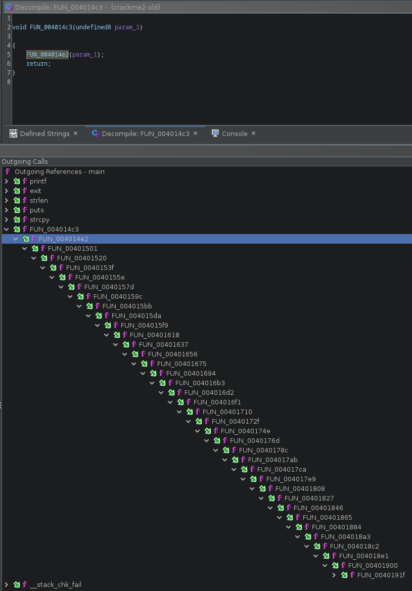

Grey Cat The Flag CTF 2023 had some nice reversing challenges, this one was very nice and i think deserves a small writeup.

You can grab the original file [here](crackme2). A fixed version was later released [fixed](crackme2-new), but i used the original binary.


# 1. Quick Recon

it's a 64 bits ELF that takes the flag as input
```
% file crackme2
crackme2: ELF 64-bit LSB executable, x86-64, version 1 (SYSV), dynamically linked, interpreter /lib64/ld-linux-x86-64.so.2, BuildID[sha1]=ef9a4ed8207e6b5b4ff62a6c5e140a5059d6d067, for GNU/Linux 3.2.0, stripped

% ./crackme2
Usage: ./crackme2 [greyctf{...}]
```

also we can notice there's some antidebug as it's attempting to ptrace itself, so we'll probably have to deal with it

```
% strace -e trace=ptrace ./crackme2 bla
ptrace(PTRACE_TRACEME)                  = -1 EPERM (Operation not permitted)
--- SIGSEGV {si_signo=SIGSEGV, si_code=SI_KERNEL, si_addr=NULL} ---
+++ killed by SIGSEGV +++
zsh: segmentation fault  strace -e trace=ptrace ./crackme2 bla
```

the segfault is due to the original binary being slightly broken but is not an issue.

`main` is nothing fancy but we can notice the input flag is copied to the stack:
```C
undefined8 main(int argc,char **argv)
{
    uint uVar1;
    size_t len;
    long in_FS_OFFSET;
    char flag [136];
    long local_10;

    if (argc != 2) {
        printf("Usage: %s [greyctf{...}]\n",*argv);
                    /* WARNING: Subroutine does not return */
        exit(0);
    }
    len = strlen(argv[1]);
    if (0x7f < len) {
        puts("The flag isn\'t so long. You will overflow the program...");
    }
                    /* copy input flag on the stack */
    strcpy(flag,argv[1]);
                    /* meat must be here */
    uVar1 = FUN_004014c3(0);
    printf("%d\n",(ulong)uVar1);
    return 0;
}
```

everything must happen during the call to `FUN_004014c3` however it's a very long chain of function calls (lot of FUN.... :p):



so we can work backward instead: find an interesting string like `"Wrong flag :("` and walk the XREF up to `00401350`:

```C
void execute_mess(void)
{
    int iVar1;
    void *__addr;

    __addr = (void *)syscall_mmap(0,0x1000,7,0x22,0xffffffff,0);
    if (__addr == (void *)0xffffffffffffffff) {
        wrong_flag();
    }
    dyn_call(__addr,0x38c);
    iVar1 = munmap(__addr,0x1000);
    if (iVar1 == -1) {
        wrong_flag();
    }
    return;
}
```


# 2. Understanding what's happening

it starts by allocating a RWX region using `mmap`. It's not using the library function, but the syscall instead:
```asm
                             syscall_mmap
        00401232 f3 0f 1e fa                  ENDBR64
        00401236 55                           PUSH                    RBP
        00401237 48 89 e5                     MOV                     RBP,RSP
        0040123a 48 89 7d e8                  MOV                     qword ptr [RBP + local_20],RDI
        0040123e 48 89 75 e0                  MOV                     qword ptr [RBP + local_28],RSI
        00401242 89 55 dc                     MOV                     dword ptr [RBP + local_2c],EDX
        00401245 89 4d d8                     MOV                     dword ptr [RBP + local_30],ECX
        00401248 44 89 45 d4                  MOV                     dword ptr [RBP + local_34],R8D
        0040124c 4c 89 4d c8                  MOV                     qword ptr [RBP + local_40],R9
        00401250 49 89 ca                     MOV                     R10,RCX
                                       ; 0x9 is syscall for mmap (https://filippo.io/linux-syscall-table/)
        00401253 48 c7 c0 09 00 00 00         MOV                     RAX,0x9
        0040125a 0f 05                        SYSCALL
        0040125c 48 89 c1                     MOV                     RCX,RAX
        0040125f 48 89 4d f8                  MOV                     qword ptr [RBP + local_10],RCX
        00401263 48 8b 45 f8                  MOV                     RAX,qword ptr [RBP + local_10]
        00401267 5d                           POP                     RBP
        00401268 c3                           RET
```


then it loops over and over decrypting and executing some code:

```C
void dyn_call(code *mmap_mem,undefined4 idx)
{
    undefined4 index;
    undefined4 key;

    key = 0xad23773b;
    index = idx;
    do {
        decrypt_code(mmap_mem,key,index);
        /* actually returns both index and key for next round */
        index = (*mmap_mem)();
    } while( true );
}

void decrypt_code(void *table,uint key,int offset)

{
    ulong i;
    uint size;
    
    size = ENCRYPTED_CODE[offset];
    for (i = 0; i < size; i = i + 1) {
        *(dword *)((long)table + i * 4) = ENCRYPTED_CODE[i + (long)(offset + 1)] ^ key;
    }
    return;
}
```

`decrypt_code` takes a XOR key and offset into an array we call `ENCRYPTED_CODE` and decrypt+copy into the mmap'ed region.

We can use a small GDB script to trace calls to `decrypt_code` and dump xor keys and offsets:

```python
import gdb

def read_reg(reg):
    return gdb.parse_and_eval("${}".format(reg))


fd = open("trace_crack2.txt", "w")

gdb.execute('break *0x40133b')  # call decrypt_code
gdb.execute('run aaaaaaaaaaaaaaaaaaaaaaaaaaaaaaaaaaaaaaa')

while 1:
    key = int(read_reg('esi')) & 0xffffffff
    idx = int(read_reg('edx'))
    if idx < 0:
        break

    print("key 0x%x idx 0x%x"%(key, idx))
    fd.write("key 0x%x idx 0x%x\n"%(key, idx))
    gdb.execute("continue")
```

which produces a trace like that:

```
key 0xad23773b idx 0x38c
key 0x92d26427 idx 0x3c3
key 0x1411f6c3 idx 0x3ff
key 0x69cbae50 idx 0x446
key 0x7332a93 idx 0x477
key 0x93efb281 idx 0x4ad
key 0xe23f1d80 idx 0x4e6
key 0xceb1956e idx 0x517
key 0xab7f0423 idx 0x54a
key 0x565118bb idx 0x57f
key 0xd99d45a idx 0x5b7
key 0x5601610d idx 0x5ef
key 0xb38a2126 idx 0x62a
key 0x1cf5510b idx 0x670
key 0x83125f0c idx 0x6a0
key 0xd48c0a3a idx 0x6d9
key 0xe89cc9cd idx 0x4
```

which can be used by this script to decrypt and disassemble the code:

```python
import sys
from pwn import *
from capstone import *

# encrypted code region
CODE_OFFSET = 0xc0a0
CODE_SIZE   = 0x10000

def disasm(code):
    md = Cs(CS_ARCH_X86, CS_MODE_64)
    for i in md.disasm(code, 0x0):
        print("0x%x:\t%s\t%s" %(i.address, i.mnemonic, i.op_str))


def dec(data, key, sz):
    key = p32(key)
    size = data[sz*4]   # read size
    code = xor(key, data[(sz+1)*4:(sz+1+size)*4])
    disasm(code)

# read encrypted code from binary
with open(sys.argv[1], "rb") as fp:
    fp.seek(CODE_OFFSET)
    data = fp.read(CODE_SIZE)

with open("trace_crack2.txt") as fp:
    for line in fp:
        line = line.split()

        key = int(line[1][2:], 16)
        idx = int(line[3][2:], 16)

        print("\n\n\n")
        print("bloc: 0x%x   0x%x"%(idx, key))
        dec(data, key, idx)
```


the decrypted code clearly looks obfuscated:

```asm
bloc: 0x38c   0xad23773b
0x0:    mov rdx, 0x3689bc0d
0x7:    movabs  rdi, 0x864e55d5
0x11:   xor rdi, rdx
0x14:   mov rbx, 0x1471e32d
0x1b:   sub rbx, rdi
0x1e:   movabs  r10, 0xe9d3019e
0x28:   sub r10, rbx
0x2b:   mov rsi, 0x9f3a96e
0x32:   sub rsi, r10
0x35:   mov rbx, 0x5bcaf507
0x3c:   xor rbx, rsi
0x3f:   movabs  r10, 0xafdf5a79
0x49:   xor r10, rbx
0x4c:   mov r8, 0x2a3bfde6
0x53:   add r8, r10
0x56:   mov rsi, 0x32b2ae6b
0x5d:   sub rsi, r8
0x60:   movabs  rax, 0x19097a1e9
0x6a:   xor rax, rsi
0x6d:   movabs  rdx, 0xdd66c684
0x77:   movabs  rsi, 0xe89e6c60
0x81:   add rsi, rdx
0x84:   mov rbx, 0x147e8930
0x8b:   xor rbx, rsi
0x8e:   movabs  rsi, 0xfbd886c4
0x98:   xor rsi, rbx
0x9b:   movabs  r9, 0xcb56fcb7
0xa5:   xor r9, rsi
0xa8:   mov rbx, 0x3e2bc149
0xaf:   xor rbx, r9
0xb2:   mov rdx, 0x3231b3f7
0xb9:   add rdx, rbx
0xbc:   movabs  r11, 0xad2afb66
0xc6:   sub r11, rdx
0xc9:   movabs  rcx, 0x1f4b71da6
0xd3:   add rcx, r11
0xd6:   ret
```


and we can find the `ptrace` call in there:
```asm
bloc: 0x6d9   0xd48c0a3a
0x0:    xor edi, edi
0x2:    push    0x65        ; ptrace syscall number
0x4:    pop rax
0x5:    syscall
0x7:    mov rsi, rax
0xa:    movabs  r10, 0xc9d392ed
0x14:   movabs  rbx, 0xf21ee895
```


`ptrace` will return 0 upon success, so one way to circumvent it is to change `syscall` to `xor eax, eax`.

Both instructions are the same size:

```
% rasm2 -b64 'syscall'
0f05
% rasm2 -b64 "xor eax, eax"
31c0
``` 

we can use the following script to patch a new binary (not forgetting the XOR):

```python
from pwn import p32

idx = 0x6d9 + 1
xor_key = p32(0xd48c0a3a)
file_offset = 0xc0a0 + idx*4

data = bytearray(open("crackme2", 'rb').read())

# syscall -> xor eax,eax
data[file_offset+5] = 0x31 ^ xor_key[1]
data[file_offset+6] = 0xc0 ^ xor_key[2]

open('crackme2.patch', 'wb').write(data)
``` 


if we dump the encrypted code blocs from the patched binary we can validate the change:

```asm
bloc: 0x6d9   0xd48c0a3a
0x0:    xor    edi, edi
0x2:    push    0x65
0x4:    pop    rax
0x5:    xor    eax, eax     ; here
0x7:    mov    rsi, rax
0xa:    movabs    r10, 0xc9d392ed
0x14:    movabs    rbx, 0xf21ee895
0x1e:    sub    rbx, r10
0x21:    movabs    r8, 0xa019c58c
0x2b:    xor    r8, rbx
```

if we re-run the GDB trace script on the patched binary, the generated trace is much longer and that's now something we can work on


# 3. Flag in the haystack

The initial trace was executing 17 encrypted blocs, the new one goes over 125
```
% wc -l trace_crack2.txt.*
  17 trace_crack2.txt.1
 125 trace_crack2.txt.2
 142 total
```

that's both a good and bad news because the assembly is obfuscated by a lot of arithmetic constants unfolding and we need to find how the flag is checked.

We can also generate a new disassembly out of this trace using the same script as before: 
```
% ./dump.py crackme2.patch > trace2.txt
```


At some point the code needs to load the input flag if it wants to check.
When the decrypted code is called, debugging shows no obvious reference to the input string in any register, however we know from the `main` function that it's been copied to the
stack.

We can see some blocks are loading an address relative to the stack, which is already a good lead:

```
% egrep "bloc|rbp" trace2.txt
[...]
bloc: 0x8d3   0xe2b797ea
0x42:	lea	rdx, [rbp + rdx]
bloc: 0x97b   0xfe5ddd5e
0x42:	lea	rbx, [rbp + rbx]
bloc: 0xa14   0x5eb21c2c
0x4b:	lea	rdx, [rbp + rdx]
bloc: 0xab3   0x44c6f479
0x42:	lea	r10, [rbp + r10]
[...]
```

also there must be some kind of conditionnal instruction somewhere to trigger the good or bad message.

Some block contains a `cmp` instruction, but they are just decoys and here for more confusion.
The before last block of the new trace in interesting as it ends with:

```
0x1e1:  test    r12, r12
0x1e4:  cmove   rdx, rbx
0x1e8:  mov rcx, rdx
0x1eb:  ret
```

The `CMOVE` instruction will move rbx to rdx if r12 == 0. RDX then ends up in ECX which holds the index of the next bloc to run.

If we debug the binary and force r12 to be 0 at this stage, we end up with the winning message, so in order to get the correct flag, we need to end up with r12 == 0.

```
% grep r12 trace2.txt
0x91:	xor	r12, r12
0xfb:	or	r12, rdx
0x12c:	or	r12, rdx
0xf5:	or	r12, r11
0x109:	or	r12, rdx
0x115:	or	r12, r8
0x106:	or	r12, rax
0xfa:	or	r12, r10
0x126:	or	r12, rdx
0x10b:	or	r12, rcx
0x108:	or	r12, r9
0x10b:	or	r12, rdx
0x104:	or	r12, r8
0x119:	or	r12, rdi
0x126:	or	r12, r10
0x11c:	or	r12, r9
0x118:	or	r12, rsi
0x10c:	or	r12, rdx
0x10e:	or	r12, rbx
0x119:	or	r12, r10
0x10e:	or	r12, r10
0x118:	or	r12, rdx
0xf1:	or	r12, rdi
0x10f:	or	r12, rax
0x109:	or	r12, rbx
0x128:	or	r12, rax
0x119:	or	r12, r10
0xfb:	or	r12, rbx
0x129:	or	r12, rcx
0xfa:	or	r12, r11
0x119:	or	r12, r11
0x119:	or	r12, rdi
0x108:	or	r12, rcx
0x124:	or	r12, rbx
0x11e:	or	r12, rbx
0x118:	or	r12, rsi
0x12c:	or	r12, r10
0x13c:	or	r12, rbx
0xfe:	or	r12, r8
0x119:	or	r12, r10
0x122:	or	r12, r10
0xfb:	test	r12, r12
0x1e1:	test	r12, r12
```

it's first initialized to 0 and sometimes, or'd with another register (which must 0 as well).

starring at the screen, we can notice a recurring pattern in some blocks, like this one:

``` 
bloc: 0x165c   0x803ed377
;
;  /// skipped some instructions
;
; load input flag string 
0x45:   lea r9, [rbp + r9]
;
; /// skipped more instructions
;
; load char 'r9' from the input flag string
0xbb:   movzx   rax, byte ptr [r9 + rbx]
;
; /// skipped even more instructions
;
; do a or with r12
0xfb:   or  r12, rdx
```

so if can find these blocks, get the character index that being check (from the movzx instruction) and then manage to get 0 in the or'd register with r12, we should be good to go.


# 4. Poor man's ugly emulation

As i'm not familiar enough with [miasm](https://miasm.re/) or [Triton](https://triton-library.github.io/) to quickly do what i wanted in my limited available i went down the quick
and dirty road:

```python
    def emu(self, code):
        print("######################")

        st = {'r12': 0}

        md = Cs(CS_ARCH_X86, CS_MODE_64)
        for i in md.disasm(code, 0x0):
            op = i.mnemonic
            dat =  i.op_str.replace(",", "").split()
            #print(op, dat)
            match i.mnemonic:
                case 'mov':
                    st[dat[0]] = int(dat[1].replace("0x", ""), 16) & 0xffffffff
                case 'movabs':
                    st[dat[0]] = int(dat[1].replace("0x", ""), 16) & 0xffffffff
                case 'sub':
                    st[dat[0]] -= st[dat[1]]
                    st[dat[0]] &= 0xffffffff
                case 'add':
                    st[dat[0]] += st[dat[1]]
                    st[dat[0]] &= 0xffffffff
                case 'xor':
                    st[dat[0]] ^= st[dat[1]]
                case 'or':
                    st[dat[0]] |= st[dat[1]]
                    if dat[0] == 'r12':
                        # r12 persist and must be 0 for last check to pass
                        #print(" ---------- R12")
                        #print(st[dat[1]])
                        print(st['r12'])
                        # solve dat[1] == 0
                        result = self.slv(st[dat[1]], 0)
                        self.out[pos] = result
                        print(self.out)
                case 'lea':
                    # load flag
                    if st[dat[0]] == 16488:
                        print("load flag")
                        st[dat[0]] = self.flag
                case 'movzx':
                    # load flag chr index
                    o1 = dat[-1][:-1]
                    o2 = dat[-3][1:]
                    if type(st[o1]) is list:
                        pos = st[o2]
                        st[dat[0]] = st[o1][pos]
                    elif type(st[o2]) is list:
                        pos = st[o1]
                        st[dat[0]] = st[o2][pos]
                    else:
                        print(op, dat)
                        print(st)
                        raise
                    print("checking flag pos %d"%pos)
```

I used z3 to symbolize the input flag and then solve the contrains to keep r12 == 0 (which turned out to be quite simple...)

Full script [here](https://gist.github.com/matthw/0a02e8324bf90b1a90ae38bdd1229adb).

Running the script yields the following output:

```
% python emu.py
bloc: 0x801   0x3c23c429
######################
bloc: 0x839   0x47569508
######################
[...]
######################
load flag
checking flag pos 5
0 | 100 - f5 & 255
bytearray(b'\x00\x00\x00\x00{d\x00\x00\x00\x00\x00\x00\x00\x00\x00\x00\x00\x00\x00\x00\x00\x00\x00\x00\x00\x00\x00\x00\x00\x00\x00\x00\x00\x00\x00\x00\x00\x00\x00\x00\x00')
bloc: 0x18d3   0x22b364d3
######################
load flag
checking flag pos 39
0 | 125 - f39 & 255
bytearray(b'\x00\x00\x00\x00{d\x00\x00\x00\x00\x00\x00\x00\x00\x00\x00\x00\x00\x00\x00\x00\x00\x00\x00\x00\x00\x00\x00\x00\x00\x00\x00\x00\x00\x00\x00\x00\x00\x00}\x00')
bloc: 0x195d   0xc295cc42
######################
bloc: 0x19b5   0xd7f207a3
######################
load flag
checking flag pos 18
0 | 95 - f18 & 255
bytearray(b'\x00\x00\x00\x00{d\x00\x00\x00\x00\x00\x00\x00\x00\x00\x00\x00\x00_\x00\x00\x00\x00\x00\x00\x00\x00\x00\x00\x00\x00\x00\x00\x00\x00\x00\x00\x00\x00}\x00')
bloc: 0x1a46   0x545b9046
######################
load flag
checking flag pos 9
0 | 121 - f9 & 255
bytearray(b'\x00\x00\x00\x00{d\x00\x00\x00y\x00\x00\x00\x00\x00\x00\x00\x00_\x00\x00\x00\x00\x00\x00\x00\x00\x00\x00\x00\x00\x00\x00\x00\x00\x00\x00\x00\x00}\x00')

[....]

######################
load flag
checking flag pos 17
0 | 51 - f17 & 255
bytearray(b'grey{d1d_y0u_s0lv3_b\x00_emul4t1ng?_1e4b8a}\x00')
bloc: 0x3e51   0x193272c7
######################
load flag
checking flag pos 7
bloc: 0x3ee7   0xd6d30c89
######################
load flag
checking flag pos 20
0 | 121 - f20 & 255
bytearray(b'grey{d1d_y0u_s0lv3_by_emul4t1ng?_1e4b8a}\x00')
bloc: 0x3f84   0xd25edc37
######################
``` 


# 5. Files

- binary: [crackme2](crackme2)
- gdb trace script: [trace.py](trace.py)
- disassembler: [dump.py](dump.py)
- ptrace patcher: [patch.py](patch.py)
- emulator: [emu.py](emu.py)
- execution trace before ptrace patch: [trace_crack2_1.txt](trace_crack2_1.txt) + disassembly [trace1.txt](trace1.txt)
- execution trace after ptrace patch: [trace_crack2_2.txt](trace_crack2_2.txt) + disassembly [trace2.txt](trace2.txt)

