"serpentine" was the 9th and penultimate challenge from Google/FLARE's [Flare-On](https://flare-on.com/) 2024 - and arguably the hardest challenge of these past couple of years (at least in my opinion).

Some information may be presented in a simplistic or incomplete way, as I tried to stay focused on the main points for this challenge. However, it’s very possible I got something slightly wrong or made a mistake, so feel free to point it out.

# 1. Untangling The Spaghetti

## 1.1 Quick Peek

The program expects a 32 bytes key as parameter, it is copied at address `0x14089b8e8` (that i labelled `INPUT_KEY`), execution is then transfered to some code region.

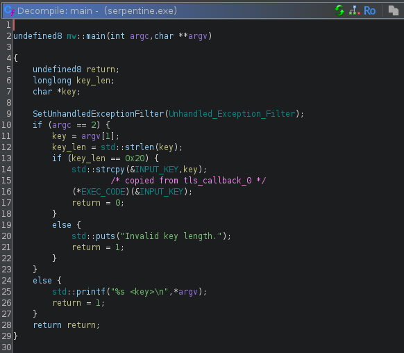

Providing the wrong key prints the message `"Wrong Key"`, we can follow string references up to that function, next to which we find the `show_flag` function:

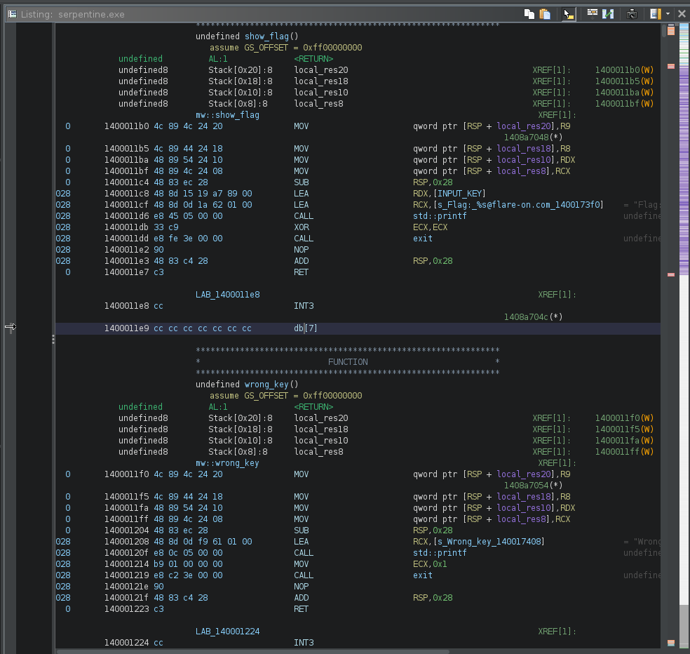

The `EXEC_CODE` pointer is initialized within the first TLS callback:

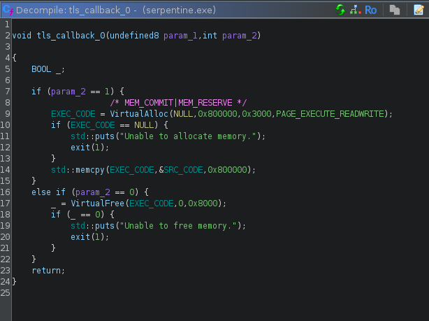

We now know its source (`0x140097af0`) and size (`0x800000`) - and it welcomes us with a nice `HLT` instruction...

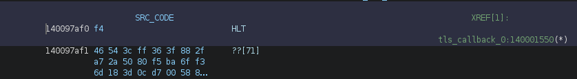

Debugging confirms that code execution is correctly transfered to the allocated buffer and that the `HLT` instruction triggers an exception, as expected, meaning that we'll probably have to deal with some
kind of exception based obfuscation.

## 1.2 Exception Handling

The `main` function does a call to `SetUnhandledExceptionFilter`, sadly for us, the referenced handler doesn't do much:

```C
void mw::Unhandled_Exception_Filter(void)

{
    std::puts("Unexpected exception occurred.");
    exit(1);
    return;
}
```

We'll find some luck in `__scrt_common_main_seh()` calling `_initterm()`, which will loop around a list of function pointers and call them before `main()`.

The last 2 functions are the interesting ones:

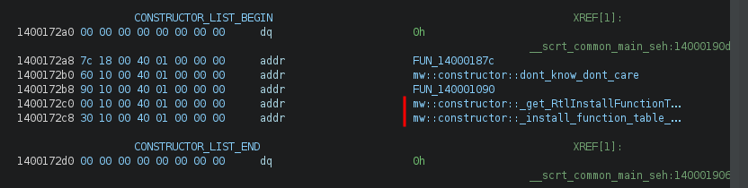

The first one will initialize a global pointer to `RtlInstallFunctionTableCallback` (easier done through debugging than by following the code... :):

```C
        if ((((*exportName == 'R') && (exportName[3] == 'I')) && (exportName[10] == 'F')) &&
           ((exportName[0x12] == 'T' && (exportName[0x17] == 'C')))) break;
```


The 2nd one will call `RtlInstallFunctionTableCallback`

```C
undefined8 mw::constructor::install_function_table_callback(void)

{
    if (RtlInstallFunctionTableCallback != NULL) {
                    /* NTSYSAPI BOOLEAN RtlInstallFunctionTableCallback(
                         [in] DWORD64                        TableIdentifier,
                         [in] DWORD64                        BaseAddress,
                         [in] DWORD                          Length,
                         [in] PGET_RUNTIME_FUNCTION_CALLBACK Callback,
                         [in] PVOID                          Context,
                         [in] PCWSTR                         OutOfProcessCallbackDll
                       ); */
        (*RtlInstallFunctionTableCallback)(EXEC_CODE | 3,EXEC_CODE,0x2e4d26,PTR_callback_handler_1400245b0,0,0);
    }
    return 0;
}
```

If like me you never encountered `RtlInstallFunctionTableCallback`, the [MSDN](https://learn.microsoft.com/en-us/windows/win32/api/winnt/nf-winnt-rtlinstallfunctiontablecallback) is very clear: 

```
Adds a dynamic function table to the dynamic function table list.
```

Thank you, very helpful :-)

Hopefully the [remarks](https://learn.microsoft.com/en-us/windows/win32/api/winnt/nf-winnt-rtlinstallfunctiontablecallback#remarks) section gives more information and we can start being scared:

```
Function tables are used on 64-bit Windows to determine how to unwind or walk the stack.
These tables are usually generated by the compiler and stored as part of the image.
However, applications must provide the function table for dynamically generated code.
For more information about function tables, see the architecture guide for your system.

This function is useful for very dynamic code. 
The application specifies the memory range for the generated code, but does not need to generate a table
until it is needed by an unwind request. At that time, the system calls the callback function with the 
Context and the control address. The callback function must return the runtime function entry for 
the specified address.
```

This hints us towards the fact the exceptions will not be handled by a single static handler and that we'll have to put in some work.

## 1.3 Callback

The `Callback` parameter of `RtlInstallFunctionTableCallback()` is a pointer to a `GET_RUNTIME_FUNCTION_CALLBACK` whose definition looks like
```C
PRUNTIME_FUNCTION GET_RUNTIME_FUNCTION_CALLBACK (
    _In_ DWORD64 ControlPc,
    _In_opt_ PVOID Context
    );
```

This function will be called for any exception happening between the `BaseAddress` and `BaseAddress + Size` parameters of `RtlInstallFunctionTableCallback`, namely any exception happening between `0x14089b8e0` and `0x14089b8e0` + `0x2e4d26` and will return a pointer to a [RUNTIME_FUNCTION](https://learn.microsoft.com/en-us/windows/win32/api/winnt/ns-winnt-runtime_function) structure of the form:

```C
typedef struct _IMAGE_RUNTIME_FUNCTION_ENTRY {
  DWORD BeginAddress;
  DWORD EndAddress;
  union {
    DWORD UnwindInfoAddress;
    DWORD UnwindData;
  } DUMMYUNIONNAME;
} RUNTIME_FUNCTION, *PRUNTIME_FUNCTION, _IMAGE_RUNTIME_FUNCTION_ENTRY, *_PIMAGE_RUNTIME_FUNCTION_ENTRY;
```

It has a single mandatory argument `ControlPC` which is the address where the exception happened.

Our callback function dynamically creates a `RUNTIME_FUNCTION` struct and populates its fields based on the address of the crash:

```C
/* BeginAddress = crash offset in shellcode
   EndAddress = crash offset in shellcode + 1
   UnwindData = EndAddress + 1 + byte [crash_rip + 1] */

PRUNTIME_FUNCTION mw::callback_handler(longlong exception_RIP)

{
    PRUNTIME_FUNCTION runtime_func;
    uint alignment;

    runtime_func = (PRUNTIME_FUNCTION)operator_new(0xc);
    runtime_func->BeginAddress = (int)exception_RIP - (int)EXEC_CODE;
    runtime_func->EndAddress = runtime_func->BeginAddress + 1;
    runtime_func->UnwindData = runtime_func->EndAddress + 1 + (uint)*(byte *)(exception_RIP + 1);
    alignment = (uint)((runtime_func->UnwindData & 1) != 0);
    runtime_func->UnwindData = runtime_func->UnwindData + alignment;
    return runtime_func;
}
```

From the above function, we can infer the following structure in the code:

```
[     HLT     ]    HLT instruction, trigger an exception
[  JUNK_SIZE  ]    One byte indicating the number of junk bytes
[    JUNK     ]   -+
[    JUNK     ]    |
      ...          | JUNK_SIZE bytes of junk
[    JUNK     ]   -+
[ UNWIND_INFO ]    UNWIND_INFO structure
```

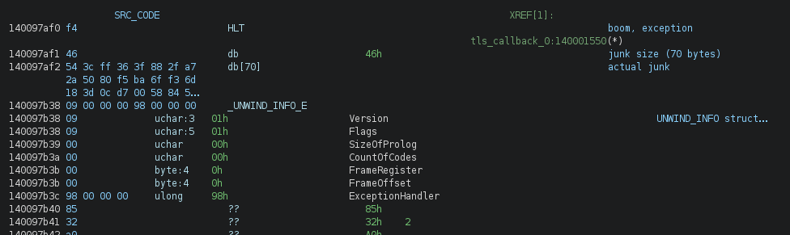

At this stage, reading the [x64 exception handling documentation](https://learn.microsoft.com/en-us/cpp/build/exception-handling-x64?view=msvc-170) is a must - even though my initial thought was something like "baaah screw this, we don't need it".

Well, yes we need it.


## 1.4 Unwinding

All of this is nice but we still dont know what code will be executed after the instruction triggers. If we put a breakpoint in `KiUserExceptionDispatcher` and trace it far enough, we see that eventually the flow is transfered back to our code region of interest. We need to understand where and how, and for this we need to keep digging and understand what this `UNWIND_INFO` structure is.

The structure is documented [here](https://learn.microsoft.com/en-us/cpp/build/exception-handling-x64?view=msvc-170#struct-unwind_info) and can be a bit tricky to parse.

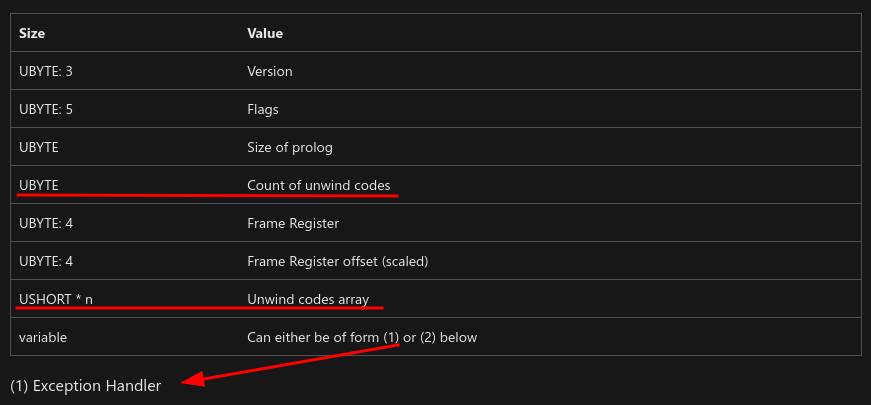

Its size depends on the `Count of unwind codes` field and what they are not saying is that while each unwind code is a `USHORT`, the array size should be `DWORD` aligned. In simpler terms, if the struct says there's 3 unwind codes, the array size will be of 4 unwind codes, the latest one being to be discarded.

Luckily for us the first `UNWIND_INFO` struct we encounter has 0 unwind code, so we dont have to deal with it now.

The last `DWORD` of the structure is the offset of the actual exception handler that needs to be executed, and just like that we know where code execution continues after the execution.

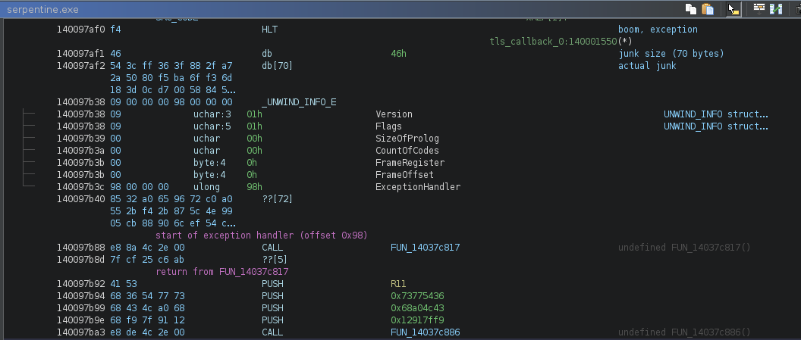

*// bear in mind that 0x140097af0 is considered offset 0*


The exception handler is an `EXCEPTION_ROUTINE` as documented [here](https://learn.microsoft.com/en-us/cpp/build/exception-handling-x64?view=msvc-170#language-specific-handler), whose prototype is 
```C
typedef EXCEPTION_DISPOSITION (*PEXCEPTION_ROUTINE) (
    IN PEXCEPTION_RECORD ExceptionRecord,
    IN ULONG64 EstablisherFrame,
    IN OUT PCONTEXT ContextRecord,
    IN OUT PDISPATCHER_CONTEXT DispatcherContext
);
```


At this stage, I started to draft my plan:
- shove all the code to the [unicorn](https://www.unicorn-engine.org/) emulator
- `HOOK_CODE` to catch the `HLT` instructions
- get the `UNWIND_INFO` address
- parse it to grab the exception handler address
- set `RIP` to that address
- continue execution
- profit (maybe ?)

that should give me a trace (that i was unable to get with x64dbg - because of skill issues, not the tool), from which i may be able to understand what's the code actually doing.

I worked until it didn't, and that was fairly quickly :-)

The actual code is scattered around exceptions handlers, and it turned out we actually *need* to do something with the unwind codes.

## 1.5 Unwinding (For Real)

So what is unwinding ?

*Stack unwinding is the process in programming where the runtime system reverses (or "unwinds") the call stack to clean up resources and execute any necessary destructors or exception handlers after an
exception is thrown. This happens sequentially from the point of the exception back through each previous function call, releasing resources at each level until a suitable catch block is found or the
program terminates.* (thank you ChatGPT).

Unwinding is the process of undoing the changes that have been made to the stack by any function call.

Unwind codes describe what needs to be done in order to undo those changes.

The `UNWIND_CODE` structure:
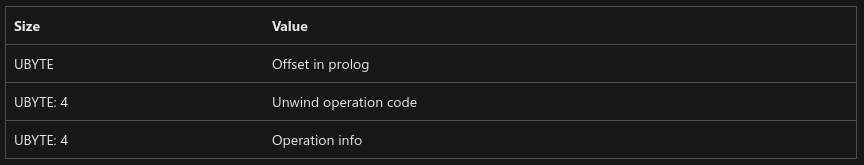

In our case, we're only interested in a limited number of *Unwind operation codes*:
- `UWOP_PUSH_MACHFRAME`
- `UWOP_PUSH_NONVOL`
- `UWOP_ALLOC_LARGE`
- `UWOP_ALLOC_SMALL`
- `UWOP_SET_FPREG`

They are all documented [here](https://learn.microsoft.com/en-us/cpp/build/exception-handling-x64?view=msvc-170#unwind-operation-code).

For example, `UWOP_PUSH_NONVOL`:

```
Push a nonvolatile integer register, decrementing RSP by 8. The operation info is the number of the register.
```

In order to reverse that we have to pop that register off the stack and increment RSP by 8, easy, but what wasn't clear to me is that these operations are __not done on actual registers, but within a `CONTEXT` struct that is created when the exception occured__ in order to save the CPU context (makes sense).

After reading [reactos source code](https://doxygen.reactos.org/d8/d2f/unwind_8c_source.html), [libunwindstack](https://github.com/google/orbit/blob/02f72c7311ed08e6418ecbfab4a457db67aa38d9/third_party/libunwindstack/PeCoffUnwindInfoUnwinderX86_64.cpp) and crawling the [depths of github](https://github.com/wine-mirror/wine/commit/400520192284c34e5b34b52b657cd3dda084403f), each opcode can be implemented as follow (in the more or less pythonic pseudocode):


### # UWOP_PUSH_MACHFRAME
```python
offset = 0x20 if unwind_op_info == 1 else 0x18
context.regs[RSP] = mem_read_qword(context.regs[RSP] + offset)
```

### # UWOP_PUSH_NONVOL

```python
reg = REGS(unwind_op_info)
v = mem_read_qword(context.regs[RSP])   # v = [rsp]
context.regs[reg] = v                   # regX = v
context.regs[RSP] += 8                  # rsp += 8
```


### # UWOP_ALLOC_LARGE

This one requires 2 or 3 slots depending on the OpInfo field

```python
# alloc size = next slot * 8
if unwind_op_info == 0:
    size = USHORT(unwind_codes.read(2)) * 8
    node += 1
# alloc size = next 2 slot
elif unwind_op_info == 1:
    size = UINT(unwind_codes.read(4))
    node += 2
context.regs[RSP] += size

```

### # UWOP_ALLOC_SMALL
```python
size = unwind_op_info * 8 + 8
context.regs[RSP] += size
```

### # UWOP_SET_FPREG
```python
context.regs[RSP] = context.regs[REGS(frame_reg)]
context.regs[RSP] -= frame_offset * 16

```


## 1.6 CONTEXT

We already mentionned that a [`CONTEXT` struct](https://learn.microsoft.com/en-us/windows/win32/api/winnt/ns-winnt-context) is saved whenever an exception occurs and that the unwinding takes place within that structure.

It is important because the code that interests us is using that `CONTEXT` struct to pass information between the different exception handlers.

When tracing the code we can see things like this, which in this specific case is loading the saved r13 register from the saved context to rdi.

```
>>  0x600001a7  mov     rbp, qword ptr [r9 + 0x28]      ; DISPATCHER_CONTEXT->ContextRecord
[...]
>>  0x602e4e8c  mov     rdi, qword ptr [rbp + 0xe0]     ; ContextRecord.R13
```

`r9` holds the fourth argument to our `EXCEPTION_ROUTINE`, which is a pointer to a `DISPATCHER_CONTEXT` structure.
```C
typedef struct _DISPATCHER_CONTEXT {
    ULONG64 ControlPc;
    ULONG64 ImageBase;
    PRUNTIME_FUNCTION FunctionEntry;
    ULONG64 EstablisherFrame;
    ULONG64 TargetIp;
    PCONTEXT ContextRecord;
    PEXCEPTION_ROUTINE LanguageHandler;
    PVOID HandlerData;
} DISPATCHER_CONTEXT, *PDISPATCHER_CONTEXT;
```

## 1.7 Stitching It All Together

Turned out our emulator needs to do a little bit more than initially expected.

Whenever we encounter a `HLT` instruction we need to:

1. Save a `CONTEXT` structure with the current CPU state
2. Compute the address of `RUNTIME_FUNCTION.UnwindData` for our crash location
3. Parse the `UNWIND_INFO` structure at that location
4. Apply all the `UNWIND_OPCODE` to our saved `CONTEXT` struct
5. Save that `CONTEXT` struct to memory and make sure the `EXCEPTION_ROUTINE` handler can access it (we need R9 = DISPATCHER_CONTEXT address and R9+0x28 = CONTEXT address)


When running the [emulator](https://github.com/matthw/ctf/tree/main/flare-on_11/ch09/emu_v4.py) with the input key `AAAABBBBCCCCDDDDaaaabbbbccccdddd` we can see something like ([full trace here](data/emu_v4_trace.txt)):

```
mapping .text @ 0x140001000 (sz: 0x16000)
mapping .rdata @ 0x140017000 (sz: 0xb000)
mapping .data @ 0x140022000 (sz: 0x885000)
mapping .pdata @ 0x1408a7000 (sz: 0x2000)
mapping .rsrc @ 0x1408a9000 (sz: 0x1000)
>>  0x140001642 lea rcx, [rip + 0x89a29f]
>>  0x140001649 call    qword ptr [rip + 0x89a291]
>>  0x60000000  hlt
saving context...
CTX  rax: 0x0000000000000000 rcx: 0x000000014089b8e8 rdx: 0x0000000000000000 rbx: 0x0000000000000000
CTX  rsp: 0x00000000067ffea8 rbp: 0x0000000000000000 rsi: 0x0000000000000000 rdi: 0x0000000000000000
CTX  r8:  0x0000000000000000 r9:  0x0000000000000000 r10: 0x0000000000000000 r11: 0x0000000000000000
CTX  r12: 0x0000000000000000 r13: 0x0000000000000000 r14: 0x0000000000000000 r15: 0x0000000000000000
CTX: rip: 0x0000000060000000 mxcsr: 0x00000000
flag: 1 / opcodes: 0
exception_handler: 0x98
CTX  rax: 0x0000000000000000 rcx: 0x000000014089b8e8 rdx: 0x0000000000000000 rbx: 0x0000000000000000
CTX  rsp: 0x00000000067ffea8 rbp: 0x0000000000000000 rsi: 0x0000000000000000 rdi: 0x0000000000000000
CTX  r8:  0x0000000000000000 r9:  0x0000000000000000 r10: 0x0000000000000000 r11: 0x0000000000000000
CTX  r12: 0x0000000000000000 r13: 0x0000000000000000 r14: 0x0000000000000000 r15: 0x0000000000000000
CTX: rip: 0x0000000060000000 mxcsr: 0x00000000
HANDLER ADDR: 0x60000098
context to mem...
>>  0x60000098  call    0x602e4d27
>>  0x602e4d27  pop qword ptr [rip + 0x33]
>>  0x602e4d27  pop qword ptr [rip + 0x33]
>>  0x602e4d2d  push    rax
>>  0x602e4d2e  mov rax, 0
>>  0x602e4d35  mov ah, byte ptr [rip - 0x15]
>>  0x602e4d3b  lea eax, [eax + 0x7f497049]
>>  0x602e4d42  mov dword ptr [rip + 1], eax
>>  0x602e4d42  mov dword ptr [rip + 1], eax
>>  0x602e4d48  pop rax
>>  0x602e4d49  movabs  r11, 0x10add7f49
>>  0x602e4d53  mov dword ptr [rip - 0x14], 0x676742dd
>>  0x602e4d53  mov dword ptr [rip - 0x14], 0x676742dd
>>  0x602e4d5d  push    rax
>>  0x602e4d5e  movabs  rax, 0x6000009d
>>  0x602e4d68  lea rax, [rax + 5]
>>  0x602e4d6c  xchg    qword ptr [rsp], rax
>>  0x602e4d70  ret
>>  0x600000a2  push    r11
>>  0x600000a4  push    0x73775436
>>  0x600000a9  push    0x68a04c43
>>  0x600000ae  push    0x12917ff9
>>  0x600000b3  call    0x602e4d96
>>  0x602e4d96  pop qword ptr [rip + 0x32]
>>  0x602e4d9c  push    rax
>>  0x602e4d9d  mov rax, 0
>>  0x602e4da4  mov ah, byte ptr [rip - 0x4a]
>>  0x602e4daa  lea eax, [eax + 0x2443e448]
>>  0x602e4db1  mov dword ptr [rip + 1], eax
>>  0x602e4db1  mov dword ptr [rip + 1], eax
>>  0x602e4db7  pop rax
>>  0x602e4db8  add qword ptr [rsp + 0x18], 0x35ac399f
>>  0x602e4dc1  mov dword ptr [rip - 0x13], 0x62cf7984
>>  0x602e4dc1  mov dword ptr [rip - 0x13], 0x62cf7984
>>  0x602e4dcb  push    rax
>>  0x602e4dcc  movabs  rax, 0x600000b8
>>  0x602e4dd6  lea rax, [rax + 4]
>>  0x602e4dda  xchg    qword ptr [rsp], rax
>>  0x602e4dde  ret
>>  0x600000bc  call    0x602e4dff
>>  0x602e4dff  pop qword ptr [rip + 0x2e]
>>  0x602e4dff  pop qword ptr [rip + 0x2e]
>>  0x602e4e05  push    rax
>>  0x602e4e06  mov rax, 0
>>  0x602e4e0d  mov ah, byte ptr [rip - 0x45]
>>  0x602e4e13  lea eax, [eax - 0x2e4dd617]
>>  0x602e4e1a  mov dword ptr [rip + 1], eax
>>  0x602e4e1a  mov dword ptr [rip + 1], eax
>>  0x602e4e20  pop rax
>>  0x602e4e21  jmp 0x60000107
>>  0x60000107  hlt
saving context...
CTX  rax: 0x0000000060000098 rcx: 0x0000000000000000 rdx: 0x0000000000000000 rbx: 0x0000000000000000
CTX  rsp: 0x00000000067ffe88 rbp: 0x0000000000000000 rsi: 0x0000000000000000 rdi: 0x0000000000000000
CTX  r8:  0x0000000000000000 r9:  0x0000000090000000 r10: 0x0000000000000000 r11: 0x000000010add7f49
CTX  r12: 0x0000000000000000 r13: 0x0000000000000000 r14: 0x0000000000000000 r15: 0x0000000000000000
CTX: rip: 0x0000000060000107 mxcsr: 0x00000000
flag: 1 / opcodes: 5
exception_handler: 0x1a7
unwind_op_code: <UWND_CODE.UWOP_PUSH_MACHFRAME: 10>
unwind_op_info: 0
 setting rsp to 0x14089b8e8
CTX  rax: 0x0000000060000098 rcx: 0x0000000000000000 rdx: 0x0000000000000000 rbx: 0x0000000000000000
CTX  rsp: 0x000000014089b8e8 rbp: 0x0000000000000000 rsi: 0x0000000000000000 rdi: 0x0000000000000000
CTX  r8:  0x0000000000000000 r9:  0x0000000090000000 r10: 0x0000000000000000 r11: 0x000000010add7f49
CTX  r12: 0x0000000000000000 r13: 0x0000000000000000 r14: 0x0000000000000000 r15: 0x0000000000000000
CTX: rip: 0x0000000060000107 mxcsr: 0x00000000
unwind_op_code: <UWND_CODE.UWOP_ALLOC_LARGE: 1>
unwind_op_info: 1
 ALLOC 4
CTX  rax: 0x0000000060000098 rcx: 0x0000000000000000 rdx: 0x0000000000000000 rbx: 0x0000000000000000
CTX  rsp: 0x000000014089b8ec rbp: 0x0000000000000000 rsi: 0x0000000000000000 rdi: 0x0000000000000000
CTX  r8:  0x0000000000000000 r9:  0x0000000090000000 r10: 0x0000000000000000 r11: 0x000000010add7f49
CTX  r12: 0x0000000000000000 r13: 0x0000000000000000 r14: 0x0000000000000000 r15: 0x0000000000000000
CTX: rip: 0x0000000060000107 mxcsr: 0x00000000
unwind_op_code: <UWND_CODE.UWOP_PUSH_NONVOL: 0>
unwind_op_info: 13
 reading 8 bytes of input @ offset 4 into 0
 PUSH <REGS.R13: 13> = 0x4343434342424242 (from: rsp=0x14089b8ec)
CTX  rax: 0x0000000060000098 rcx: 0x0000000000000000 rdx: 0x0000000000000000 rbx: 0x0000000000000000
CTX  rsp: 0x000000014089b8f4 rbp: 0x0000000000000000 rsi: 0x0000000000000000 rdi: 0x0000000000000000
CTX  r8:  0x0000000000000000 r9:  0x0000000090000000 r10: 0x0000000000000000 r11: 0x000000010add7f49
CTX  r12: 0x0000000000000000 r13: 0x4343434342424242 r14: 0x0000000000000000 r15: 0x0000000000000000
CTX: rip: 0x0000000060000107 mxcsr: 0x00000000
HANDLER ADDR: 0x600001a7
context to mem...
>>  0x600001a7  mov rbp, qword ptr [r9 + 0x28]
>>  0x600001ab  call    0x602e4e6a
>>  0x602e4e6a  pop qword ptr [rip + 0x30]
>>  0x602e4e70  push    rax
>>  0x602e4e71  mov rax, 0
>>  0x602e4e78  mov ah, byte ptr [rip - 0x4b]
>>  0x602e4e7e  lea eax, [eax - 0x1f4335b8]
>>  0x602e4e85  mov dword ptr [rip + 1], eax
>>  0x602e4e85  mov dword ptr [rip + 1], eax
>>  0x602e4e8b  pop rax
>>  0x602e4e8c  mov rdi, qword ptr [rbp + 0xe0]
>>  0x602e4e93  mov dword ptr [rip - 0x11], 0xd6279bce
>>  0x602e4e93  mov dword ptr [rip - 0x11], 0xd6279bce
>>  0x602e4e9d  push    rax
>>  0x602e4e9e  movabs  rax, 0x600001b0
>>  0x602e4ea8  lea rax, [rax + 2]
>>  0x602e4eac  xchg    qword ptr [rsp], rax
>>  0x602e4eb0  ret
>>  0x600001b2  movzx   rdi, dil
>>  0x600001b6  call    0x602e4ed0
>>  0x602e4ed0  pop qword ptr [rip + 0x2e]
>>  0x602e4ed6  push    rax
>>  0x602e4ed7  mov rax, 0
>>  0x602e4ede  mov ah, byte ptr [rip - 0x44]
>>  0x602e4ee4  lea eax, [eax - 0x2e4d9c17]
>>  0x602e4eeb  mov dword ptr [rip + 1], eax
>>  0x602e4eeb  mov dword ptr [rip + 1], eax
>>  0x602e4ef1  pop rax
>>  0x602e4ef2  jmp 0x6000020a
>>  0x6000020a  hlt
```

There's a number of interesting things we can notice:
- It looks like there's a second layer of obfuscation besides the exception flow:
  - the RIP relative moves with short offsets (`mov dword ptr [rip + 1], eax`) indicate self modifying code
  - the return address of the call is computed like `...; xchg    qword ptr [rsp], rax; ret` 
- The 2nd unwind loads 4 bytes of the input key into the `Context.R13` register using a `UWOP_PUSH_NONVOL` opcode
```
unwind_op_code: <UWND_CODE.UWOP_PUSH_NONVOL: 0>
unwind_op_info: 13
 reading 8 bytes of input @ offset 4 into 0
 PUSH <REGS.R13: 13> = 0x4343434342424242 (from: rsp=0x14089b8ec)
CTX  rax: 0x0000000060000098 rcx: 0x0000000000000000 rdx: 0x0000000000000000 rbx: 0x0000000000000000
CTX  rsp: 0x000000014089b8f4 rbp: 0x0000000000000000 rsi: 0x0000000000000000 rdi: 0x0000000000000000
CTX  r8:  0x0000000000000000 r9:  0x0000000090000000 r10: 0x0000000000000000 r11: 0x000000010add7f49
CTX  r12: 0x0000000000000000 r13: 0x4343434342424242 r14: 0x0000000000000000 r15: 0x0000000000000000
CTX: rip: 0x0000000060000107 mxcsr: 0x00000000
```
- The `Context.R13` register is then accessed by the 2nd exception handler:
```
>>  0x600001a7  mov     rbp, qword ptr [r9 + 0x28]      ; DISPATCHER_CONTEXT->ContextRecord
>>  0x602e4e8c  mov     rdi, qword ptr [rbp + 0xe0]     ; ContextRecord->R13
```

confirming that the unwinding process plays a crucial role in the problem we're trying to solve.

If we examine the full emulator log, we see there's only a single conditionnal instruction at the end, in the form of a `test` + `cmovne` combo.

```
>>  0x600179fd  test    r14, r14
[...]
>>  0x60017a07  cmovne  r12, r15
>>  0x60017a0b  jmp r12
>>  0x1400011f0 mov qword ptr [rsp + 0x20], r9
>>  0x1400011f5 mov qword ptr [rsp + 0x18], r8
```

In this case, we failed the test, and it jumped to `0x1400011f0`: the address of the `wrong_key` function.

In order to pass the test, we need `R14` to be zero at the time of the `test`, if we trick the emulator, we discover there's 32 blocks ending with a `test/cmovne` combo...

We can also notice the code uses the `MXCSR` register, via the `ldmxcsr` instruction:
```
% grep ldmxcsr /tmp/trace.txt
>>  0x602e5440	ldmxcsr	dword ptr [r15 + 0x90]
>>  0x600007e2	ldmxcsr	dword ptr [rdx + 0x34]
>>  0x602e5e76	ldmxcsr	dword ptr [r14 + 0x90]
>>  0x60000e3e	ldmxcsr	dword ptr [r9 + 0x34]
>>  0x602e67f2	ldmxcsr	dword ptr [r15 + 0xf0]
...
```

but also via the context struct:

```
0x600008e0  mov rbx, qword ptr [r9 + 0x28]      ; rbx  = DISPATCHER_CONTEXT->ContextRecord
...
0x600008eb  mov r11d, dword ptr [rbx + 0x34]    ; r11d = ContextRecord.MxCsr
```


## 1.8 Intermediate Summary

The call to `RtlInstallFunctionTableCallback` installs a handler reponsible for returning a pointer to a `RUNTIME_FUNCTION` for exceptions happening between the `EXEC_CODE` and `EXEC_CODE + 0x2e4d26` boundaries.

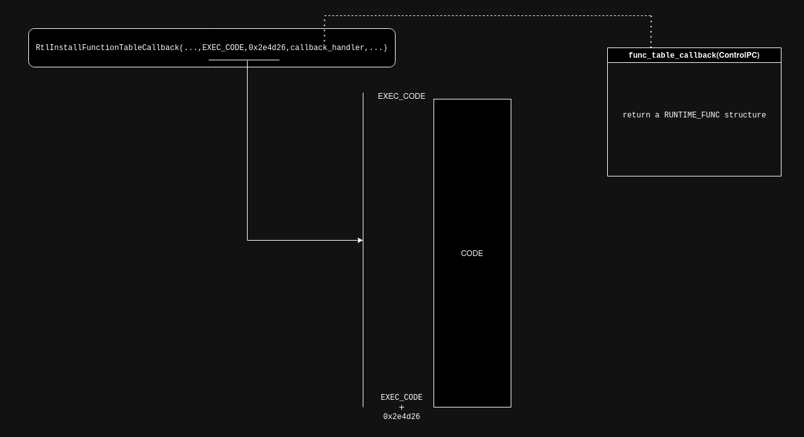


This `RUNTIME_FUNCTION` structure has an `UnwindData` field pointing to an `UNWIND_INFO` structure.

The `UNWIND_INFO` structure may contain unwind opcodes describing unwind operations to be applied to the `CONTEXT`struct, and holds the address of the exception handler where execution must be transfered to.

The overall flow when an exception triggers inside that code region looks like this:
- a `CONTEXT` structure created to save the current CPU context.
- `KiUserExceptionDispatcher` is called as per the usual exception handling process
  - the installed function table callback is called
  - it returns a `RUNTIME_FUNCTION` pointer
  - unwinding happens, potentially modifying the saved `CONTEXT`
  - the address of the exception handler is computed
- exception handler is executed
- rinse and repeat

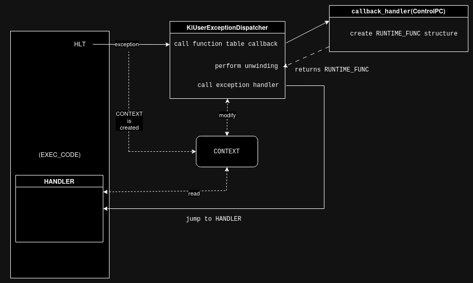


Each conditional block follows this structure, with every exception handler using the `CONTEXT` struct to pass data.

The first conditional block contains 364 `HLT` instructions...

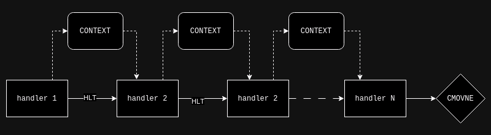

There are 32 conditionnal blocks that we need to validate in order to win:

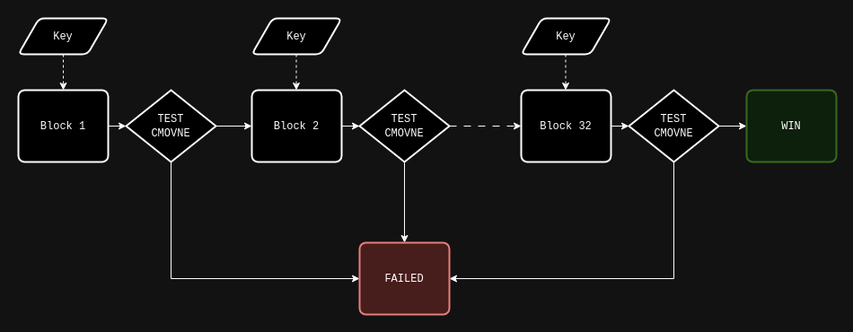


# 2. Meal Prep

Even though we can now emulate and understand the general flow of the beast, we still have no idea what we actually need to do in order to find the key.

Taking into account that first conditionnal block alone has 364 handlers, that there's 32 conditionnal blocks and that the code of the handlers is obfuscated, we're not going to do that by hand. In other
words we need some tooling.

Disassemblers and decompilers like ghidra, binary ninja or IDA are *sometimes* pretty powerful at simplifying code and expressions out of the box, so our first goal would be to feed a conditionnal block to one of these and see what happens.

While emulating we can dump raw opcodes to a file as we disassemble instructions, so that will not be a problem.

However, there's several issues that needs to be overcome in the hope to get any meaningful result:
- there's a `CONTEXT` struct passing data between each exception handlers: we need to somewhat reproduce that, otherwise the data flow will be wrong
- the unwinding process can modify that `CONTEXT` struct between each exception handlers: we need to generate code which reproduce that
- the code is obfuscated with calls, self modifications and stack (ab)uses, we may want to clean that a bit upfront too...

## 2.1 Flattening The Dough (or getting rid of the exceptions)

We need to make our code "flat" and self contained, in the sense that it should not rely anymore on external mechanisms like an actual context struct, the unwinding process or exception handling in
general.

### 2.1.1 Context Simulation

An easy way to get rid of the `CONTEXT` struct is to actually not get rid of it :-)

Each time we run through a `HLT` instruction, we can save the registers ourselves somewhere.
I arbitrarily chosed the following addresses:
- 0x1000:    `DISPATCHER_CONTEXT`   (that's the structure passed to the exception handlers via `r9`)
- 0x1100:    `CONTEXT`

We start by setting up the `DISPATCHER_CONTEXT->ContextRecord` pointer:

```asm
mov     rcx, 0x1100                     ; address of CONTEXT
mov     qword ptr [0x1028], rcx         ; DISPATCHER_CONTEXT->ContextRecord = CONTEXT
```

then, in place of every exceptions, we emit the follow code to fill in a basic `CONTEXT` struct with the info we need:
```asm
movabs  qword ptr [0x1178], rax
mov     qword ptr [0x1180], rcx
mov     qword ptr [0x1188], rdx
mov     qword ptr [0x1190], rbx
mov     qword ptr [0x1198], rsp
mov     qword ptr [0x11a0], rbp
mov     qword ptr [0x11a8], rsi
mov     qword ptr [0x11b0], rdi
mov     qword ptr [0x11b8], r8
mov     qword ptr [0x11c0], r9
mov     qword ptr [0x11c8], r10
mov     qword ptr [0x11d0], r11
mov     qword ptr [0x11d8], r12
mov     qword ptr [0x11e0], r13
mov     qword ptr [0x11e8], r14
mov     qword ptr [0x11f0], r15
stmxcsr dword ptr [0x1134]              ; save MXCSR
mov     r9, 0x1000                      ; R9 = 3rd exception handler arg
                                        ; must point to DISPATCHER_CONTEXT
```

that's already one problem solved.

### 2.1.2 JIT The Unwind

The 2nd thing we need to solve to have an accurate data flow between the exception handlers, is to convert the unwind operations to code.
We have pythonic code already for each opcode, the operations are pretty simple.

#### # UWOP_PUSH_MACHFRAME
```python
#
# python
# 
offset = 0x20 if unwind_op_info == 1 else 0x18
self.ctx.regs[REGS.RSP] = self.mem_read(self.ctx.regs[REGS.RSP] + offset)

#
# emit assembly
#
rsp = self.ctx.get_reg_addr("rsp")
ANAL.emit("push rax")
ANAL.emit("mov rax, [0x%x]"%rsp)
ANAL.emit("add rax, %d"%offset)
ANAL.emit("mov rax, [rax]")
ANAL.emit("mov [0x%x], rax"%rsp)
ANAL.emit("pop rax")
```

#### # UWOP_PUSH_NONVOL
```python
#
# python
#
reg = REGS(unwind_op_info)

v = self.mem_read(self.ctx.regs[REGS.RSP])   # v = [rsp]
self.ctx.regs[reg] = v                       # regX = v
self.ctx.regs[REGS.RSP] += 8                 # rsp += 8

#
# emit assembly
#
rsp = self.ctx.get_reg_addr("rsp")
r = self.ctx.get_reg_addr(ASM_REGS[reg])
ANAL.emit("push rax")
ANAL.emit("mov rax, [0x%x]"%rsp)       # v = rsp
ANAL.emit("mov rax, [rax]")            # regX = [v]
ANAL.emit("mov [0x%x], rax"%r)         # regX = [v]

# add rsp, 8
ANAL.emit("mov rax, [0x%x]"%rsp)
ANAL.emit("add rax, 8")
ANAL.emit("mov [0x%x], rax"%rsp)
ANAL.emit("pop rax")
```

#### # UWOP_ALLOC_LARGE
```python
#
# python
#
# alloc size = next slot * 8
if unwind_op_info == 0:
    size = u16(self.codes.read(2)) * 8
    node += 1
# alloc size = next 2 slot
elif unwind_op_info == 1:
    size = u32(self.codes.read(4))
    node += 2
self.ctx.regs[REGS.RSP] += size

#
# emit assembly
#
rsp = self.ctx.get_reg_addr("rsp")
ANAL.emit("push rax")
ANAL.emit("mov rax, [0x%x]"%rsp)
ANAL.emit("add rax, %d"%size)
ANAL.emit("mov [0x%x], rax"%rsp)
ANAL.emit("pop rax")
```

#### # UWOP_ALLOC_SMALL
```python
#
# python
#
size = unwind_op_info * 8 + 8
self.ctx.regs[REGS.RSP] += size

#
# emit assembly
#
rsp = self.ctx.get_reg_addr("rsp")
ANAL.emit("push rax")
ANAL.emit("mov rax, [0x%x]"%rsp)
ANAL.emit("add rax, %d"%size)
ANAL.emit("mov [0x%x], rax"%rsp)
ANAL.emit("pop rax")
```

#### # UWOP_SET_FPREG
```python
#
# python
#
self.ctx.regs[REGS.RSP] = self.ctx.regs[REGS(self.frame_reg)]
self.ctx.regs[REGS.RSP] -= self.frame_offset * 16

#
# emit assembly
#
reg = REGS(self.frame_reg)
rsp = self.ctx.get_reg_addr("rsp")
r = self.ctx.get_reg_addr(ASM_REGS[reg])
ANAL.emit("push rax")
ANAL.emit("mov rax, [0x%x]"%r)
ANAL.emit("sub rax, %d"%(self.frame_offset * 16))
ANAL.emit("mov [0x%x], rax"%rsp)
ANAL.emit("pop rax")
```

and "just" like that we got rid of the exception process.


## 2.2 Sorting The Ingredients (or deobfuscation)

The code obfuscator always follows the same scheme:
- __inside function calls__, the only instructions we care about are directly located after a `pop rax` instruction. The rest is either useless self modifying code for confusion, or return address computation.
- __outside function calls__, everything's good to keep


Using the first handler as an example:

```asm
0x60000098  call    0x602e4d27                        ; crap - call = enter obfuscated code
0x602e4d27  pop qword ptr [rip + 0x33]                ; crap
0x602e4d27  pop qword ptr [rip + 0x33]                ; crap
0x602e4d2d  push    rax                               ; crap
0x602e4d2e  mov rax, 0                                ; crap
0x602e4d35  mov ah, byte ptr [rip - 0x15]             ; crap
0x602e4d3b  lea eax, [eax + 0x7f497049]               ; crap
0x602e4d42  mov dword ptr [rip + 1], eax              ; crap
0x602e4d42  mov dword ptr [rip + 1], eax              ; crap
0x602e4d48  pop rax                                   ; crap pop rax: next instruction is good
0x602e4d49  movabs  r11, 0x10add7f49                    ; YES
0x602e4d53  mov dword ptr [rip - 0x14], 0x676742dd    ; crap
0x602e4d53  mov dword ptr [rip - 0x14], 0x676742dd    ; crap
0x602e4d5d  push    rax                               ; crap
0x602e4d5e  movabs  rax, 0x6000009d                   ; crap - compute return address
0x602e4d68  lea rax, [rax + 5]                        ; crap - compute return address
0x602e4d6c  xchg    qword ptr [rsp], rax              ; crap - push return address
0x602e4d70  ret                                       ; crap - ret
0x600000a2  push    r11                                 ; YES
0x600000a4  push    0x73775436                          ; YES
0x600000a9  push    0x68a04c43                          ; YES
0x600000ae  push    0x12917ff9                          ; YES
0x600000b3  call    0x602e4d96                        ; crap - call == enter obfuscated code
0x602e4d96  pop qword ptr [rip + 0x32]                ; crap
0x602e4d9c  push    rax                               ; crap
0x602e4d9d  mov rax, 0                                ; crap
0x602e4da4  mov ah, byte ptr [rip - 0x4a]             ; crap
0x602e4daa  lea eax, [eax + 0x2443e448]               ; crap
0x602e4db1  mov dword ptr [rip + 1], eax              ; crap
0x602e4db1  mov dword ptr [rip + 1], eax              ; crap
0x602e4db7  pop rax                                   ; crap - pop rax: next instruction is good
0x602e4db8  add qword ptr [rsp + 0x18], 0x35ac399f      ; YES
0x602e4dc1  mov dword ptr [rip - 0x13], 0x62cf7984    ; crap
0x602e4dc1  mov dword ptr [rip - 0x13], 0x62cf7984    ; crap
0x602e4dcb  push    rax                               ; crap
0x602e4dcc  movabs  rax, 0x600000b8                   ; crap - compute return address
0x602e4dd6  lea rax, [rax + 4]                        ; crap - compute return address
0x602e4dda  xchg    qword ptr [rsp], rax              ; crap - push return address
0x602e4dde  ret                                       ; crap - ret
0x600000bc  call    0x602e4dff                        ; crap - call == enter obfuscated code
0x602e4dff  pop qword ptr [rip + 0x2e]                ; crap
0x602e4dff  pop qword ptr [rip + 0x2e]                ; crap
0x602e4e05  push    rax                               ; crap
0x602e4e06  mov rax, 0                                ; crap
0x602e4e0d  mov ah, byte ptr [rip - 0x45]             ; crap
0x602e4e13  lea eax, [eax - 0x2e4dd617]               ; crap
0x602e4e1a  mov dword ptr [rip + 1], eax              ; crap    
0x602e4e1a  mov dword ptr [rip + 1], eax              ; crap
0x602e4e20  pop rax                                   ; crap - pop rax: next instruction is good
0x602e4e21  jmp 0x60000107                              ; YES / but we shouldn't re-emit
0x60000107  hlt                                         ; YES / but we shouldn't re-emit
```


Considering that we should not re-emit `jmp` and `hlt`  instructions (unless we want an unreadable, useless output...), that leaves us with following instructions:

```asm
0x602e4d49  movabs  r11, 0x10add7f49                    ; YES
0x600000a2  push    r11                                 ; YES
0x600000a4  push    0x73775436                          ; YES
0x600000a9  push    0x68a04c43                          ; YES
0x600000ae  push    0x12917ff9                          ; YES
0x602e4db8  add qword ptr [rsp + 0x18], 0x35ac399f      ; YES
```

This is pretty easy to implement programmatically.

Of course, eveytime we apply a modification to the original code (like flattening the exception handling or deobfuscating), we have to emulate the output code and compare it to the original run to make sure the result is semantically identical...

... and this how awful it looked in ghidra:

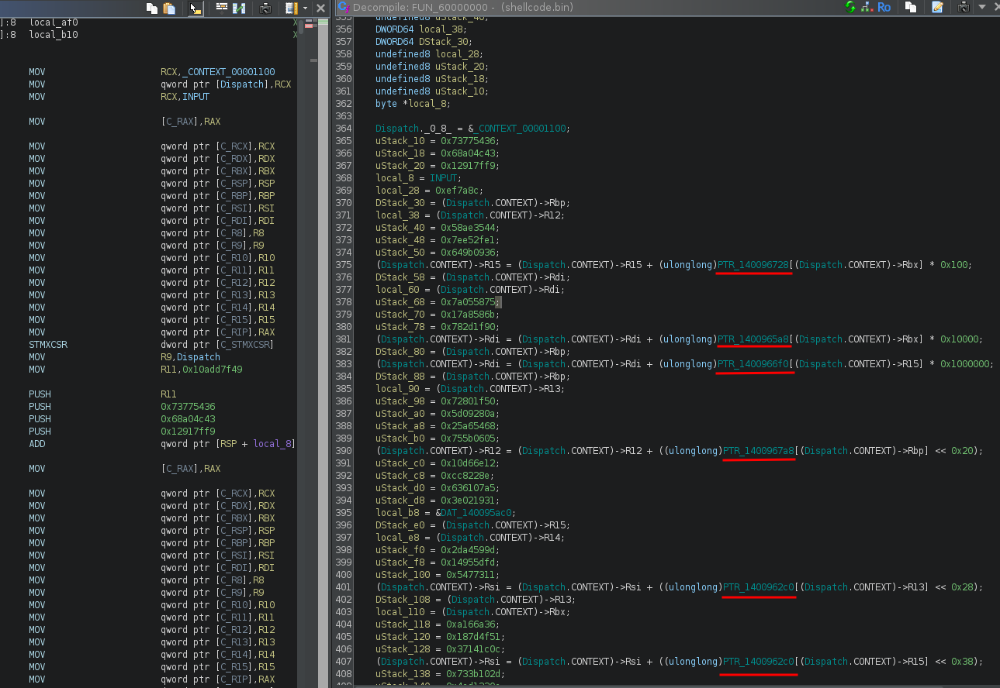

There's something the decompiler doesn't like (and i don't know what): it's not showing half the operations, it's not showing that our input is used, ... even though the code executes the same.

Anyway, if it's not readable, it should be solvable using symbolic execution:
- we know how to setup the initial context (input key and stuff)
- we know where we should or shouldn't land in the code (win/fail functions) and even where we need to push some path constraints (test instructions)

but... [angr](https://angr.io/) hung (hangr...) and [Triton](https://triton-library.github.io/) wasn't happy either (as in returning wrong results). Could have been a skill issue in both cases (and
probably was to be fair), but after looking carefully, we can a see a lot of tables lookups (underligned in red), with some of these lookups being "input dependant".

That's what symbolic execution and underlying SMT solvers do not like (probably, i'm not an expert), so let's see what we can do about it.


## 2.2 At The Table !

Now comes what I think was the trickiest part of the whole challenge...

### 2.2.1 Tables... Tables Everywhere

Starting at offset `0x1400942c0` are a bunch of pointers, each of them pointing to a 256 bytes array

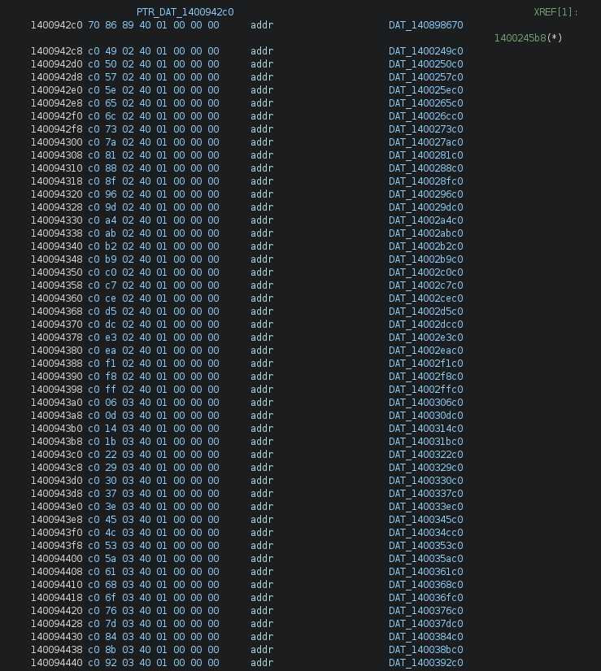

we can dump them using a simple script:
```python
import sys
from pwn import u64

start = 0x1400942c0
end = 0x140097ac0

tbls = {}

addr = start
with open('serpentine.exe', 'rb') as fp:
    while addr <= end:
        fp.seek(addr - 0x140001c00)
        ptr = u64(fp.read(8))
        tbls[addr] = ptr
        addr += 8
        print(hex(addr))

    for name, ptr in tbls.items():
        fp.seek(ptr - 0x140001c00)
        data = fp.read(256)

        data = [int(_) for _ in data]
        print("off_%s = %r"%(hex(ptr)[2:], data))
```

All these tables are flattened output of simple byte functions (thank you [mak](https://x.com/maciekkotowicz) !). There's a total of 3586 tables, which gives us 14 (3586/256) different operations (maybe).

For example, the table at offset `0x14002a5c0` is

```
% python dump_tbl_2.py | grep 14002a5c0
off_14002a5c0 = [
    14, 15, 12, 13, 10, 11, 8, 9, 6, 7, 4, 5, 2, 3, 0, 1, 30, 31, 28, 29, 26, 27, 24, 25, 22, 23, 20, 21, 
    18, 19, 16, 17, 46, 47, 44, 45, 42, 43, 40, 41, 38, 39, 36, 37, 34, 35, 32, 33, 62, 63, 60, 61, 58, 59,
    56, 57, 54, 55, 52, 53, 50, 51, 48, 49, 78, 79, 76, 77, 74, 75, 72, 73, 70, 71, 68, 69, 66, 67, 64, 65,
    94, 95, 92, 93, 90, 91, 88, 89, 86, 87, 84, 85, 82, 83, 80, 81, 110, 111, 108, 109, 106, 107, 104, 105, 
    102, 103, 100, 101, 98, 99, 96, 97, 126, 127, 124, 125, 122, 123, 120, 121, 118, 119, 116, 117, 114, 115, 
    112, 113, 142, 143, 140, 141, 138, 139, 136, 137, 134, 135, 132, 133, 130, 131, 128, 129, 158, 159, 156, 
    157, 154, 155, 152, 153, 150, 151, 148, 149, 146, 147, 144, 145, 174, 175, 172, 173, 170, 171, 168, 169,
    166, 167, 164, 165, 162, 163, 160, 161, 190, 191, 188, 189, 186, 187, 184, 185, 182, 183, 180, 181, 178,
    179, 176, 177, 206, 207, 204, 205, 202, 203, 200, 201, 198, 199, 196, 197, 194, 195, 192, 193, 222, 223,
    220, 221, 218, 219, 216, 217, 214, 215, 212, 213, 210, 211, 208, 209, 238, 239, 236, 237, 234, 235, 232,
    233, 230, 231, 228, 229, 226, 227, 224, 225, 254, 255, 252, 253, 250, 251, 248, 249, 246, 247, 244, 245,
    242, 243, 240, 241
]
```

and corresponds to a __xor 14__: `off_14002a5c0[X] == X ^ 14`

Based on the emulated code, we can track down the required functions to 5 operations:
- x + y
- x ^ y
- x & 0
- x > y
- x <= y
- x >> y
- y >> x

We can start to manually identify the operations: once we know the operation it's easy to find the other tables for that operation (by bruteforcing).

Eventually we end up with something like [tables.py](https://github.com/matthw/ctf/tree/main/flare-on_11/ch09/tables.py)...


### 2.2.2 Removing The Tables

Now that we have the tables identified, we need to find a way to remove them by replacing them by equivalent assembly instructions.

There's 2 instruction patterns used to perform those table lookups and the register holding the end result is always a 8 bits register:

```asm
mov table, table_base
add table, v
mov res.8b, [table]
```
and 

```asm
mov reg.8b, v
add reg, table_base
mov res.8b, [reg]
```

for example:

```
050        600005bd 4d 8b b6 68 04 00 00         MOV                     R14,qword ptr [R14 + 0x468]=>PTR_140096728 = NaP
050        600005c4 4d 03 b7 90 00 00 00         ADD                     R14,qword ptr [R15 + 0x90]=>C_RBX
050        600005cb 41 8a 36                     MOV                     SIL,byte ptr [R14]
```

scanning for that pattern is fairly easy, the issue is to know what's the table base address and what's the index register.

The loosy strat I came up with is:
- detect every `mov` instruction with a __8 bits destination register__
- if the __2 previous instructions__ are `add` and `mov` then
    - if the first `mov` destination operand is a 8 bits register:
      - then the source register is the `index` register
      - and the right `add` operand is the `table base` register
    - else:
      - source register of the `mov` instruction is the `table base`
      - right `add` operand is the `index` register
- using the computed address by the last `mov` we can find in which table we're in:

```python
def find(addr):
    for i in TABLES.keys():
        if 0 <= addr - i < 256:
            return TABLES[i]
    raise Exception("unknown table 0x%x"%addr)
``` 

- emit assembly code in place of the table lookup:

*// `v` is the value hardcoded in the table, `input` is the index*

#### # `add` _(input + v)_:
```python
dst = (input + v) & 0xff
```
```asm
mov tmp, var
add tmp, v
and tmp, 0xff
mov dst, tmp
```

#### # `and` _(input & v)_:
```python
dst = input & v
```
```asm
mov tmp, input
and tmp, v
mov dst, tmp
```

#### # `xor` _(input ^ v)_:
```python
dst = input ^ v
```
```asm
mov tmp, input
xor tmp, v
mov dst, tmp
```

#### # `rshift_x` _(input >> v)_:
```python
dst = var >> v
```
```asm
mov tmp, input
shr tmp, v
mov dst, tmp
```

#### # `rshift_y` _(v >> input)_:
*only works if v == 1 (which is the case)*
```python
dst = 1 if input == 0 else 0
```
```asm
mov tmp, input
or tmp, tmp
setz tmp
movzx dst, tmp
```

#### # `cmp_gt` _(input > v)_:
```python
dst = ((v - input) >> 8) & 1
```
```asm
mov tmp, v
sub tmp, input
shr tmp, 8
and tmp, 1
mov dst, tmp
```

#### # `cmp_le` _(input <= v)_:
```python
dst = (((v - input) >> 8) & 1) ^ 1
```
```asm
mov tmp, v
sub tmp, input
shr tmp, 8
and tmp, 1
xor tmp, 1
mov dst, tmp
```
The full code can be seen in [emu_v7.py](https://github.com/matthw/ctf/tree/main/flare-on_11/ch09/emu_v7.py) - this is an abomination, I know... (and it requires [tables.py](https://github.com/matthw/ctf/tree/main/flare-on_11/ch09/tables.py))

Running it will spit out 32 binary blobs in a "stages/" folder.


# 3. Dessert Time

Now we can use Triton to solve it.

If you dont want to compile Triton, here's what you have to do (at the time of the writeup):
- run python 3.11 (the version is important)
- pip install triton-library

The idea is to symbolize the user input and have Triton execute the reconstructed shellcode, while we push path constraints every time we hit a `test` instruction.


[The script](https://github.com/matthw/ctf/tree/main/flare-on_11/ch09/triton_solver.py) is pretty simple but it took me some time to get things right (skill issue): I was trying to solve the conditionnal blocks one by one, getting a model after each one.
The time required to solve them looked like exponential, requiring more than 20 minutes only to solve the first 4, and i had to restart from scratch everytime.

In the end i figured out that sending everything, only pushing path constraints and getting a model at then end only was the way to go (takes ~30s to solve on my computer).

Triton is a special beast i'm yet to tame, sometimes things work some way and i dont understand why, sometimes they work another way and i dont understand either, but i find its API more staightforward
than angr and it can also easily be used as a sort of unicorn replacement too.

```python
#!/usr/bin/env python
import sys
from triton import *

# random addresses
BASE_ARGV  = 0x20000000
BASE_STACK = 0x9ffffff0
BASE_CODE  = 0x600000

# not random stuff
FLAG_ADDR = 0x14089b8e8
FLAG_LEN = 0x20


def emulate(ctx, pc):
    test_count = 0

    while pc:
        opcode = ctx.getConcreteMemoryAreaValue(pc, 16)
        instruction = Instruction(pc, opcode)
        addr = instruction.getAddress()

        ctx.processing(instruction)
        #print(instruction)

        # test instruction
        if instruction.getType() == OPCODE.X86.TEST:
            test_count += 1

            register = instruction.getOperands()[0]
            print("testing %s @ 0x%x"%(register.getName(), addr))
            r = ctx.simplify(ctx.getSymbolicRegister(register).getAst())

            # we want that register to be 0
            ctx.pushPathConstraint(r == 0)
            
        # got enough "test", get model
        if test_count == 32:
            mod = ctx.getModel(ctx.getPathPredicate())
            for k,v in list(mod.items()):
                ctx.setConcreteVariableValue(ctx.getSymbolicVariable(v.getId()), v.getValue())

            flag = ''
            for x in range(FLAG_LEN):
                flag += chr(ctx.getConcreteMemoryValue(FLAG_ADDR + x))
            print("flag: %s@flare-on.com"%flag)

            sys.exit(0)

        # set rip
        pc = ctx.getConcreteRegisterValue(ctx.registers.rip)


def main():
    ctx = TritonContext(ARCH.X86_64)
    # Set a symbolic optimization mode
    ctx.setMode(MODE.ALIGNED_MEMORY, True)
    ctx.setMode(MODE.ONLY_ON_SYMBOLIZED, True)
    ctx.setSolver(SOLVER.BITWUZLA)
    
    ast = ctx.getAstContext()

    # load code
    ctx.setConcreteMemoryAreaValue(BASE_CODE, open("stages/full.bin", "rb").read())


    # setup key
    key = b'********************************'
    ctx.setConcreteMemoryAreaValue(FLAG_ADDR, key + b'\x00')

    # symbolize key
    for i in range(len(key)):
        var = ctx.symbolizeMemory(MemoryAccess(FLAG_ADDR + i, CPUSIZE.BYTE))
        #vast = ast.variable(var)
        #ctx.pushPathConstraint(ast.land([vast >= ord(b' '), vast <= ord(b'~')]))
 

    # stack
    ctx.setConcreteRegisterValue(ctx.registers.rbp, BASE_STACK)
    ctx.setConcreteRegisterValue(ctx.registers.rsp, BASE_STACK)

    # fire
    emulate(ctx, BASE_CODE)


if __name__ == "__main__":
    main()
```

and this is how it goes:

```
% mkdir stages
% python emu_v7.py
% cat stages/shellcode_??.bin > stages/full.bin     # concat all blocks to a big blob
% python triton_solver.py
testing r14 @ 0x6136b1
testing rbx @ 0x626c9e
testing r12 @ 0x63aaec
testing rsi @ 0x64caf9
testing r15 @ 0x65e091
testing r14 @ 0x670cfc
testing r15 @ 0x68455a
testing rdi @ 0x6972ac
testing r13 @ 0x6ab683
testing rbx @ 0x6be963
testing rdi @ 0x6d1fcd
testing rbx @ 0x6e4e72
testing r14 @ 0x6f7821
testing rdi @ 0x70af3d
testing r14 @ 0x7208dd
testing r15 @ 0x73472a
testing r13 @ 0x7495eb
testing r12 @ 0x75aede
testing r12 @ 0x76db6e
testing r12 @ 0x78243c
testing rbp @ 0x795969
testing r13 @ 0x7a9d35
testing rbp @ 0x7bbfa7
testing rbp @ 0x7cc746
testing r13 @ 0x7dd64e
testing rbx @ 0x7efa70
testing rbp @ 0x800a9d
testing rbp @ 0x813a32
testing r12 @ 0x827e35
testing rsi @ 0x83b742
testing rbx @ 0x84e950
testing rbx @ 0x86205f
flag: $$_4lway5_k3ep_mov1ng_and_m0ving@flare-on.com
```


# 4. Conclusion

Learning more about exception handling, unwinding and crafting a working emulator was the highlight of this year's Flare-On.

It was really an iterative process, requiring several versions of the emulator as features were added, and a lot of testing to make sure it wouldn't introduce issues or semantic differences.

But in the end... after sweating, swearing and tweaking... it finally worked.


# 5. Resources

- __MSDN:__ https://learn.microsoft.com/en-us/cpp/build/exception-handling-x64?view=msvc-170
- __MSDN:__ https://learn.microsoft.com/en-us/windows/win32/api/winnt/ns-winnt-context
- __Android's libunwindstack:__ https://github.com/google/orbit/blob/02f72c7311ed08e6418ecbfab4a457db67aa38d9/third_party/libunwindstack/PeCoffUnwindInfoUnwinderX86_64.cpp
- __Wine's dbghelp:__ https://github.com/wine-mirror/wine/blob/master/dlls/dbghelp/cpu_x86_64.c#L530
- __[Maurice Heumann](https://x.com/momo5502)'s blog:__ https://momo5502.com/posts/2024-09-07-a-journey-through-kiuserexceptiondispatcher/
- __ReactOS:__ https://doxygen.reactos.org/d8/d2f/unwind_8c_source.html

# 6. Files

- __Challenge file:__ [serpentine.7z](data/serpentine.7z) (password: `flare`)
- __Simple emulator:__ [emu_v4.py](https://github.com/matthw/ctf/tree/main/flare-on_11/ch09/emu_v4.py)
- __Trace for the first conditionnal block:__ [emu_v4_trace.txt](data/emu_v4_trace.txt)
- __Full blown emulator/deobfuscator:__ [emu_v7.py](https://github.com/matthw/ctf/tree/main/flare-on_11/ch09/emu_v7.py) + [tables.py](https://github.com/matthw/ctf/tree/main/flare-on_11/ch09/tables.py)
- __Triton solver:__ [triton_solver.py](https://github.com/matthw/ctf/tree/main/flare-on_11/ch09/triton_solver.py)
