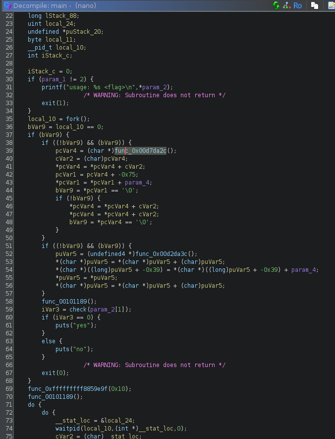
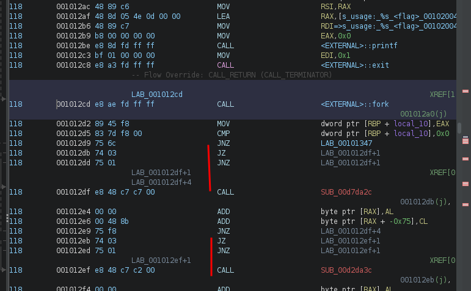
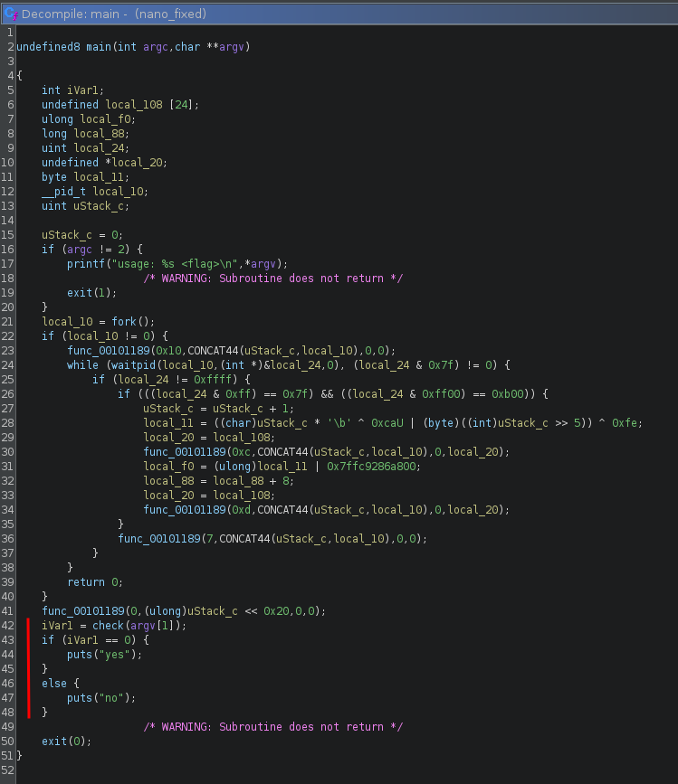
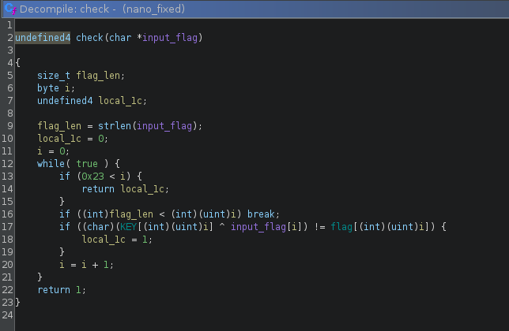
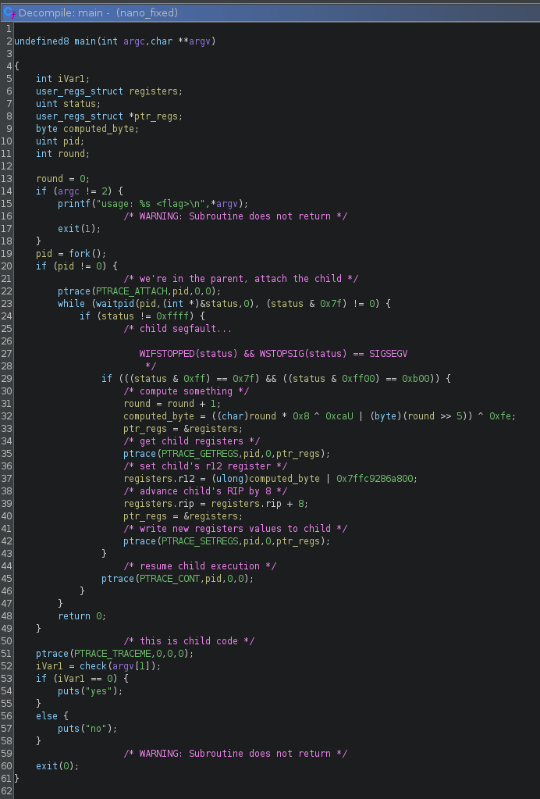
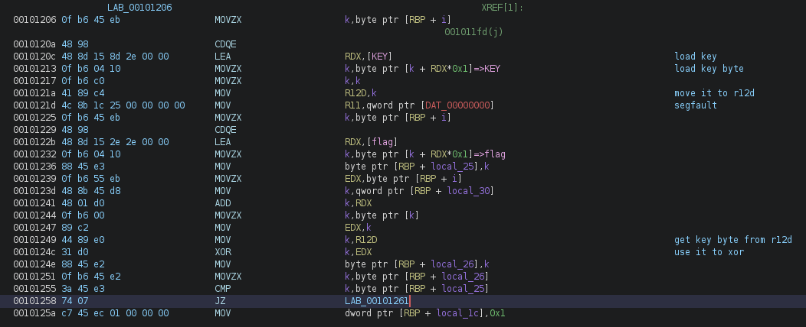
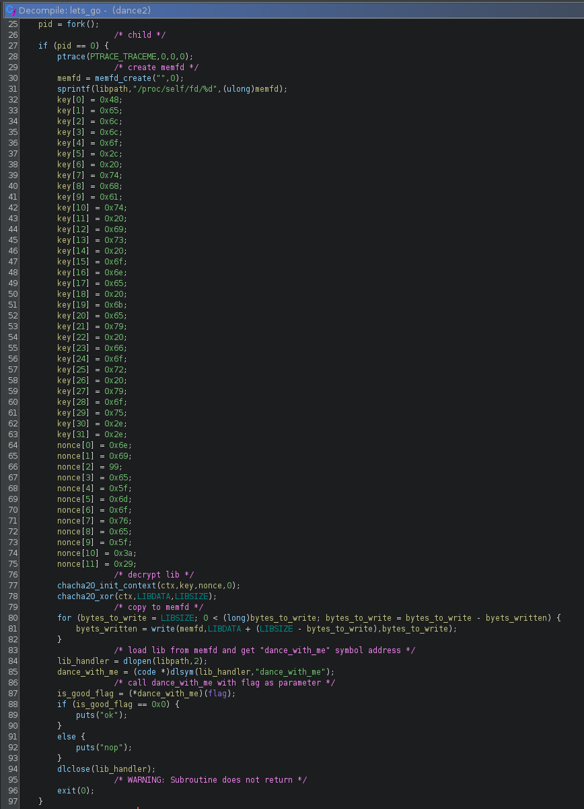
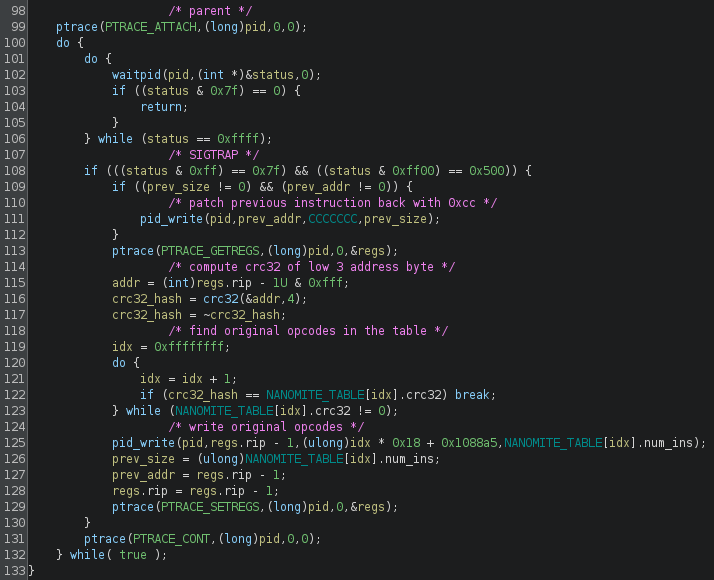

These are two self-debugging ptrace (or nanomite, as you prefer) based challenges I made for 0xl4augh CTF.

`ptrace` is a system call that allows a process to trace/debug another process, it is used by debuggers and tracing tools like `strace`.

Since it can be used to read/write the memory and the CPU context of another process, it can also be used for all kind of fun stuff like hot patching.

Another *interesting* property of `ptrace` that often makes it used as an anti-debugging technique is that a process can only be traced by one and only one process.

It can do a whole lot of things, I recommend reading the [ptrace(2) manpage](https://man7.org/linux/man-pages/man2/ptrace.2.html).


# 1. nano

This challenge is meant as an introduction to nanomites, there's also a bit of code obfuscation.
It is unstripped, mainly to trick the reverser into some rabbit holes, the idea was to force people out of the decompiler and briefly look at the disassembly.

The source and binary are available [here](https://github.com/matthw/ctf/blob/main/2024-0xl4augh/nano/), let's dive into it.

## 1.1 Obfuscation

Opening the binary, we notice the main function doesn't make much sense:


This is due to a common obfuscation technique with JZ/JNZ to produce a non-conditionnal jump but still confuse the disassembler.


The method is well described in the great [Practical Malware Analysis](https://nostarch.com/malware) book, which i highly recommend everyone to read.


We can get rid of it by looking for the `JZ +5; JNZ +3; CALL` pattern and NOPing it:

```python
data = open("nano", "rb").read()

# nop patterns
data = data.replace(b"\x74\x03\x75\x01\xe8", b"\x90\x90\x90\x90\x90")

open("nano_fixed", "wb").write(data)
```

This produces a new binary where the code actually decompiles fine:


## 1.2 Fake Flag

Since this is a CTF, we are first after the flag, we ignore the noise and jump into the `check` function:


It is pretty straightforward: it goes over a 0x24 char input flag, xoring each char with a `KEY` and verifies that the result is what is in the `flag` global variable.

We can extract both `KEY` and `flag`, xor them together and that should give us the actual input flag:

```
>>> from pwn import xor
>>> KEY = b'\x7b\x3d\x14\x43\x01\x43\x5e\x2f\x27\x6a\x47\x4a\x1b\x10\x53\xf6\xac\xbf\xbc\x93\xb6\xde\xde\xce\xb4\xb3\xc9\xfc\x9b\xc7\xc1\x10\x2e\x4e\x2a\x39'
>>> flag = b'\x0c\x5c\x60\x20\x69\x63\x64\x0f\x4f\x1e\x33\x3a\x68\x2a\x7c\xd9\xd5\xd0\xc9\xe7\xc3\xf0\xbc\xab\x9b\xd7\x98\x8b\xaf\xb0\xf8\x47\x49\x16\x49\x68'
>>> xor(KEY, flag)
b'watch : https://youtu.be/dQw4w9WgXcQ'
```

clearly this is not the flag we're looking for:

```
% ./nano 'watch : https://youtu.be/dQw4w9WgXcQ'
no
```

## 1.3 Self-Debugging

Going back to `main`, the function `func_00101189`, turns out to be a wrapper around the `ptrace` syscall (syscall 0x65 is the sys_ptrace on x86_64 linux), we can rename it and
apply proper typing:



So what's happening is that the process will `fork` and the parent will attach the child with `ptrace`:

```
         ┌──────────────────────────────────┐
         │                                  │
         │   Parent process                 │
         │                                  │
         └───────┬──────────────────────────┘
                 │
                 │
         debug with ptrace
                 │
                 │
                 │                ┌────────────────────────────────────┐
                 │                │                                    │
                 └───────────────►│       Child Process                │
                                  │                                    │
                                  └────────────────────────────────────┘
```

then everytime the child segfaults, the parent will compute a byte value, update the child's registers and resume its execution:

```

                                          Parent catches SIGSEGV
        ┌──────────────────────────────────┐
        │                                  │
        │   Parent process                 │◄───────────────────┐
        │                                  │                    │
        └─────────┬────────────────────────┘                    │
                  │                                             │
                  │                                             │
                  │                                             │
                  │                                          SIGSEGV
        Compute byte value and update                           │
        Child's R12 register                                    │
                  │                                             │
                  │                                             │
        Resume child execution                                  │
                  │                                             │
                  │                                             │
                  │                                             │
                  │              ┌──────────────────────────────┴─────┐
                  │              │                                    │
                  └─────────────►│       Child Process                │
                                 │                                    │
                                 └────────────────────────────────────┘

```


The parent uses `PTRACE_GETREGS` to read the child's registers into a `user_regs_struct` structure and then `PTRACE_SETREGS` to set the child's registers.


The structure is defined as such in [sys/user.h](https://sites.uclouvain.be/SystInfo/usr/include/sys/user.h.html):

```C
struct user_regs_struct
{
  __extension__ unsigned long long int r15;
  __extension__ unsigned long long int r14;
  __extension__ unsigned long long int r13;
  __extension__ unsigned long long int r12;
  __extension__ unsigned long long int rbp;
  __extension__ unsigned long long int rbx;
  __extension__ unsigned long long int r11;
  __extension__ unsigned long long int r10;
  __extension__ unsigned long long int r9;
  __extension__ unsigned long long int r8;
  __extension__ unsigned long long int rax;
  __extension__ unsigned long long int rcx;
  __extension__ unsigned long long int rdx;
  __extension__ unsigned long long int rsi;
  __extension__ unsigned long long int rdi;
  __extension__ unsigned long long int orig_rax;
  __extension__ unsigned long long int rip;
  __extension__ unsigned long long int cs;
  __extension__ unsigned long long int eflags;
  __extension__ unsigned long long int rsp;
  __extension__ unsigned long long int ss;
  __extension__ unsigned long long int fs_base;
  __extension__ unsigned long long int gs_base;
  __extension__ unsigned long long int ds;
  __extension__ unsigned long long int es;
  __extension__ unsigned long long int fs;
  __extension__ unsigned long long int gs;
};
```

You can refer to [nano.c](https://github.com/matthw/ctf/blob/main/2024-0xl4augh/nano/src/nano.c) to see the full parent debugging loop.

Now if we you look at the `check` disassembly, we can see that the XOR key is stored in register `R12` and that in the middle of the XOR loop, there's a move from address 0.
This triggers the segfault and the beauty is that the decompiler doesn't give any hint about it.



Clearly now, the child crashes in the middle of the XOR loop and the parent replaces the key before resuming execution.
It does so by incrementing `RIP` by 8 before continuing, because the faulty instruction (`mov r11, qword ptr [0]`) is 8 bytes.

## 1.4 Solving

We know how the parent computes the correct key so we can just do the same:

```python
flag = bytearray(b'\x0c\x5c\x60\x20\x69\x63\x64\x0f\x4f\x1e\x33\x3a\x68\x2a\x7c\xd9\xd5\xd0\xc9\xe7\xc3\xf0\xbc\xab\x9b\xd7\x98\x8b\xaf\xb0\xf8\x47\x49\x16\x49\x68')

for rnd in range(1, len(flag)+1):
    k = ((rnd * 0x8) & 0xff ^ 0xca | (rnd >> 5)) ^ 0xfe
    flag[rnd-1] ^= k

print(flag)
```

## 1.5 Solving with strace

We've mentionned earlier that `strace` uses `ptrace` and that a process can only be ptraced one.
This mean that we cannot `strace` the child, but we can still `strace` the parent and use that to dump the `PTRACE_SETREGS` calls:

```
% strace ./nano aaaaaaaaaaaaaaaaaaaaaaaaaaaaaaaaaaaa 2>&1 | grep PTRACE_SETREGS
ptrace(PTRACE_SETREGS, 10574, {r15=0x7f2746a15000, r14=0x5604d7806dd8, r13=0x7ffcddf96000, r12=0x7ffc9286a83c, rbp=0x7ffcddf95db0, rbx=0x7ffcddf95fe8, r11=0x7f2746943200, r10=0x7f27467ed328, r9=0x7f27467db740, r8=0, rax=0x7b, rcx=0x7ffcddf97906, rdx=0x5604d78070a0, rsi=0, rdi=0xfffffffffffffffa, orig_rax=0xffffffffffffffff, rip=0x5604d7804225, cs=0x33, eflags=0x10206, rsp=0x7ffcddf95d80, ss=0x2b, fs_base=0x7f27467db740, gs_base=0, ds=0, es=0, fs=0, gs=0}) = 0
ptrace(PTRACE_SETREGS, 10574, {r15=0x7f2746a15000, r14=0x5604d7806dd8, r13=0x7ffcddf96000, r12=0x7ffc9286a824, rbp=0x7ffcddf95db0, rbx=0x7ffcddf95fe8, r11=0x7f2746943200, r10=0x7f27467ed328, r9=0x7f27467db740, r8=0, rax=0x3d, rcx=0x7ffcddf97906, rdx=0x5604d78070a0, rsi=0, rdi=0xfffffffffffffffa, orig_rax=0xffffffffffffffff, rip=0x5604d7804225, cs=0x33, eflags=0x10202, rsp=0x7ffcddf95d80, ss=0x2b, fs_base=0x7f27467db740, gs_base=0, ds=0, es=0, fs=0, gs=0}) = 0
ptrace(PTRACE_SETREGS, 10574, {r15=0x7f2746a15000, r14=0x5604d7806dd8, r13=0x7ffcddf96000, r12=0x7ffc9286a82c, rbp=0x7ffcddf95db0, rbx=0x7ffcddf95fe8, r11=0x7f2746943200, r10=0x7f27467ed328, r9=0x7f27467db740, r8=0, rax=0x14, rcx=0x7ffcddf97906, rdx=0x5604d78070a0, rsi=0, rdi=0xfffffffffffffffa, orig_rax=0xffffffffffffffff, rip=0x5604d7804225, cs=0x33, eflags=0x10206, rsp=0x7ffcddf95d80, ss=0x2b, fs_base=0x7f27467db740, gs_base=0, ds=0, es=0, fs=0, gs=0}) = 0
ptrace(PTRACE_SETREGS, 10574, {r15=0x7f2746a15000, r14=0x5604d7806dd8, r13=0x7ffcddf96000, r12=0x7ffc9286a814, rbp=0x7ffcddf95db0, rbx=0x7ffcddf95fe8, r11=0x7f2746943200, r10=0x7f27467ed328, r9=0x7f27467db740, r8=0, rax=0x43, rcx=0x7ffcddf97906, rdx=0x5604d78070a0, rsi=0, rdi=0xfffffffffffffffa, orig_rax=0xffffffffffffffff, rip=0x5604d7804225, cs=0x33, eflags=0x10206, rsp=0x7ffcddf95d80, ss=0x2b, fs_base=0x7f27467db740, gs_base=0, ds=0, es=0, fs=0, gs=0}) = 0
ptrace(PTRACE_SETREGS, 10574, {r15=0x7f2746a15000, r14=0x5604d7806dd8, r13=0x7ffcddf96000, r12=0x7ffc9286a81c, rbp=0x7ffcddf95db0, rbx=0x7ffcddf95fe8, r11=0x7f2746943200, r10=0x7f27467ed328, r9=0x7f27467db740, r8=0, rax=0x1, rcx=0x7ffcddf97906, rdx=0x5604d78070a0, rsi=0, rdi=0xfffffffffffffffa, orig_rax=0xffffffffffffffff, rip=0x5604d7804225, cs=0x33, eflags=0x10202, rsp=0x7ffcddf95d80, ss=0x2b, fs_base=0x7f27467db740, gs_base=0, ds=0, es=0, fs=0, gs=0}) = 0
ptrace(PTRACE_SETREGS, 10574, {r15=0x7f2746a15000, r14=0x5604d7806dd8, r13=0x7ffcddf96000, r12=0x7ffc9286a804, rbp=0x7ffcddf95db0, rbx=0x7ffcddf95fe8, r11=0x7f2746943200, r10=0x7f27467ed328, r9=0x7f27467db740, r8=0, rax=0x43, rcx=0x7ffcddf97906, rdx=0x5604d78070a0, rsi=0, rdi=0xfffffffffffffffa, orig_rax=0xffffffffffffffff, rip=0x5604d7804225, cs=0x33, eflags=0x10212, rsp=0x7ffcddf95d80, ss=0x2b, fs_base=0x7f27467db740, gs_base=0, ds=0, es=0, fs=0, gs=0}) = 0
[...]
```

we just have to read the low byte of `r12` (the rest of the value is for confusion), and we have our key:

```
% strace ./nano aaaaaaaaaaaaaaaaaaaaaaaaaaaaaaaaaaaaaaaaaaaaa 2>&1 | grep PTRACE_SETREGS | sed 's/^.*r12=[^ ]*\(..\), .*$/\1/' | xargs
3c 24 2c 14 1c 04 0c 74 7c 64 6c 54 5c 44 4c b4 bc a4 ac 94 9c 84 8c f4 fc e4 ec d4 dc c4 cc 35 3d 25 2d 15

% python
>>> from pwn import xor
>>> xor(b'\x0c\x5c\x60\x20\x69\x63\x64\x0f\x4f\x1e\x33\x3a\x68\x2a\x7c\xd9\xd5\xd0\xc9\xe7\xc3\xf0\xbc\xab\x9b\xd7\x98\x8b\xaf\xb0\xf8\x47\x49\x16\x49\x68', bytes.fromhex("3c 24 2c 14 1c 04 0c 74 7c 64 6c 54 5c 44 4c b4 bc a4 ac 94 9c 84 8c f4 fc e4 ec d4 dc c4 cc 35 3d 25 2d 15"))
b'0xL4ugh{3z_n4n0mites_t0_g3t_st4rt3d}'
```


# 2. dance

The binary, sources and solve script for dance are available [here](https://github.com/matthw/ctf/tree/main/2024-0xl4augh/dance).
It uses the same concept, but will use `ptrace` to modify the actual code of the child instead of registers.


Again it starts by forking and attaching:

```C
undefined8 main(int args,char **argv)

{
    uint status;
    __pid_t pid;
    
    if (args == 2) {
        pid = fork();
        if (pid == 0) {
                    /* child: do something */
            lets_go(argv[1]);
        }
                   /* parent: attach child */
        ptrace(PTRACE_ATTACH,(long)pid,0,0);
        while (waitpid(pid,(int *)&status,0), (status & 0x7f) != 0) {
            if (status != 0xffff) {
                ptrace(PTRACE_CONT,(long)pid,0,0);
            }
        }
        return 0;
    }
    printf("usage: %s <flag>\n",*argv);
                    /* WARNING: Subroutine does not return */
    exit(1);
}
```

## 2.1 lets_go child

`lets_go` will fork once more (so stracing the parent won't show anything relevant), decrypt a shared library using chacha20 and call the `dance_with_me` flag check function from this library, easy.




we can extract the lib like this:
```python
from Crypto.Cipher import ChaCha20
from pwn import u64

with open("dance", "rb") as fp:
    # get libsize
    fp.seek(0x40a0)
    libsize = u64(fp.read(8))

    # lib data
    fp.seek(0x40c0)
    libdata_enc = fp.read(libsize)

c = ChaCha20.new(key=bytes.fromhex("48656c6c6f2c2074686174206973206f6e65206b657920666f7220796f752e2e"),
                 nonce=bytes.fromhex("6e6963655f6d6f76655f3a29"))
libdata = c.decrypt(libdata_enc)

open("lib.so", "wb").write(libdata)
```

and confirm that the lib is OK:
```
% file lib.so
lib.so: ELF 64-bit LSB shared object, x86-64, version 1 (SYSV), dynamically linked, BuildID[sha1]=f05cef21094717d75fb2cf7bd3206c7c0e28949c, stripped
```

however we can quickly notice that the shared library code has been replaced by `INT3`:

```
% objdump -M intel -d lib.so 

lib.so:     file format elf64-x86-64

[...]

Disassembly of section .text:

00000000000010a0 <dance_with_me@@Base-0x3e4>:
    10a0:	cc                   	int3
    10a1:	cc                   	int3
    10a2:	cc                   	int3
    10a3:	cc                   	int3
    10a4:	cc                   	int3
    10a5:	cc                   	int3
    10a6:	cc                   	int3
    10a7:	cc                   	int3
    10a8:	cc                   	int3
    10a9:	cc                   	int3
    10aa:	cc                   	int3
    10ab:	cc                   	int3
    10ac:	cc                   	int3
    10ad:	cc                   	int3
    10ae:	cc                   	int3
    10af:	cc                   	int3
    10b0:	cc                   	int3
    10b1:	cc                   	int3
    10b2:	cc                   	int3
    10b3:	cc                   	int3
    10b4:	cc                   	int3
    10b5:	cc                   	int3
    10b6:	cc                   	int3
    10b7:	cc                   	int3
    10b8:	cc                   	int3
    10b9:	cc                   	int3
    10ba:	cc                   	int3
    10bb:	cc                   	int3
    10bc:	cc                   	int3
    10bd:	cc                   	int3
    10be:	cc                   	int3
    10bf:	cc                   	int3
    10c0:	cc                   	int3
    10c1:	cc                   	int3
[...]
```

bummer, back to `lets_go`...

## 2.2 lets_go parent

The parent will wait for the child to generate a SIGTRAP - which happens as soon as it loads the library.
Upon crash, it will get the low 3 bytes of the crash address, compute their crc32 and use that to lookup the original original opcodes to execute.

The instructions table is an array of 
```C
typedef struct {
    uint32_t crc32;
    uint8_t  num_ins;
    uint8_t  code[16];
} instruction;
```

Once found, it writes the opcodes back to the child and resume execution.

At the next crash, if will overwrite the previously written correct opcodes by a bunch of INT3 before looking for the next opcodes to execute, this is to prevent dumping the memory
at the end of the execution and getting a fully decoded library.



If you look at the source code, the library is doing a checksum of the main binary's code between 2 NOP markers, this is to prevent patching: if you patch the binary to remove the double fork
in order to use strace to dump the opcodes as they are written, the binary should quickly exit, before any actual flag checking.

It's also using ptrace and exit as syscalls instead of libc functions to prevent hooking with LD_PRELOAD.

## 2.3 Reconstructing the library

The library reconstruction process is quite easy, the crc32 is only done on the 3 low bytes of the address, so we can built a rainbow table and use that to put the opcodes back
into place (full script [here](https://github.com/matthw/ctf/blob/main/2024-0xl4augh/dance/solve/extract_lib.py))

```python
def get_nano_table():
    _struct = "<IB19B"
    _size = struct.calcsize(_struct)

    nanomites = {}
    crc_table = {}

    # build crc32 rainbow table of 'nanomited' address space
    for i in range(0xfff+1):
        crc_table[crc32(p32(i))] = i


    with open(binary, "rb") as fp:
        # nanomite table
        fp.seek(0x78a0)

        while True:
            _v = struct.unpack(_struct, fp.read(_size))
            crc = _v[0]
            sz  = _v[1]
            ops = bytes(_v[2:])

            # end
            if crc == 0 and sz == 0:
                break

            # build table for reconstruction
            nanomites[crc_table[crc]] = ops[:sz]

    return nanomites

def main():
    data = get_lib()
    with open("raw_lib.so", "wb") as fp:
        fp.write(data)

    nanomites = get_nano_table()

    # reconstruction
    data_fp = io.BytesIO(data)
    for addr, ops in nanomites.items():
        data_fp.seek(0x1000 + addr)
        data_fp.write(ops)

    with open("reconstructed_lib.so", "wb") as fp:
        fp.write(data_fp.getvalue())
```


After that it's just another round of ChaCha20 to get the flag, the challenge was about getting the lib, not sweating some more after getting it:
```python
from Crypto.Cipher import ChaCha20

key = b'l{\xb1\xee\nLG\x9d\xed\xd7[\xbc\xd2C\xdd@\x1d\xb2w\xb85nYK\xf8c&\xd7\xe2P\xed\xdb'
nonce = b'\x96\xbf\xeb\xca\x8e|\xfb\xbc\xd9r\xa8S'
message = b'\xb7\xe0]\xe8f\xae\xaej\xd9\x0f:WW\xcb\xb7{\xfeF\x9a\n\xf8/\xf8c\\^\xbc\x8b\xf6t\xf5fa\x97\xf1\x11\xc5il\xd5\xdb\xdd $6\x8al/\xfe'

c = ChaCha20.new(key=key, nonce=nonce)
print(c.decrypt(message))
```

```
% python dec.py
b'0xL4ugh{i_h0p3_you_l1k3d_ptr4c3_and_lat1n_danc3s}'
```

