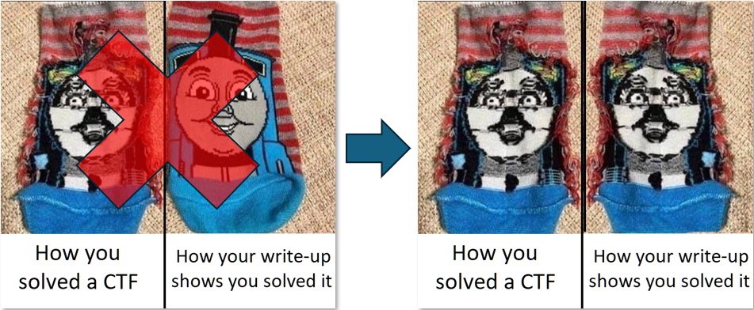

`computing software` was a fun (ie: no maths degree required) challenge from FCSC 2026.

There's a binary and an execution trace provided; the binary checks for the `FCSC_MOTHERBOARD_NAME` environment variable.

TL;DR: use trace and binary to get the flag (who would have guessed).

# 0. Disclaimer



# 1. Get to know each other

the main is pretty self explanatory
```C
undefined4 main(void)

{
    char *board_name;
    ulong uVar1;
    undefined4 local_c;

    FUN_0040af70();
    memset(MEM,0,0x80);
    FUN_00401ac0();
    printf("[.] Welcome to computing-software-2\n");
    printf("[.] Setup the environment...\n");
    board_name = getenv("FCSC_MOTHERBOARD_NAME");
    if (board_name == NULL) {
        printf(
              "[!] Please setup your environment before loading this program\n[!] We need your motherboard name in order to run th is program\n[!] $ export FCSC_MOTHERBOARD_NAME=$(sudo cat /sys/devices/virtual/dmi/id/board_name)\n"
              );
        local_c = 0xffffffff;
    }
    else {
        FUN_004022e0();
        FUN_00402b50(board_name);
        FUN_00401ac0();
        printf("[.] Setup done, please wait...\n");
        FUN_004022e0();
        uVar1 = FUN_004038a0();
        if ((uVar1 & 1) == 0) {
            printf("[!] Looks like your computer is not supposed to run this software...\n");
        }
        else {
            printf("[*] Congrats!\n");
            printf("[*] Computer validated! (You can use your HWID as flag)\n");
        }
        FUN_00401ac0();
        local_c = 0;
    }
    return local_c;
}
```

# 2. Jump Obfuscation

Some functions like `FUN_00401ac0` decompile like junk: it is using some JZ/JNZ trick to twart the decompiler:

```asm
008        00401ae8 74 0c                        JZ                      LAB_00401aef+7
008        00401aea 75 0a                        JNZ                     LAB_00401aef+7
```

this can be fixed by this heavy deobfuscator which changes `JZ x; JNZ x`; to `JMP x; NOP` and potentially breaks the binary but is good enough to help with static analysis.

```python
data = open("software.bin", "rb").read()

for x in range(0x03, 0x100):
    pat = bytes([0x74, x, 0x75, x-2])
    rep = bytes([0xeb, x, 0x90, 0x90])

    data = data.replace(pat, rep)

with open("software.bin.patched", "wb") as fp:
    fp.write(data)
```

It is now easier to dive into each function (note how it also renamed functions ;p)

```C

undefined4 main(void)

{
    char *board_name;
    ulong _;
    undefined4 local_c;

    ctf::setup_sigsegv_sigill_handler();
    memset(MEMORY,0,0x80);
    ctf::get_new_key_and_xor_memory();
    printf("[.] Welcome to computing-software-2\n");
    printf("[.] Setup the environment...\n");
    board_name = getenv("FCSC_MOTHERBOARD_NAME");
    if (board_name == NULL) {
        printf(
              "[!] Please setup your environment before loading this program\n[!] We need your motherboard name in order to run th is program\n[!] $ export FCSC_MOTHERBOARD_NAME=$(sudo cat /sys/devices/virtual/dmi/id/board_name)\n"
              );
        local_c = 0xffffffff;
    }
    else {
        ctf::xor_memory_prev_key();
        ctf::load_input_into_128_array_and_xor_0x91(board_name);
        ctf::get_new_key_and_xor_memory();
        printf("[.] Setup done, please wait...\n");
        ctf::xor_memory_prev_key();
        _ = ctf::check_board_name();
        if ((_ & 1) == 0) {
            printf("[!] Looks like your computer is not supposed to run this software...\n");
        }
        else {
            printf("[*] Congrats!\n");
            printf("[*] Computer validated! (You can use your HWID as flag)\n");
        }
        ctf::get_new_key_and_xor_memory();
        local_c = 0;
    }
    return local_c;
}
```

# 3. FCSC_MOTHERBOARD_NAME Processing

Quick reversing of `ctf::load_input_into_128_array_and_xor_0x91` shows that the value of FCSC_MOTHERBOARD_NAME is loaded as a repeating string into a 128 bytes array and xored with byte value 0x91.

We'll call this array `BOARD_NAME`.

That can quickly be checked dynamically:


```
% FCSC_MOTHERBOARD_NAME="coucou" gdb ./software.bin
pwndbg> run
Starting program: /home/matth/security/ctf/2026/fcsc/rev/computing_software/software.bin 
[.] Welcome to computing-software-2
[.] Setup the environment...
[.] Setup done, please wait...

Program received signal SIGSEGV, Segmentation fault.
pwndbg> python
>data = gdb.selected_inferior().read_memory(0x004b1110, 128)
>print(bytes(int.from_bytes(_) ^ 0x91 for _ in data))
>end
b'coucoucoucoucoucoucoucoucoucoucoucoucoucoucoucoucoucoucoucoucoucoucoucoucoucoucoucoucoucoucoucoucoucoucoucoucoucoucoucoucoucouco'
```

PS: the xor 0x91 comes from this function:

```C
/*
   func at 0x0402910 */

byte ctf::xor_0x91(void)

{
    undefined1 local_38;

    return local_38 ^ 0x91;
}
```

PPS: also note the SIGSEGV


# 4. ctf::check_board_name()


The function of interest is `ctf::check_board_name()` - so we'll focus on this one now.

It starts by modifying its own code using bytes from the `BOARD_NAME`, meaning without the correct $FCSC_MOTHERBOARD_NAME it will not execute (hence the SIGSEGV):

```asm
4a8        004038bc 9c                           PUSHFQ
4b0        004038bd 50                           PUSH                    RAX
                             modify code
4b8        004038be 8a 05 98 d8 0a 00            MOV                     AL,byte ptr [BOARD_NAME[76]]
4b8        004038c4 30 05 02 00 00 00            XOR                     byte ptr [modified_code],AL
4b8        004038ca 58                           POP                     RAX
4b0        004038cb 9d                           POPFQ
                             modified_code                                                         XREF[2]:
4a8        004038cc ed                           IN                      EAX,DX
                                                                                           004038c4(RW), 004038d2(W)
4a8        004038cd 35 23 9e 00 00               XOR                     EAX,0x9e23
                             write back
4a8        004038d2 c6 05 f3 ff ff ff ed         MOV                     byte ptr [modified_code],0xed
```

the correct byte value at address `004038cc` can be recovered from the trace:

```
% grep -i 04038cc software.bin.trace.log
0x004038CC: xor  rax, 0x9e23 : 48 35 23 9E 00 00
```


if we patch the byte to its correct value (0x48) and follow along, we endup in an obfuscated `jmp rax`:

```asm
4a8        004038d9 48 05 79 13 ff ff            ADD                     RAX,-0xec87
4a8        004038df 48 b9 0b 47 30 0b 80 10      MOV                     RCX,0x41d110800b30470b
                    d1 41
4a8        004038e9 48 31 c8                     XOR                     RAX,RCX
4a8        004038ec 48 83 c0 02                  ADD                     RAX,0x2
4a8        004038f0 48 35 27 a5 00 00            XOR                     RAX,0xa527
4a8        004038f6 48 b9 d7 7b 62 9c f4 24      MOV                     RCX,0x558e24f49c627bd7
                    8e 55
4a8        00403900 48 01 c8                     ADD                     RAX,RCX
4a8        00403903 48 35 a3 b2 89 09            XOR                     RAX,0x989b2a3
4a8        00403909 b9 2e 1b 47 8a               MOV                     ECX,0x8a471b2e
4a8        0040390e 48 01 c8                     ADD                     RAX,RCX
4a8        00403911 48 b9 7a 9e 9a 24 ce ff      MOV                     RCX,0x4d7dffce249a9e7a
                    7d 4d
4a8        0040391b 48 31 c8                     XOR                     RAX,RCX
4a8        0040391e 48 b9 4d 84 7b 8a 08 95      MOV                     RCX,0x512595088a7b844d
                    25 51
4a8        00403928 48 01 c8                     ADD                     RAX,RCX
4a8        0040392b ff e0                        JMP                     RAX
```

and the decompiled output looks like:

```C
void ctf::check_board_name(void)

{
                    /* self modify code */
                    /* WARNING (jumptable): Read-only address (ram,0x004038cc) is written */
                    /* WARNING: Read-only address (ram,0x004038cc) is written */
                    /* WARNING (jumptable): Read-only address (ram,0x004038cc) is written */
                    /* WARNING: Read-only address (ram,0x004038cc) is written */
                    /* back to original value */
    uRam00000000004038cc = 0xed;
                    /* WARNING: Could not recover jumptable at 0x0040392b. Too many branches */
                    /* WARNING: Treating indirect jump as call */
    (*(code *)((((((STATIC_UINT64_ARR[0] + (ulong)BOARD_NAME[4] ^ 0x9e23) - 0xec87 ^ 0x41d110800b30470b) + 2 ^ 0xa527) +
                 0x558e24f49c627bd7 ^ 0x989b2a3) + 0x8a471b2e ^ 0x4d7dffce249a9e7a) + 0x512595088a7b844d))();
    return;
}
```


The jump is dependant from a `BOARD_NAME` byte (and a value from a static uint64_t[192] array).

From the trace, we know where it should jump:

```
% grep -iA1 040392b software.bin.trace.log
0x0040392B: jmp  rax : FF E0 
0x00403937: mov  rax, qword ptr [rip + 0xab7a2] : 48 8B 05 A2 B7 0A 00 
```

We can quickly verify we can recover the BOARD_NAME byte:

```python
from z3 import *

null_ARRAY_004af0d8_0 = 0xCFC860C4390D0D7A
jmp_addr = 0x00403937

MEM_4 = BitVec("m", 64)

s = Solver()
s.add(((((((null_ARRAY_004af0d8_0 + MEM_4 ^ 0x9e23) - 0xec87 ^ 0x41d110800b30470b) + 2 ^ 0xa527) +
                 0x558e24f49c627bd7 ^ 0x989b2a3) + 0x8a471b2e ^ 0x4d7dffce249a9e7a) 
                 + 0x512595088a7b844d) == jmp_addr)

print(s.check())
print(s.model())
```

```
% python tst_slv.py
sat
[m = 234]
```

yay, a prime target for symbolic execution (because there's more than one jump rax :))

```
% grep "jmp  rax" interesting.trace | wc -l
192
```


So now, let's recover all bytes from self modifying ops and jmp rax instructions...


## 4.1 Self Modifying Code

I extracted only the relevant part from the full trace into [interesting.trace](https://github.com/matthw/matthw.github.io/blob/master/content/posts/2026/fcsc2026_computing_software/data/interesting.trace) (ie: the code of `ctf::check_board_name()`) to avoid pollution.

We can use pattern matching (grep :)) to identify the self modifying ops:

```
% grep -A1 'mov  al, byte ptr \[rip + 0x' interesting.trace
0x004038BE: mov  al, byte ptr [rip + 0xad898] : 8A 05 98 D8 0A 00
0x004038C4: xor  byte ptr [rip + 2], al : 30 05 02 00 00 00
--
0x00403AB4: mov  al, byte ptr [rip + 0xad673] : 8A 05 73 D6 0A 00
0x00403ABA: xor  byte ptr [rip + 2], al : 30 05 02 00 00 00
--
0x00403D19: mov  al, byte ptr [rip + 0xad453] : 8A 05 53 D4 0A 00
0x00403D1F: xor  byte ptr [rip + 2], al : 30 05 02 00 00 00
--
etc...
```

Then squeeze that into an ugly script [01_fix_self_modifying_code.py](https://github.com/matthw/matthw.github.io/blob/master/content/posts/2026/fcsc2026_computing_software/data/01_fix_self_modifying_code.py) that will get the original bytes from the trace and nop the self modifying parts so we can actually execute a clean function:

It creates a `fixed_function.bin` file with the cleaned opcodes and output the recovered values from the `BOARD_NAME`:

```
% python 01_fix_self_modifying_code.py
[None, None, None, None, None, None, 245, 160, 165, None, None, 243, None, 166, None, 163, 169, None, None, None, 247, None, 161, 247, 160, None, None, None, 167, 163, None, 240, 163, 245, None, 165, None, None, 168, 164, None, None, None, None, None, 243, None, None, 165, None, None, None, None, 165, 245, None, None, None, None, 162, None, 242, None, None, None, None, 167, None, 168, 167, None, 215, None, None, None, None, 165, 245, 160, None, 160, None, None, 240, 166, 165, None, None, 169, 247, 166, None, None, None, 247, None, 166, None, 162, None, None, None, None, 163, 245, 169, 165, 240, None, None, 164, 165, None, None, None, None, None, None, 247, None, None, 169, 242, 242, 165, 245, 169, 240]
```


## 4.2 Indirect Jumps

we can recover all jump addresses and targets using a professional trace2python transpiler (grep):

```
% grep -A1 "jmp  rax" interesting.trace | cut -d: -f1 | xargs | sed 's/ -- /,\n/g' | tr " " ":"
0x0040392B:0x00403937,
0x004039A7:0x004039B9,
0x00403A39:0x00403A46,
0x00403B00:0x00403B03,
0x00403B48:0x00403B61,
0x00403BE3:0x00403BFB,
0x00403C44:0x00403C5E,
0x00403D67:0x00403D78,
...
```

and forcefeed that to [02_symbolic_block_solver.py](https://github.com/matthw/matthw.github.io/blob/master/content/posts/2026/fcsc2026_computing_software/data/02_symbolic_block_solver.py).

This script uses Triton to symbolically execute the previously generated `fixed_function.bin` and whenever it reaches a `jmp rax` address, it solves for the correct target address from the trace:

```
% python 02_symbolic_block_solver.py
TABLE[4] = 0xea
TABLE[30] = 0xf5
TABLE[39] = 0xa4
TABLE[119] = 0xa5
TABLE[70] = 0xec
TABLE[29] = 0xa3
TABLE[37] = 0xf0
TABLE[124] = 0xa5
TABLE[53] = 0xa5
TABLE[69] = 0xa7
TABLE[79] = 0xa5
TABLE[20] = 0xf7
TABLE[7] = 0xa0
TABLE[13] = 0xa6
TABLE[20] = 0xf7
TABLE[106] = 0xa5
TABLE[56] = 0xf0
TABLE[91] = 0xf7
TABLE[80] = 0xa0
TABLE[44] = 0xa8
TABLE[125] = 0xf5
TABLE[90] = 0xa6
TABLE[9] = 0xa0
TABLE[46] = 0xf2
TABLE[74] = 0xd2
TABLE[31] = 0xf0
TABLE[83] = 0xf0
TABLE[127] = 0xf0
TABLE[100] = 0xa3
TABLE[46] = 0xf2
TABLE[84] = 0xa6
TABLE[121] = 0xa9
TABLE[33] = 0xf5
TABLE[35] = 0xa5
TABLE[91] = 0xf7
TABLE[57] = 0xa5
TABLE[81] = 0xa2
TABLE[19] = 0xa6
TABLE[60] = 0xa8
TABLE[60] = 0xa8
TABLE[51] = 0xf2
TABLE[27] = 0xa2
TABLE[62] = 0xf4
TABLE[118] = 0xf7
TABLE[33] = 0xf5
TABLE[21] = 0xa4
TABLE[114] = 0xa2
TABLE[15] = 0xa3
TABLE[115] = 0xa8
TABLE[18] = 0xf7
TABLE[1] = 0xd2
TABLE[69] = 0xa7
TABLE[44] = 0xa8
TABLE[114] = 0xa2
TABLE[59] = 0xa2
TABLE[87] = 0xa9
TABLE[24] = 0xa0
TABLE[16] = 0xa9
TABLE[12] = 0xf0
TABLE[2] = 0xc2
TABLE[18] = 0xf7
TABLE[71] = 0xd7
TABLE[12] = 0xf0
TABLE[106] = 0xa5
TABLE[45] = 0xf3
TABLE[11] = 0xf3
TABLE[125] = 0xf5
TABLE[123] = 0xf2
TABLE[42] = 0xa7
TABLE[84] = 0xa6
TABLE[44] = 0xa8
TABLE[2] = 0xc2
TABLE[29] = 0xa3
TABLE[38] = 0xa8
TABLE[60] = 0xa8
TABLE[116] = 0xf3
TABLE[46] = 0xf2
TABLE[60] = 0xa8
TABLE[58] = 0xa7
TABLE[18] = 0xf7
TABLE[46] = 0xf2
TABLE[104] = 0xf5
TABLE[36] = 0xf0
TABLE[85] = 0xa5
TABLE[84] = 0xa6
TABLE[77] = 0xf5
TABLE[102] = 0xf0
TABLE[34] = 0xa9
TABLE[94] = 0xf7
TABLE[107] = 0xf0
TABLE[102] = 0xf0
TABLE[32] = 0xa3
TABLE[60] = 0xa8
TABLE[80] = 0xa0
TABLE[126] = 0xa9
TABLE[64] = 0xa3
TABLE[117] = 0xf2
TABLE[105] = 0xa9
TABLE[5] = 0xa5
TABLE[26] = 0xa0
TABLE[51] = 0xf2
TABLE[127] = 0xf0
TABLE[45] = 0xf3
TABLE[63] = 0xa6
TABLE[78] = 0xa0
TABLE[58] = 0xa7
TABLE[100] = 0xa3
TABLE[98] = 0xa2
TABLE[84] = 0xa6
TABLE[83] = 0xf0
TABLE[24] = 0xa0
TABLE[55] = 0xa9
TABLE[7] = 0xa0
TABLE[56] = 0xf0
TABLE[40] = 0xa5
TABLE[45] = 0xf3
TABLE[34] = 0xa9
TABLE[9] = 0xa0
TABLE[51] = 0xf2
TABLE[75] = 0xea
TABLE[126] = 0xa9
TABLE[76] = 0xa5
TABLE[64] = 0xa3
TABLE[122] = 0xf2
TABLE[120] = 0xf2
TABLE[120] = 0xf2
TABLE[51] = 0xf2
TABLE[43] = 0xa2
TABLE[101] = 0xf5
TABLE[52] = 0xf2
TABLE[122] = 0xf2
TABLE[119] = 0xa5
TABLE[59] = 0xa2
TABLE[64] = 0xa3
TABLE[104] = 0xf5
TABLE[87] = 0xa9
TABLE[56] = 0xf0
TABLE[17] = 0xa9
TABLE[103] = 0xa3
TABLE[104] = 0xf5
TABLE[69] = 0xa7
TABLE[125] = 0xf5
TABLE[80] = 0xa0
TABLE[17] = 0xa9
TABLE[26] = 0xa0
TABLE[82] = 0xf3
TABLE[13] = 0xa6
TABLE[121] = 0xa9
TABLE[112] = 0xa0
TABLE[85] = 0xa5
TABLE[33] = 0xf5
TABLE[109] = 0xa8
TABLE[25] = 0xa6
TABLE[112] = 0xa0
TABLE[33] = 0xf5
TABLE[120] = 0xf2
TABLE[61] = 0xf2
TABLE[86] = 0xa3
TABLE[59] = 0xa2
TABLE[120] = 0xf2
TABLE[34] = 0xa9
TABLE[118] = 0xf7
TABLE[73] = 0xc2
TABLE[124] = 0xa5
TABLE[112] = 0xa0
TABLE[47] = 0xf7
TABLE[6] = 0xf5
TABLE[30] = 0xf5
TABLE[58] = 0xa7
TABLE[45] = 0xf3
TABLE[48] = 0xa5
TABLE[13] = 0xa6
TABLE[121] = 0xa9
TABLE[52] = 0xf2
TABLE[39] = 0xa4
TABLE[23] = 0xf7
TABLE[46] = 0xf2
TABLE[20] = 0xf7
TABLE[126] = 0xa9
TABLE[104] = 0xf5
TABLE[41] = 0xa0
TABLE[34] = 0xa9
TABLE[110] = 0xa4
TABLE[77] = 0xf5
TABLE[65] = 0xf0
TABLE[116] = 0xf3
TABLE[48] = 0xa5
TABLE[126] = 0xa9
TABLE[89] = 0xf7
TABLE[23] = 0xf7
TABLE[108] = 0xf0
TABLE[46] = 0xf2
```


# 5. The Flag

We combine the output from the 2 previous scripts to build a more complete TABLE [03_build_table.py](https://github.com/matthw/matthw.github.io/blob/master/content/posts/2026/fcsc2026_computing_software/data/03_build_table.py) then xor 0x91 to get the following:

```
% python 03_build_table.py
b'_CS_{4d141_ba7_288f7f50f171362da2d84aa9541639bcf4__cc4d8a4639ce72a6_96}F_SC{4d1413ba74288f7f__f_7_3_2da2d84aa9541_39bcf4c8cc4d8a'
``` 

since we know from step 3 the variable repeats, we can recover most the missing bytes:

```
_CS_{4d141_ba7_288f7f50f171362da2d84aa9541639bcf4__cc4d8a4639ce72a6_96}
F_SC{4d1413ba74288f7f__f_7_3_2da2d84aa9541_39bcf4c8cc4d8a


FCSC{4d1413ba74288f7f50f171362da2d84aa9541639bcf4c8cc4d8a4639ce72a6_96}
                                                                   ^
```

and bruteforce the last one in the flag input box ;-)
